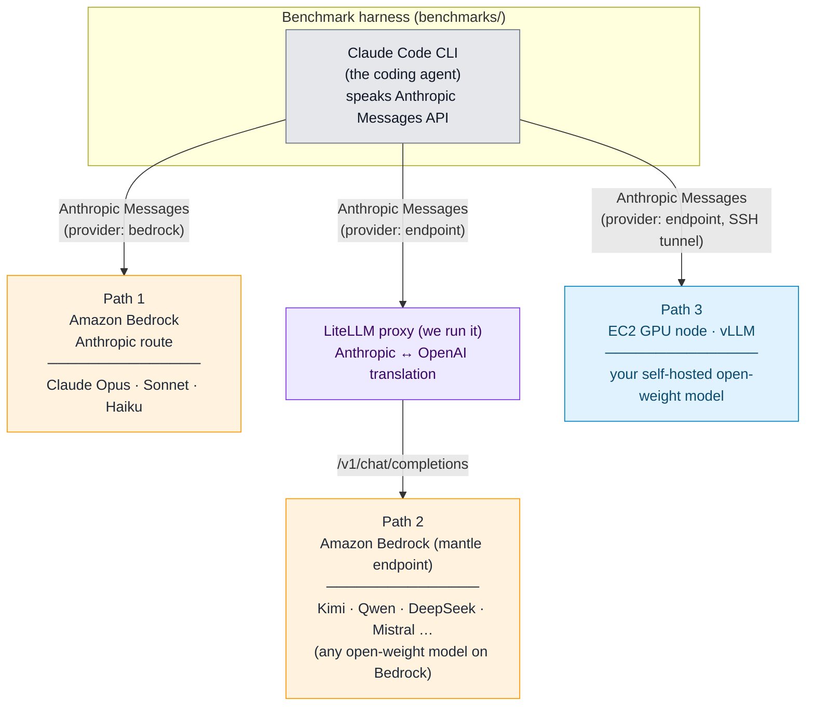
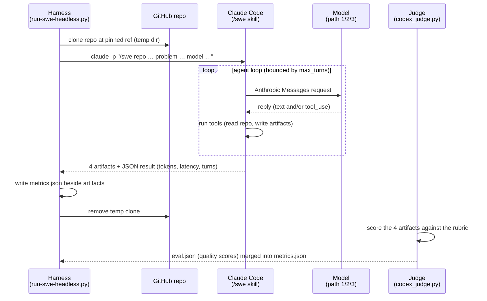

# Agentic Coding Harness and Benchmarks

[](LICENSE)
[](https://docs.aws.amazon.com/bedrock/latest/userguide/models-endpoint-availability.html)
[](./)

> **This is sample code intended for demonstration and learning purposes only.**
> It is not meant for production use. Review and harden all scripts, configurations,
> and IAM permissions before using in any production or sensitive environment.

## Overview

This repository is a **benchmark and harness for measuring how well different LLMs perform real-world software-engineering tasks** when driven by a coding agent. The coding agent is [Claude Code](https://docs.anthropic.com/en/docs/claude-code), Anthropic's command-line coding agent, which by default talks only to Anthropic's own models. Here it is wired up to run with a model hosted in any of **three different places**, so you can put many models through the *same* tasks with the *same* agent and compare them directly on both quality and cost.

Each task points the agent at a real GitHub repository and a real problem. The agent works the task **non-interactively** through the `/swe` skill, which lands four design artifacts on disk (`github-issue.md`, `lld.md`, `review.md`, `testing.md`). The harness records what the run cost -- token usage, latency, and the number of LLM turns -- and a separate [judge](benchmarks/docs/harness-reference.md#scoring-the-artifacts-the-judge) scores the artifacts for quality. Run the same task across models and the resulting `metrics.json` / `eval.json` files line up side by side.

## Results: a worked example

To show what the harness produces, we ran it against [agentic-community/mcp-gateway-registry](https://github.com/agentic-community/mcp-gateway-registry) at tag `1.24.4` -- **5 tasks**, each scored by the judge. Below is what we have measured so far: **13 models** across **Path 1** (Anthropic on Amazon Bedrock) and **Path 3** (self-hosted on vLLM, across an 8x H200 `p5en.48xlarge` and a single `g6e.12xlarge`); the cost/quality chart leads, the full task-by-task table and per-model leaderboard follow, and the exact models + hardware are listed under the table. Path 2 (open-weight on Bedrock via the LiteLLM proxy) is **coming soon** -- we publish only what we have measured here. (The `mcp-gateway-registry` dataset ships in [benchmarks/dataset/](benchmarks/dataset/mcp-gateway-registry.yaml) so you can reproduce the run; the generated artifacts themselves are not committed, so a customer's own runs never risk landing in version control. The only committed worked example under [benchmarks/swe-benchmark-data/](benchmarks/swe-benchmark-data/) is the trivial `Hello-World` sanity run.)

| # | Problem | Difficulty | Source |
|---|---------|-----------|--------|
| 1 | `remove-faiss` | Medium | Upstream [#1285](https://github.com/agentic-community/mcp-gateway-registry/issues/1285) / [#452](https://github.com/agentic-community/mcp-gateway-registry/issues/452) |
| 2 | `remove-efs-from-terraform-aws-ecs` | Medium | Upstream [#1286](https://github.com/agentic-community/mcp-gateway-registry/issues/1286) |
| 3 | `ssrf-hardening-outbound-url-validation` | Medium | Upstream [#1282](https://github.com/agentic-community/mcp-gateway-registry/issues/1282) |
| 4 | `migrate-ecs-env-vars-to-secrets-manager` | High | Upstream [#1134](https://github.com/agentic-community/mcp-gateway-registry/issues/1134) |
| 5 | `replace-keycloak-db-password-with-rds-iam` | High | Upstream [#1303](https://github.com/agentic-community/mcp-gateway-registry/issues/1303) |

**Models benchmarked so far:** **Path 1 (Bedrock):** Claude-Opus-5, Claude-Opus-4.8, Claude-Sonnet-5. **Path 3 (self-hosted on vLLM):** Kimi-K2.7-Code, GLM-5.2, DeepSeek-V3.2, MiniMax-M2.5, Nemotron-Ultra-550B, Qwen3-Coder-480B-A35B-Instruct, and Devstral-2-123B-Instruct (all on 8x H200 / `p5en.48xlarge`), plus Qwen3.6-35B-A3B, Qwen3-Coder-30B-A3B-Instruct, Qwen3-Coder-Next, and Gemma-4-31B-it (on `g6e.12xlarge` / 4x L40S). **Coming soon:** Claude Haiku on Bedrock (Path 1) and Path 2 (open-weight on Bedrock via the LiteLLM proxy -- Mistral, …).

### Cost vs. quality


Mean cost per task (x) against mean task score (y), one point per model. For **self-hosted** models with a throughput sweep, cost is **hardware-derived**: the model's blended cost per token (instance $/hr / measured tokens/sec, see [cost-per-task-methodology.md](self-hosted/vllm/cost-per-task-methodology.md)) times its *actual* input+output tokens per task, averaged over non-failed tasks. The three **Anthropic** points (Opus-5, Opus-4.8, Sonnet-5) are **real token-metered Bedrock bills**; **DeepSeek-V3.2**, **Nemotron-Ultra-550B**, and **Devstral-2-123B** have no sweep so use a token-priced estimate (`‡`) -- comparable as spend, different in kind. The cost/quality frontier runs **Qwen3-Coder-30B ($0.98 / 30.20) -> Qwen3.6-35B ($1.03 / 50.32) -> MiniMax-M2.5 ($1.16 / 51.56) -> Kimi-K2.7-Code ($8.10 / 58.68) -> GLM-5.2 ($12.33 / 59.20) -> Claude-Opus-4.8 ($17.42 / 75.32) -> Claude-Opus-5 ($54.41 / 77.45)**. Everything else is **dominated**: notably Claude-Sonnet-5 (72.84 but $26.39), Gemma-4-31B, Qwen3-Coder-480B ($7.43), Devstral-2-123B ($37.61 est.), Nemotron-Ultra-550B, and DeepSeek-V3.2 ($50.10 est., the priciest). Opus-5 is the top-quality point but its $54.41/task makes it the frontier's expensive extreme -- Opus-4.8 delivers nearly the same quality for a third of the cost. Qwen3-Coder-Next is omitted (not viable on this node). A model's mean excludes any 0-score failed task (footnote ⁵). Regenerate with `uv run scripts/plot_cost_quality.py` (add `--dark`) from `benchmarks/`.

### Results -- 5 tasks x models

All cells are task scores (0-100), the mean of the artifact totals per (task x model). These are **`/swe2` runs -- design *and* implementation** (six artifacts: the four design docs plus `patch.diff` + `implementation.md`), scored by the same judge (`codex exec`, `gpt-5.6-sol`, high reasoning effort). **Claude-Opus-5, Claude-Opus-4.8, and Claude-Sonnet-5** are **Path 1** results (Anthropic on Amazon Bedrock); every other column is **Path 3, self-hosted via vLLM** (hardware differs by model size -- see the row under the table). Columns are ordered by mean score. Bold = top score in row. Path 2 (open-weight on Bedrock via LiteLLM) is still **coming soon**.

| Task | Diff. | Opus-5⁸ | Opus-4.8⁹ | Sonnet-5⁹ | GLM-5.2⁶ | Kimi-K2.7 | DeepSeek-V3.2 | MiniMax-M2.5 | Qwen3.6-35B | Nemotron-550B | Gemma-4-31B | Qwen3-Coder-480B⁷ | Devstral-2-123B | Qwen3-Coder-30B |
|------|-------|--------:|----------:|----------:|---------:|----------:|--------------:|-------------:|------------:|--------------:|------------:|------------------:|----------------:|----------------:|
| `remove-faiss` | Med | 69.6 | 69.2 | **72.8** | 54.0 | 55.2 | 48.2 | 44.2 | 53.2 | 0.0 ⁵ | 38.0 | 45.6 | 40.2 | 32.0 |
| `remove-efs-from-terraform-aws-ecs` | Med | **89.2** | 79.6 | 86.8 | 64.0 | 63.4 | 59.0 | 62.0 | 65.2 | 55.4 | 53.6 | 55.4 | 49.6 | 28.2 |
| `ssrf-hardening-outbound-url-validation` | Med | 78.6 | **80.6** | 68.6 | 66.8 | 56.4 | 56.4 | 58.2 | 41.6 | 52.4 | 64.6 | 0.0 ⁵ | 47.2 | 0.0 ⁵ |
| `migrate-ecs-env-vars-to-secrets-manager` | High | n/a⁸ | **70.6** | 66.0 | 54.2 | 67.6 | 51.2 | 53.6 | 46.4 | 50.0 | 48.4 | 41.0 | 38.2 | 30.8 |
| `replace-keycloak-db-password-with-rds-iam` | High | 72.4 | **76.6** | 70.0 | 57.0 | 50.8 | 46.2 | 39.8 | 45.2 | 43.0 | 37.4 | 37.8 | 41.0 | 29.8 |
| **Mean (excl. failed⁵)** | | **77.45** | 75.32 | 72.84 | 59.20 | 58.68 | 52.20 | 51.56 | 50.32 | 50.20 | 48.40 | 44.95 | 43.24 | 30.20 |

The **Mean** row excludes any task that scored 0 -- a genuine model failure (missing artifacts), an unresolved anomaly rather than a quality measurement, so it is left out of the average **pending further investigation** and flagged with `⁵`. Per-task 0.0 cells are still shown so the failure is visible. No-failure (5/5): Opus-4.8, Sonnet-5, GLM-5.2, Kimi-K2.7-Code, DeepSeek-V3.2, MiniMax-M2.5, Qwen3.6-35B, Gemma-4-31B, Devstral-2-123B. 4/5 (one failed): Nemotron-550B (`remove-faiss`), Qwen3-Coder-480B (`ssrf`), Qwen3-Coder-30B (`ssrf`). **Opus-5 ran 4 tasks** (`migrate` not run) -- its mean is over those 4; see `⁸`.

**Hardware:** Kimi-K2.7-Code (1.06T-param MoE, ~1 TB weights) ran on **8x H200** (`p5en.48xlarge`) at its full **131,072-token (128K) native context window**; GLM-5.2 (744B MoE / 40B active, ~750 GB FP8 weights), MiniMax-M2.5, Qwen3-Coder-480B (480B MoE / 35B active, FP8, TP=4), DeepSeek-V3.2, Nemotron-Ultra-550B, and Devstral-2-123B (123B dense, 256K window) also ran on **8x H200** (`p5en.48xlarge`); the three smaller Qwen models (3B-active MoE) and Gemma-4-31B (dense, ~63 GB) ran on a single **`g6e.12xlarge`** (4x L40S) at a 200K window. All via vLLM. Gemma-4-31B is dense and slow, so it used a raised per-task timeout (`--timeout-seconds 3600`); the default 1800s was not enough for it to return. Note Kimi's 128K window is below the harness's 200K agentic-coding guideline, yet it completed all 5 tasks with no failures -- two tasks (`ssrf`, `remove-faiss`) hit the max-turns cap (251) at that window but still produced scoreable artifacts, so neither is a context-overflow failure.

⁴ Qwen3-Coder-Next (79.6B, ~160 GB weights) **could not be benchmarked on the `g6e.12xlarge`.** There the weights leave room for only a ~16K context window, but agentic coding tasks need 100K-250K input tokens per request, so every task overflows the window on the first prompt. It needs a larger-VRAM node (e.g. `g6e.48xlarge`) to serve a >=200K window. The `/benchmark` skill enforces a 200K-minimum gate by default as a conservative guideline -- Kimi's 128K run shows a window somewhat below 200K can still work when the tasks fit, but 16K cannot. See [self-hosted/vllm/models/qwen3-coder-next.md](self-hosted/vllm/models/qwen3-coder-next.md).

⁵ **Genuine model failures, scored 0.** On these `/swe2` runs the failures are: Nemotron-Ultra-550B on `remove-faiss`, Qwen3-Coder-480B on `ssrf`, and Qwen3-Coder-30B on `ssrf`. Each failed to produce a scorable artifact set (typically the model exhausted its turn budget on the implementation step without landing edits, so no `patch.diff`). The judge records a missing/empty-artifact folder as a 0 with a `MODEL FAILURE` verdict rather than dropping it. The **Mean** row is over the tasks each model completed, excluding those failures: 5/5 for Opus-4.8, Sonnet-5, GLM-5.2, Kimi-K2.7-Code, DeepSeek-V3.2, MiniMax-M2.5, Qwen3.6-35B, Gemma-4-31B, Devstral-2-123B; 4/5 for Nemotron-Ultra-550B, Qwen3-Coder-480B, and Qwen3-Coder-30B; Opus-5 ran 4/4 (the `migrate` task was not run -- see `⁸`).

⁶ **GLM-5.2 ran with more headroom than the others -- not strictly apples-to-apples.** GLM-5.2 (`zai-org/GLM-5.2-FP8`, 744B MoE / 40B active, ~750 GB FP8 weights) was served on **8x H200** at a **300K context window** (~$12.33/task, see the cost section). It scores 59.20 over 5/5 -- narrowly ahead of Kimi (58.68) on the same box. Treat cross-instance comparisons as indicative until normalized.

⁷ **Qwen3-Coder-480B intermittently fails to produce artifacts -- the failure is nondeterministic, not task-specific.** Qwen3-Coder-480B (`Qwen/Qwen3-Coder-480B-A35B-Instruct-FP8`, 480B MoE / 35B active) was served on the **8x H200** node at **TP=4** (a block-FP8 MoE sharding constraint forces TP=4, not 8 -- see [its model guide](self-hosted/vllm/models/qwen3-coder-480b.md)), 200K window. Like the smaller Qwen3-Coder-30B, it periodically explores/edits the repo instead of completing the artifact chain (or exhausts the turn cap), scoring 0 on some tasks. It is a harness-conformance instability of a coder-tuned model, not a serving or context problem.

⁸ **Claude-Opus-5 ran only 4 of the 5 tasks** (`migrate-ecs-env-vars-to-secrets-manager` was not run), so its 77.45 mean is over those 4 -- not strictly comparable to the 5-task means until it is completed. It is a Path 1 (Bedrock) result like Opus-4.8/Sonnet-5, so its **$54.41/task is a real metered API bill** (its long, thorough implementations run up output tokens -- the most expensive per task measured). It tops the quality table but sits well right of the frontier on cost.

⁹ **Claude-Opus-4.8 and Claude-Sonnet-5 are Path 1 (Bedrock) results -- their cost is a real metered API bill, not hardware-derived.** Both were run through Amazon Bedrock (no self-hosting), so their `$/task` ($17.42 and $26.39) is the actual token-metered charge (read from each run's `total_cost_usd`), whereas a self-hosted model's `$/task` is `instance $/hr / measured tokens/sec` x tokens (see the cost section). Comparable as "what you would pay," but different in provenance. Opus-4.8 is on the frontier at $17.42; the best open-weight model is GLM-5.2 (59.20) at $12.33/task, just ahead of Kimi-K2.7-Code (58.68) at ~$8/task. Sonnet-5 (72.84) is a close second on quality but pricier per task ($26.39 -- more verbose implementations, more output tokens), so it sits just off the frontier.

### Per-model leaderboard (so far)

Mean score is over the tasks each model completed (any 0-score failed task is excluded pending investigation; see the note above). **$/task** is the hardware-derived blended cost (instance $/hr / measured tokens/sec x this run's actual per-task tokens); lower is better.

| Rank | Model | Params (active) | Hardware | Mean score | $/task | Tasks scored |
|-----:|-------|----------------|----------|-----------:|-------:|-------------:|
| 1 | Claude-Opus-5⁸ | -- (Bedrock) | Amazon Bedrock (Path 1) | **77.45** | $54.41† | 4/5 |
| 2 | Claude-Opus-4.8⁹ | -- (Bedrock) | Amazon Bedrock (Path 1) | **75.32** | $17.42† | 5/5 |
| 3 | Claude-Sonnet-5⁹ | -- (Bedrock) | Amazon Bedrock (Path 1) | **72.84** | $26.39† | 5/5 |
| 4 | GLM-5.2⁶ | 744B (40B) | 8x H200 | **59.20** | $12.33 | 5/5 |
| 5 | Kimi-K2.7-Code | 1,058.6B (MoE) | 8x H200 | **58.68** | $8.10 | 5/5 |
| 6 | DeepSeek-V3.2 | 671B (37B) | 8x H200 | **52.20** | $50.10‡ | 5/5 |
| 7 | MiniMax-M2.5 | 230B (10B) | 8x H200 (TP=4) | **51.56** | $1.16 | 5/5 |
| 8 | Qwen3.6-35B-A3B | 35.9B (3B) | g6e.12xlarge | **50.32** | $1.03 | 5/5 |
| 9 | Nemotron-Ultra-550B | 550B (dense) | 8x H200 | **50.20** | $24.41‡ | 4/5 |
| 10 | Gemma-4-31B-it | 31B (dense) | g6e.12xlarge | **48.40** | $3.62 | 5/5 |
| 11 | Qwen3-Coder-480B-A35B-Instruct⁷ | 480B (35B) | 8x H200 (TP=4) | **44.95** | $7.43 | 4/5 |
| 12 | Devstral-2-123B-Instruct | 123B (dense) | 8x H200 | **43.24** | $37.61‡ | 5/5 |
| 13 | Qwen3-Coder-30B-A3B-Instruct | 30.5B (3B) | g6e.12xlarge | **30.20** | **$0.98** | 4/5 |
| - | Qwen3-Coder-Next | 79.6B (3B) | (needs bigger node) | not viable on g6e.12xlarge | -- | 0 |

† Claude-Opus-5 / Claude-Opus-4.8 / Claude-Sonnet-5 `$/task` is a real Bedrock **API bill** (token-metered), not a hardware-derived figure; see footnotes `⁸` and `⁹`.
‡ DeepSeek-V3.2, Nemotron-Ultra-550B, and Devstral-2-123B are self-hosted but have **no throughput sweep**, so their `$/task` is the harness's **token-priced estimate**, not the hardware-derived (`instance $/hr / tokens-sec`) figure used for the other self-hosted rows -- treat those three costs as indicative and higher-variance until a sweep is run.

**Coming soon:** Claude Haiku on Bedrock (Path 1) and the open-weight Bedrock models via the LiteLLM proxy (Path 2 -- Mistral, …).

### What the data says (so far)

These are early self-hosted numbers on differing hardware; treat them as a starting point, not a final ranking. Cross-path comparisons wait until the Bedrock paths are run.

- **The Anthropic models top the table:** Claude-Opus-5 (77.45, but over 4/5 -- see ⁸), Claude-Opus-4.8 (75.32 over 5/5), and Claude-Sonnet-5 (72.84 over 5/5) lead every self-hosted model by a clear margin -- the best open-weight is GLM-5.2 at 59.20 ($12.33/task, 5/5), just ahead of Kimi-K2.7-Code at 58.68 (~$8/task, 5/5). Opus-4.8 is the best-value frontier point at $17.42; Opus-5 edges it on quality but costs 3x as much ($54.41/task, its long implementations run up output tokens), and Sonnet-5 scores nearly as high but costs more per task ($26.39), so it sits just off the frontier.
- **Qwen3.6-35B is the value story:** on one mid-range GPU node (a single g6e.12xlarge) it scores 50.32 over all 5 tasks with no failures at a **hardware-derived $1.03 per task** -- roughly a median score at a small fraction of the frontier models' cost, and on the cost/quality frontier.
- **MiniMax-M2.5 is the best quality-per-dollar in the upper-middle:** 51.56 over 5/5 at **$1.16/task** -- it beats the dense Gemma-4-31B ($3.62) and the much pricier Qwen3-Coder-480B ($7.43) and DeepSeek-V3.2 ($50.10 est.) while costing a fraction, anchoring the frontier just above Qwen3.6-35B.
- **Cost is hardware-derived where a throughput sweep exists.** For the self-hosted models with a sweep, $/task is `instance $/hr / measured tokens/sec` times that model's real per-task token load; the three Anthropic rows are real Bedrock API bills; DeepSeek-V3.2, Nemotron-Ultra-550B, and Devstral-2-123B lack a sweep and fall back to a token-priced estimate (flagged `‡`). See [cost-per-task-methodology.md](self-hosted/vllm/cost-per-task-methodology.md).
- **The judge is strict, and implementation is harder than design.** These `/swe2` runs score design *and* code; scores in the 30-75 range reflect artifacts that are serviceable but often light on the specificity, risk-analysis, and complete implementation the rubric rewards. Coder-tuned models (Qwen3-Coder-30B/480B) are the least reliable here -- they tend to burn the turn budget implementing instead of completing the full artifact set, producing the 0-score failures.
- **MoE economics are the reason to self-host these.** Nearly every open-weight model here is a mixture-of-experts, so per-token compute (and cost) tracks the active-expert count, not the total -- the regime where a fixed-cost GPU node can beat per-token API pricing under load. The 3B-active Qwen MoEs on a single L40S node are the clearest example: ~$1/task.

> **The example repo is the example, not the contract.** `/swe` works against any GitHub URL -- clone the target you actually care about, write the task description, and run.

### How the scores are produced (LLM-as-judge rubric)

Each artifact is scored 0-100 by an independent judge session (`codex exec`, `gpt-5.6-sol`, high reasoning effort). Within each artifact the judge applies the same 4-criterion rubric, **25 points per criterion, summing to 100**:

| Criterion | 0-25 each | What the judge evaluates |
|-----------|-----------|--------------------------|
| **Completeness** | 25 | Did the artifact identify all affected files, dependencies, and components? Any obvious touchpoints (Terraform, IAM, Docker, tests, docs) missed? |
| **Correctness** | 25 | Are the proposed changes technically right? Would the design actually work? Are AWS service patterns idiomatic (e.g. ECS `secrets` block vs custom boto3 code)? |
| **Specificity** | 25 | Concrete file paths, line numbers, code snippets, resource names -- or vague hand-waving? Could a junior engineer implement this artifact alone? |
| **Risk awareness** | 25 | Rollback strategy, backwards-compat, deployment cutover, edge cases (cold start, secret rotation, token expiry, etc.) -- enumerated or ignored? |

**Artifact total = sum of 4 criteria (0-100). Task score = mean of the artifact totals (also 0-100).** The judge is calibrated so a median artifact scores around 60-70, not 85; 90+ is reserved for genuinely excellent work; hallucinated files or functions lose at least 10 points off Correctness. Per-cell JSON with criterion breakdowns and judge notes lives at `{model}/{repo}/{task}/eval.json`. The judge itself is documented in the [harness reference](benchmarks/docs/harness-reference.md#scoring-the-artifacts-the-judge).

## The three hosting paths

Whichever path you choose, the agent (Claude Code), the tasks, the `/swe` skill, and the scoring are identical -- only *where the model runs and how the request reaches it* changes.



| | Path 1 - Anthropic on Bedrock | Path 2 - open-weight on Bedrock (LiteLLM) | Path 3 - self-hosted on EC2 (vLLM) |
| --- | --- | --- | --- |
| **Which models** | Anthropic family (Claude Opus, Sonnet, Haiku) | Any open-weight model on Bedrock (Kimi, Qwen, DeepSeek, Mistral, GLM, …) | Any open-weight model you can serve (Qwen3-Coder, GLM, Kimi, …) |
| **Where the model runs** | Amazon Bedrock | Amazon Bedrock | Your EC2 GPU instance |
| **How Claude Code reaches it** | Directly, native Anthropic route | Through a [LiteLLM](https://github.com/BerriAI/litellm) proxy we run that translates Anthropic ↔ OpenAI | Directly to your vLLM server (over an SSH tunnel) |
| **Cost model** | Pay-per-token | Pay-per-token | Fixed hourly GPU cost |
| **Extra infrastructure** | None | The LiteLLM proxy ([one script](benchmarks/scripts/bedrock-mantle-proxy.sh)) | An EC2 GPU node running vLLM |
| **Best for** | Benchmarking the Anthropic family | Model variety with zero infrastructure to manage | Data sovereignty, air-gapped, and high-volume workloads where fixed GPU cost beats per-token pricing |
| **Operational guide** | [Path 1](benchmarks/docs/path-anthropic-on-bedrock.md) | [Path 2](benchmarks/docs/path-open-weight-on-bedrock-litellm.md) | [Path 3](benchmarks/docs/path-self-hosted-vllm.md) |

The key enabler for Path 2 is the LiteLLM proxy. Claude Code speaks the [Anthropic Messages API](https://docs.aws.amazon.com/bedrock/latest/userguide/inference-messages-api.html), which on Bedrock reaches **only** Claude/Anthropic models; the open-weight models are reachable solely through Bedrock's OpenAI-compatible [`bedrock-mantle` endpoint](https://docs.aws.amazon.com/bedrock/latest/userguide/inference.html) (Chat Completions). The proxy sits between the two and translates in both directions, so **any open-weight model on Bedrock can be wired into Claude Code** without changing the agent. All 38 third-party models on `bedrock-mantle` support tool calling and streaming natively.

## What a single benchmark run does

The flow below is identical across all three paths; only the box the request lands in (Bedrock's Anthropic route, the LiteLLM proxy, or your vLLM server) changes.



The skill **stops at design**. It does not modify production code, run tests, or open PRs -- whether the design is any good is the downstream evaluation step the judge (or a human) performs on the artifacts. Full mechanics are in the [harness reference](benchmarks/docs/harness-reference.md).

> **"SWE" here means software engineering in general -- not [SWE-bench](https://www.swebench.com/), the specific benchmark dataset.** The `/swe` skill lets you run any model against any task in any repo of your choosing. It is a *harness*, not a fixed benchmark set: compare results across models on the same task, or a single model across tasks of varying difficulty.

## Datasets

A dataset is a single YAML file: a metadata header plus a list of tasks, each pointing at a GitHub repo and a problem. Two datasets ship in [benchmarks/dataset/](benchmarks/dataset/):

- [hello-world.yaml](benchmarks/dataset/hello-world.yaml) -- a trivial sanity dataset (the [octocat/Hello-World](https://github.com/octocat/Hello-World) repo) for kicking the tires of a new model or endpoint.
- [mcp-gateway-registry.yaml](benchmarks/dataset/mcp-gateway-registry.yaml) -- the reference dataset, whose tasks are drawn from real upstream issues in [agentic-community/mcp-gateway-registry](https://github.com/agentic-community/mcp-gateway-registry).

**Nothing in the harness is specific to a particular repository.** Adding your own benchmark dataset is just writing another YAML file in the same format -- point tasks at any public repo and pinned ref. The dataset format is documented in the [harness reference](benchmarks/docs/harness-reference.md#the-dataset).

## Prerequisites

- An **AWS account** with [Amazon Bedrock model access](https://console.aws.amazon.com/bedrock/home#/modelaccess) enabled for the models you want (Paths 1 and 2).
- **AWS credentials** configured locally (`aws configure`, an IAM role, or AWS SSO).
- **[Claude Code CLI](https://docs.anthropic.com/en/docs/claude-code)** installed.
- **[uv](https://docs.astral.sh/uv/)** and **Python 3.10+** for the harness.
- For Path 3: permission to launch an **EC2 GPU instance** (e.g. `g6e.12xlarge`).

> The `bedrock-mantle` endpoint used for Path 2 (third-party models) is currently available in **`us-east-1`**.

## Get started

1. **Set up the harness** (its own isolated virtual environment):

   ```bash
   cd benchmarks
   uv sync
   cp config/runner.example.yaml config/runner.yaml
   ```

2. **Run a benchmark.** The fastest way is the **`/benchmark` skill** from Claude Code, which drives the whole flow interactively -- pre-flight checks, the harness run over a dataset, and the judge -- for any of the three paths. It even manages the vLLM server and metrics collector for the self-hosted path:

   ```
   /benchmark provider=vllm model=qwen3.6-35b dataset=dataset/mcp-gateway-registry.yaml
   ```

   Prefer a script? The same flow runs headless via [benchmarks/scripts/run-e2e-benchmark.sh](benchmarks/scripts/run-e2e-benchmark.sh) (`--provider bedrock|litellm|vllm --model ... --dataset ...`).

3. **Pick a path and follow its guide** for the setup details each one needs -- every guide ends with a copy-pasteable run command:
   - [Path 1 - Anthropic models directly on Amazon Bedrock](benchmarks/docs/path-anthropic-on-bedrock.md)
   - [Path 2 - open-weight models on Amazon Bedrock via a LiteLLM proxy](benchmarks/docs/path-open-weight-on-bedrock-litellm.md)
   - [Path 3 - self-hosted open-weight models on EC2 with vLLM](benchmarks/docs/path-self-hosted-vllm.md)

4. **Read the shared mechanics** once (they apply to every path): the [harness reference](benchmarks/docs/harness-reference.md) covers the dataset format, the runner config, running the benchmark, the metrics file, and the judge.

For Path 3 you must first stand up the vLLM server itself -- see [self-hosted/vllm/README.md](self-hosted/vllm/README.md) (or let the `/benchmark` skill start it for you).

## Repository structure

```text
claude-code-multi-model/
├── README.md                  ← You are here (concepts, the three paths, results)
├── LICENSE                    MIT-0
├── CODE_OF_CONDUCT.md
├── CONTRIBUTING.md
├── SECURITY.md
├── SUPPORT.md
├── THIRD_PARTY                Third-party dependency attributions
├── .github/                   Issue and pull-request templates
├── .claude/                   ← Claude Code skills shipped with the repo
│   └── skills/
│       ├── benchmark/         /benchmark — run one end-to-end benchmark (service + harness + judge)
│       ├── swe/               /swe — drive a model through a SWE task on any repo
│       ├── security-check/    /security-check — Cipher security review + fix before any commit
│       └── vllm-setup/        /vllm-setup — stand up the EC2 vLLM server (Path 3)
├── benchmarks/                ← The benchmark harness and results
│   ├── README.md              Harness landing page
│   ├── docs/                  Shared harness reference + one guide per hosting path
│   ├── config/                runner.example.yaml, litellm-mantle.yaml (Path 2 proxy)
│   ├── dataset/               Benchmark dataset YAML files
│   ├── scripts/               Run harness, dataset/config loaders, judges, proxy launcher
│   ├── tests/                 Unit tests
│   └── swe-benchmark-data/    Committed example: Hello-World only; all other runs are gitignored
└── self-hosted/               ← Path 3: EC2 self-hosted serving (vLLM)
    └── vllm/
        ├── README.md          Full EC2 + vLLM setup guide
        ├── models/            Per-model serving guidelines (one .md per model)
        ├── scripts/           vllm-install.sh, vllm-serve.sh, tunnel.sh, …
        ├── clients/           Inference + metrics-collection Python clients
        ├── tests/             unittest suite for the clients
        └── config/            claude-code.json, opencode.json
```

## Documentation map

Where to read more, by topic:

| Document | What it covers |
|----------|----------------|
| [benchmarks/README.md](benchmarks/README.md) | The benchmark harness landing page: the three hosting paths, how a run works, and how to reproduce the results above. |
| [benchmarks/docs/harness-reference.md](benchmarks/docs/harness-reference.md) | Full harness reference: config, the `/swe2` flow, context-window/auto-compaction, and the LLM-as-judge scoring. |
| [benchmarks/docs/path-anthropic-on-bedrock.md](benchmarks/docs/path-anthropic-on-bedrock.md) | Path 1 setup: benchmarking the Anthropic family (Claude Opus/Sonnet/Haiku) directly on Amazon Bedrock. |
| [benchmarks/docs/path-open-weight-on-bedrock-litellm.md](benchmarks/docs/path-open-weight-on-bedrock-litellm.md) | Path 2 setup: open-weight models on Amazon Bedrock through the LiteLLM proxy. |
| [benchmarks/docs/path-self-hosted-vllm.md](benchmarks/docs/path-self-hosted-vllm.md) | Path 3 setup: self-hosting a model on vLLM and pointing the harness at it. |
| [benchmarks/docs/end-to-end-self-hosted-run.md](benchmarks/docs/end-to-end-self-hosted-run.md) | The full manual run-book for an end-to-end self-hosted benchmark. |
| [self-hosted/vllm/README.md](self-hosted/vllm/README.md) | Standing up a vLLM server: install, tensor parallelism, tool-call parsers, and the serving-config reference. |
| [self-hosted/vllm/models/](self-hosted/vllm/models/) | Per-model serving guides (HF repo, context window, TP size, tool parser, hardware fit) for every benchmarked model. |
| [docs/agentic-coding-model-comparison.md](docs/agentic-coding-model-comparison.md) | Serving-economics comparison across models: throughput, saturation, and hardware-derived cost per token / per task. |
| [docs/cost-per-task-methodology.md](docs/cost-per-task-methodology.md) | How the cost numbers are derived: the two cost lenses, prompt-caching accounting (API vs self-hosted), and why agentic coding is prefill-bound. |
| [docs/serving-optimization-notes.md](docs/serving-optimization-notes.md) | Portable vLLM serving defaults and why we do not tune the prefill knobs per model. |
| [CONTRIBUTING.md](CONTRIBUTING.md) / [SECURITY.md](SECURITY.md) / [SUPPORT.md](SUPPORT.md) | How to contribute, report a vulnerability, and get help. |

## See also

- [Claude Code docs](https://docs.anthropic.com/en/docs/claude-code) -- official Claude Code documentation
- [benchmarks/README.md](benchmarks/README.md) -- the harness landing page
- [self-hosted/vllm/README.md](self-hosted/vllm/README.md) -- standing up a self-hosted vLLM server (Path 3)

## License

This library is licensed under the MIT-0 License. See the [LICENSE](LICENSE) file.
