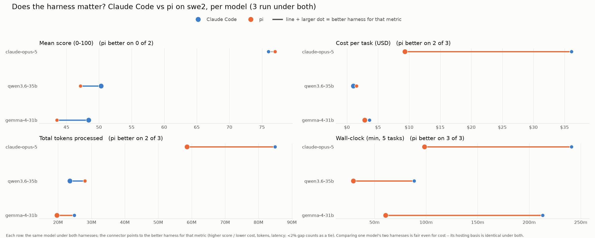
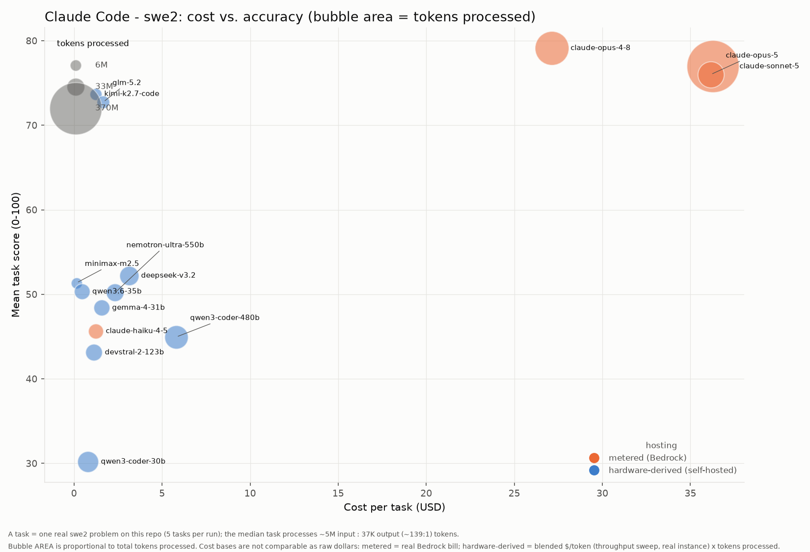

# Agentic coding: model comparison on /swe2 (quality, tokens, cost)

How every benchmarked model compares as an **agentic coding** engine on real `/swe2` tasks against `mcp-gateway-registry`, under **both harnesses** (Claude Code and pi). Unlike the serving-economics view in [agentic-coding-throughput-comparison.md](agentic-coding-throughput-comparison.md) (synthetic throughput sweep), this doc is built from the actual benchmark runs and combines the three axes a buyer trades off -- **quality, tokens, and cost** -- plus wall-clock latency.

Generated from the committed `run-summary.json` files; regenerate with `uv run scripts/gen_swe_comparison.py --skill swe2`. Numbers match the per-harness docs ([Claude Code](harness-claude-code-swe2.md), [pi](harness-pi-swe2.md)) and the charts below exactly.

## Cost basis (read this first)

Two non-comparable cost bases share the cost columns; each row states which:

- **metered (Bedrock)** -- a hosted API's real per-token bill, summed over the run. Benefits from Bedrock prompt caching.
- **hardware-derived (self-hosted)** -- a rented GPU has no per-token bill, so cost is the model's blended $/token (measured by the throughput sweep at its true instance rate -- g6e.12xlarge for L40S, p5en.48xlarge for H200) times the tokens the run processed. See [cost-per-task-methodology.md](cost-per-task-methodology.md).

`Cost/task` = run cost / scored tasks. `Cost/point` = run cost / mean score -- a value-efficiency figure (lower is more quality per dollar).

## Does the harness matter?

For every model run under both harnesses, this compares Claude Code vs pi on each metric. Each row is one model; the connector points to the better harness (higher score / lower cost, tokens, latency), and each panel title tallies how often pi wins. Comparing one model's two harnesses is fair even for cost -- its hosting basis is identical under both.



## Results by harness

For each harness: a results table (quality, tokens, run cost + the two normalized cost lenses, wall-clock; sorted by score) followed by a cost-vs-accuracy bubble chart -- x = cost/task, y = mean score, bubble area = tokens processed, color = hosting basis.

### Claude Code

| Model | Hosting | Mean score | Completed | Tokens processed | Run cost | Cost/task | Cost/point | Wall-clock |
|---|---|---:|---:|---:|---:|---:|---:|---:|
| claude-opus-4-8 | Bedrock | 79.12 | 5/5 | 150.0M | $135.69 | $27.14 | $1.71 | 178m |
| claude-sonnet-5 | Bedrock | 76.96 | 5/5 | 370.3M | $181.30 | $36.26 | $2.36 | 277m |
| claude-opus-5 | Bedrock | 76.00 | 5/5 | 84.9M | $180.73 | $36.15 | $2.38 | 241m |
| kimi-k2.7-code | self-hosted | 73.69 | 4/5 | 9.0M | $7.50 | $1.88 | $0.10 | 51m |
| glm-5.2 | self-hosted | 72.75 | 5/5 | 11.6M | $12.81 | $2.56 | $0.18 | 73m |
| deepseek-v3.2 | self-hosted | 52.20 | 5/5 | 40.9M | $24.05 | $4.81 | $0.46 | 80m |
| minimax-m2.5 | self-hosted | 51.35 | 5/5 | 6.3M | $1.07 | $0.21 | $0.02 | 10m |
| qwen3.6-35b | self-hosted | 50.32 | 5/5 | 23.5M | $5.13 | $1.03 | $0.10 | 88m |
| nemotron-ultra-550b | self-hosted | 50.20 | 4/5 | 32.8M | $14.34 | $3.58 | $0.29 | 70m |
| gemma-4-31b | self-hosted | 48.40 | 5/5 | 24.8M | $18.09 | $3.62 | $0.37 | 213m |
| claude-haiku-4-5 | Bedrock | 45.64 | 5/5 | 20.5M | $6.15 | $1.23 | $0.13 | 22m |
| qwen3-coder-480b | self-hosted | 44.95 | 4/5 | 66.2M | $35.69 | $8.92 | $0.79 | 68m |
| devstral-2-123b | self-hosted | 43.12 | 5/5 | 28.1M | $8.70 | $1.74 | $0.20 | 51m |
| qwen3-coder-30b | self-hosted | 30.20 | 4/5 | 50.7M | $7.38 | $1.84 | $0.24 | 84m |
| qwen3-coder-next | self-hosted | -- (0 scored) | 0/1 | 0 | -- | -- | -- | 3m |

Cost vs. accuracy (Claude Code) -- bubble area = tokens processed, color = hosting (Bedrock vs self-hosted):



### pi

| Model | Hosting | Mean score | Completed | Tokens processed | Run cost | Cost/task | Cost/point | Wall-clock |
|---|---|---:|---:|---:|---:|---:|---:|---:|
| claude-opus-5 | Bedrock | 77.00 | 5/5 | 58.6M | $46.56 | $9.31 | $0.60 | 98m |
| qwen3.6-35b | self-hosted | 47.15 | 4/5 | 28.0M | $6.11 | $1.53 | $0.13 | 29m |
| gemma-4-31b | self-hosted | 43.52 | 5/5 | 19.6M | $14.29 | $2.86 | $0.33 | 61m |
| qwen3-coder-30b | self-hosted | -- (0 scored) | 0/5 | 13.2M | $1.92 | -- | -- | 17m |

Cost vs. accuracy (pi) -- bubble area = tokens processed, color = hosting (Bedrock vs self-hosted):


## Takeaways

- **Claude Code:** highest score is **claude-opus-4-8** (79.1); best value (lowest $/point) is **minimax-m2.5** at $0.02/point (score 51.4).
- **pi:** highest score is **claude-opus-5** (77.0); best value (lowest $/point) is **qwen3.6-35b** at $0.13/point (score 47.1).
- **Cost bases are not comparable as raw dollars** -- a Bedrock metered bill and a hardware-derived self-hosted figure answer different questions; compare within a hosting column, and treat cross-hosting ties as order-of-magnitude, not exact (see the methodology doc).
- **The same model can sit very differently under the two harnesses** -- compare a model's row across the two tables and its bubble position (cost and token size) in each chart.

## How to reproduce

```bash
cd benchmarks
uv run python scripts/gen_swe_comparison.py --skill swe2
# charts:
uv run python scripts/plot_cost_accuracy_bubble.py --harness pi --skill swe2
uv run python scripts/plot_cost_accuracy_bubble.py --harness claude-code --skill swe2
```
