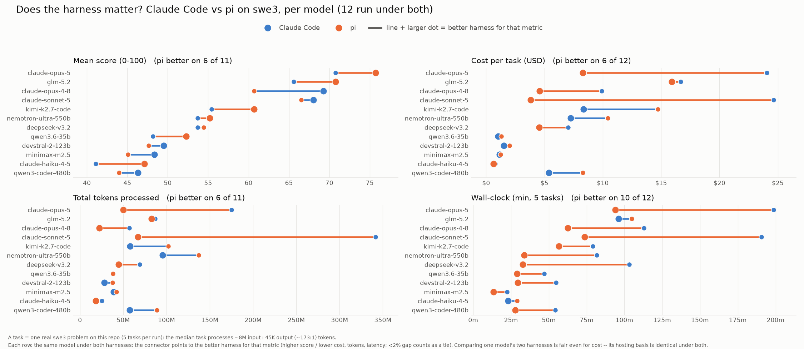

# Agentic coding: model comparison on /swe3 (quality, tokens, cost)

How every benchmarked model compares as an **agentic coding** engine on real `/swe3` tasks against `mcp-gateway-registry`, under **both harnesses** (Claude Code and pi). Unlike the serving-economics view in [agentic-coding-throughput-comparison.md](agentic-coding-throughput-comparison.md) (synthetic throughput sweep), this doc is built from the actual benchmark runs and combines the three axes a buyer trades off -- **quality, tokens, and cost** -- plus wall-clock latency.

Generated from the committed `run-summary.json` files; regenerate with `uv run scripts/gen_swe_comparison.py --skill swe3`. Numbers match the per-harness docs ([Claude Code](harness-claude-code-swe3.md), [pi](harness-pi-swe3.md)) and the charts below exactly.

## Cost basis (read this first)

Two non-comparable cost bases share the cost columns; each row states which:

- **metered (Bedrock)** -- a hosted API's real per-token bill, summed over the run. Benefits from Bedrock prompt caching.
- **hardware-derived (self-hosted)** -- a rented GPU has no per-token bill, so cost is the model's blended $/token (measured by the throughput sweep at its true instance rate -- g6e.12xlarge for L40S, p5en.48xlarge for H200) times the tokens the run processed. See [cost-per-task-methodology.md](cost-per-task-methodology.md).

`Cost/task` = run cost / scored tasks. `Cost/point` = run cost / mean score -- a value-efficiency figure (lower is more quality per dollar).

## Does the harness matter?

For every model run under both harnesses, this compares Claude Code vs pi on each metric. Each row is one model; the connector points to the better harness (higher score / lower cost, tokens, latency), and each panel title tallies how often pi wins. Comparing one model's two harnesses is fair even for cost -- its hosting basis is identical under both.



## Results by harness

For each harness: a results table (quality, tokens, run cost + the two normalized cost lenses, wall-clock; sorted by score) followed by a cost-vs-accuracy bubble chart -- x = cost/task, y = mean score, bubble area = tokens processed, color = hosting basis.

### Claude Code

| Model | Hosting | Mean score | Completed | Tokens processed | Run cost | Cost/task | Cost/point | Wall-clock |
|---|---|---:|---:|---:|---:|---:|---:|---:|
| claude-opus-5 | Bedrock | 70.76 | 5/5 | 175.1M | $120.25 | $24.05 | $1.70 | 199m |
| claude-opus-4-8 | Bedrock | 69.24 | 5/5 | 57.0M | $49.51 | $9.90 | $0.72 | 113m |
| claude-sonnet-5 | Bedrock | 68.04 | 5/5 | 341.6M | $123.20 | $24.64 | $1.81 | 191m |
| glm-5.2 | self-hosted | 65.60 | 5/5 | 86.8M | $96.16 | $19.23 | $1.47 | 96m |
| kimi-k2.7-code | self-hosted | 55.44 | 5/5 | 57.9M | $48.13 | $9.63 | $0.87 | 79m |
| deepseek-v3.2 | self-hosted | 53.72 | 5/5 | 68.9M | $40.48 | $8.10 | $0.75 | 103m |
| nemotron-ultra-550b | self-hosted | 53.68 | 5/5 | 95.6M | $41.80 | $8.36 | $0.78 | 82m |
| devstral-2-123b | self-hosted | 49.52 | 5/5 | 28.2M | $8.73 | $1.75 | $0.18 | 55m |
| minimax-m2.5 | self-hosted | 48.36 | 5/5 | 39.0M | $6.65 | $1.33 | $0.14 | 22m |
| qwen3.6-35b | self-hosted | 48.16 | 5/5 | 37.8M | $8.25 | $1.65 | $0.17 | 47m |
| qwen3-coder-480b | self-hosted | 46.32 | 5/5 | 57.5M | $30.99 | $6.20 | $0.67 | 54m |
| claude-haiku-4-5 | Bedrock | 41.08 | 5/5 | 25.4M | $3.99 | $0.80 | $0.10 | 23m |

Cost vs. accuracy (Claude Code) -- bubble area = tokens processed, color = hosting (Bedrock vs self-hosted):


### pi

| Model | Hosting | Mean score | Completed | Tokens processed | Run cost | Cost/task | Cost/point | Wall-clock |
|---|---|---:|---:|---:|---:|---:|---:|---:|
| claude-opus-5 | Bedrock | 75.72 | 5/5 | 50.0M | $41.42 | $8.28 | $0.55 | 94m |
| glm-5.2 | self-hosted | 70.76 | 5/5 | 82.7M | $91.65 | $18.33 | $1.30 | 105m |
| claude-sonnet-5 | Bedrock | 66.52 | 5/5 | 67.0M | $19.07 | $3.81 | $0.29 | 74m |
| claude-opus-4-8 | Bedrock | 60.68 | 5/5 | 22.5M | $22.99 | $4.60 | $0.38 | 63m |
| kimi-k2.7-code | self-hosted | 60.68 | 5/5 | 102.1M | $84.89 | $16.98 | $1.40 | 57m |
| nemotron-ultra-550b | self-hosted | 55.20 | 5/5 | 137.3M | $60.06 | $12.01 | $1.09 | 34m |
| deepseek-v3.2 | self-hosted | 54.44 | 5/5 | 44.5M | $26.17 | $5.23 | $0.48 | 33m |
| qwen3.6-35b | self-hosted | 52.30 | 4/5 | 37.9M | $8.27 | $2.07 | $0.16 | 29m |
| devstral-2-123b | self-hosted | 47.64 | 5/5 | 37.5M | $11.60 | $2.32 | $0.24 | 30m |
| claude-haiku-4-5 | Bedrock | 47.12 | 5/5 | 18.1M | $3.21 | $0.64 | $0.07 | 29m |
| minimax-m2.5 | self-hosted | 45.08 | 5/5 | 42.3M | $7.20 | $1.44 | $0.16 | 13m |
| qwen3-coder-480b | self-hosted | 43.96 | 5/5 | 88.7M | $47.79 | $9.56 | $1.09 | 28m |
| gemma-4-31b | self-hosted | 42.96 | 5/5 | 32.9M | $23.93 | $4.79 | $0.56 | 58m |
| qwen3-coder-30b | self-hosted | 26.90 | 2/5 | 19.6M | $2.85 | $1.43 | $0.11 | 18m |

Cost vs. accuracy (pi) -- bubble area = tokens processed, color = hosting (Bedrock vs self-hosted):


## Takeaways

- **Claude Code:** highest score is **claude-opus-5** (70.8); best value (lowest $/point) is **claude-haiku-4-5** at $0.10/point (score 41.1).
- **pi:** highest score is **claude-opus-5** (75.7); best value (lowest $/point) is **claude-haiku-4-5** at $0.07/point (score 47.1).
- **Cost bases are not comparable as raw dollars** -- a Bedrock metered bill and a hardware-derived self-hosted figure answer different questions; compare within a hosting column, and treat cross-hosting ties as order-of-magnitude, not exact (see the methodology doc).
- **The same model can sit very differently under the two harnesses** -- compare a model's row across the two tables and its bubble position (cost and token size) in each chart.

## How to reproduce

```bash
cd benchmarks
uv run python scripts/gen_swe_comparison.py --skill swe3
# charts:
uv run python scripts/plot_cost_accuracy_bubble.py --harness pi --skill swe3
uv run python scripts/plot_cost_accuracy_bubble.py --harness claude-code --skill swe3
```
