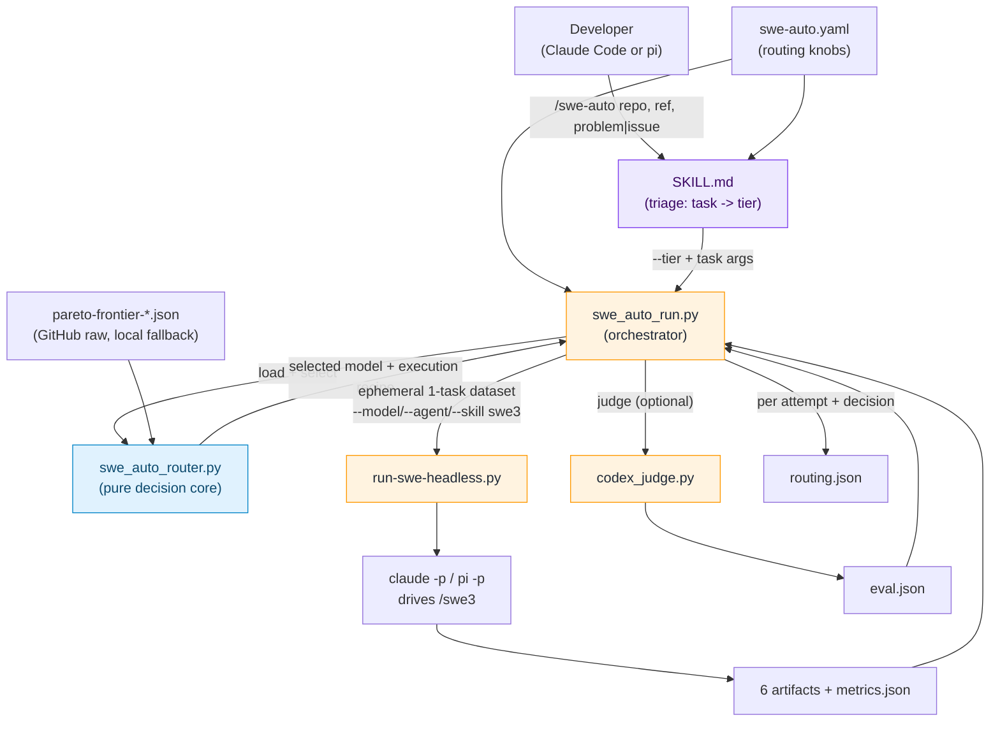
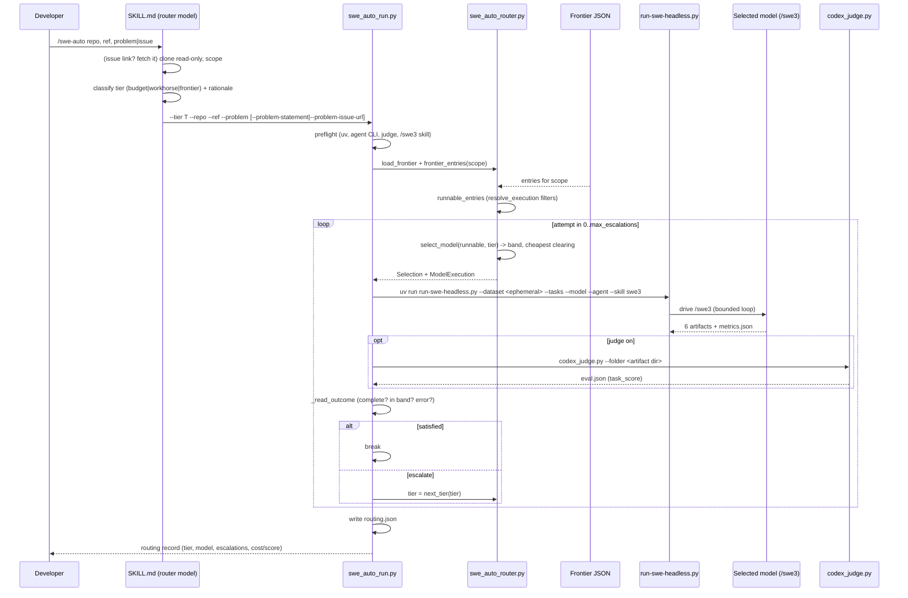

# /swe-auto design: HLD + LLD

*Status: implemented (v1, issue [#123](https://github.com/aarora79/agentic-coding-harness-benchmarks/issues/123)). Branch: `feat/swe-auto-router`.*

This is the single design reference for the `/swe-auto` cost-aware router skill. It is layered so you can read only as deep as you need:

- **HLD - 100 level:** what it is and why, in a paragraph.
- **HLD - 200 level:** the components and how they divide the work (block diagram).
- **HLD - 300 level:** the end-to-end flow (sequence diagram) and the data contracts.
- **LLD:** module-by-module internals, the selection and escalation algorithms, data structures, and code snippets.

For the user-facing guide (how to run it), see [docs/swe-auto.md](../swe-auto.md). For the north star, see [docs/vision.md](../vision.md).

---

## HLD - 100 level: what and why

A developer usually picks one model and uses it for everything, which over-pays on routine work and under-delivers on hard work. This repo already measures a **cost/quality Pareto frontier** (the set of models where nothing else is both better and cheaper). `/swe-auto` is the consumer of that frontier: given a repo, a ref, and a problem, it **classifies how hard the task is**, then **routes it to the cheapest model that is good enough**, runs the existing `/swe3` skill with that model, and **escalates to a stronger model only if the run falls short**. The developer never chooses the model; they get frontier-quality results at workhorse cost.

## HLD - 200 level: components and responsibilities

`/swe-auto` deliberately separates the one **model-driven judgement** (how hard is this task?) from all the **deterministic mechanics** (which model, how to run it, did it work, escalate?). Three components, plus the reused harness:

| Component | Kind | Responsibility |
|---|---|---|
| `.claude/skills/swe-auto/SKILL.md` | Model-driven | Read the task (and, for an issue link, fetch it), scope the repo read-only, and **classify the task into a tier** (budget/workhorse/frontier). Then hand off. |
| `benchmarks/scripts/swe_auto_router.py` | Pure / deterministic | Parse the frontier, map tier -> quality band (with `budget_posture`), pick the **cheapest non-dominated model that clears the band**, and resolve **how to launch** it. No I/O in the hot path; fully unit-tested. |
| `benchmarks/scripts/swe_auto_run.py` | Orchestrator (I/O) | Preflight; write an ephemeral one-task dataset; invoke the in-repo headless runner; optionally run the judge; assess the outcome; **escalate a tier and re-run** on shortfall; write `routing.json`. |
| `run-swe-headless.py` + `codex_judge.py` | Reused, unchanged | Clone the repo, drive `/swe3`, produce the six artifacts + `metrics.json`; score them into `eval.json`. |



## HLD - 300 level: end-to-end flow and data contracts

The flow implements the sequence in [vision.md](../vision.md). The one difference from that idealized diagram: the judge is a **separate step** (`codex_judge.py`) after the runner, not inside it.



### Data contracts

**In - frontier JSON** (`docs/metrics/pareto-frontier-<code>-<skill>.json`, `<code>` in cc/pi/kiro). Read one of three lists by `frontier_scope`: `combined_frontier_cross_hosting_directional`, `bedrock_frontier`, `self_hosted_frontier`. Each entry:

```json
{ "model": "claude-opus-5", "mean_score": 75.72, "mean_cost_per_task": 8.28,
  "hosting": "Bedrock", "n_scored": 5, "n_tasks": 5, "completed": "5/5" }
```

**Out - `routing.json`** (written in the selected model's artifact dir): `task` (repo/ref/problem/issue), `initial_tier`, `final_tier`, `selected_model`, `harness`, `skill`, `candidates_considered`, `pricing_basis`, `judge_enabled`, `succeeded`, `escalations[]` (one record per attempt: tier, model, band_floor, complete, score, in_band, cost_usd, artifact_dir), and frontier provenance (`frontier_file`, `frontier_source`, `frontier_as_of`, `frontier_stale_warning`).

---

## LLD

### Data structures (`swe_auto_router.py`)

Config is a Pydantic model with `extra="forbid"` (unknown keys rejected). The task (repo/ref/problem) is never here - only routing behavior.

```python
class SweAutoConfig(BaseModel):
    router_model: str = "claude-opus-5"     # triage classifier (recorded in v1)
    harness: str = "pi"                       # claude-code | pi ; picks frontier code + --agent
    skill: str = "swe3"
    frontier_file: str | None = None          # URL or path; default = canonical GitHub raw
    frontier_scope: str = "combined"           # combined | bedrock-only | self-hosted-only
    budget_posture: str = "balanced"           # cheap | balanced | best
    posture_shift_points: float = 5.0
    judge: bool = True
    max_escalations: int = 1
    reliability_gating: bool = True
    aws_region: str | None = None
    tier_bands: dict[str, float | None] = {budget: 47, workhorse: 54, frontier: None}
    model_execution: dict[str, ModelExecution] = {}   # override layer (see below)

    @property
    def agent(self) -> str:                    # claude-code -> claude, pi -> pi
        return _HARNESS_AGENT[self.harness]
```

`ModelExecution` is how to launch one model: `{provider: "bedrock"|"endpoint", model: <wire id>, endpoint: <url|None>}`. `FrontierEntry` mirrors a frontier row and derives `is_full` (`n_scored == n_tasks`) and `pricing_basis` (`metered` for Bedrock, else `hardware-derived`). `Selection` carries the outcome: `{tier, band_floor, selected_model, selected_entry, clears_band, candidates_considered, rationale}`.

### Frontier as the selectable universe; execution is a thin override

The frontier lists a **slug** and hosting, but not the wire id or endpoint. `resolve_execution` supplies those, and `runnable_entries` filters the frontier to only what can actually be launched here - so the router never picks a model it cannot run.

```python
def resolve_execution(config, entry) -> ModelExecution | None:
    override = config.model_execution.get(entry.model)      # 1. user override wins
    if override is not None:
        return override
    builtin = _BUILTIN_EXECUTION.get(entry.model)           # 2. built-in Bedrock recipe
    if builtin is not None:
        return builtin
    if entry.hosting.lower().startswith("bedrock") and entry.model.startswith("claude-"):
        return ModelExecution(provider="bedrock", model=f"us.anthropic.{entry.model}")  # 3. derive
    return None                                              # 4. self-hosted w/o endpoint -> not runnable

def runnable_entries(entries, config):
    return [e for e in entries if resolve_execution(config, e) is not None]
```

So Bedrock Anthropic models work with zero config; a self-hosted model becomes selectable only once its `endpoint` is added to `model_execution`.

### Tier -> quality band

The frontier tier has **no** numeric floor (pick the top model, cost no object). Budget/workhorse floors shift with `budget_posture`.

```python
POSTURE_SIGN = {"cheap": -1, "balanced": 0, "best": 1}

def _band_floor(tier, config) -> float | None:
    base = config.tier_bands.get(tier)          # frontier -> None
    if base is None:
        return None
    shift = POSTURE_SIGN[config.budget_posture] * config.posture_shift_points
    return max(0.0, base + shift)
```

### Selection algorithm

Pure over the candidates it is given (filter to runnable first). Cheapest that clears the band, with reliability gating; the frontier tier takes the top score; a no-clearing case falls back to the best-effort top model and flags `clears_band = False`.

```python
def select_model(entries, tier, config) -> Selection:
    floor = _band_floor(tier, config)
    if not entries: raise RouterError(...)
    if floor is None:                                  # frontier tier
        chosen = max(entries, key=lambda e: (e.mean_score, -e.mean_cost_per_task))
    else:
        clearing = [e for e in entries if e.mean_score >= floor]
        pool = [e for e in clearing if e.is_full] if config.reliability_gating else clearing
        pool = pool or clearing                        # fall back off "full" if none clear full
        chosen = min(pool, key=lambda e: (e.mean_cost_per_task, -e.mean_score)) if pool else None
        if chosen is None:                             # nothing clears -> best effort, flagged
            chosen = max(entries, key=lambda e: e.mean_score)
    # ... build Selection(clears_band=..., rationale=..., candidates_considered=[e.model ...])
```

`next_tier` is the escalation ladder over `("budget", "workhorse", "frontier")`, returning `None` at the top.

### Frontier loading (provenance + fallback)

`load_frontier` prefers the canonical GitHub-raw URL and falls back to the committed local copy, recording where the data came from and warning when it fell back (so `routing.json` is honest about freshness).

```python
data = _fetch_json_url(url)                     # canonical (or explicit) URL
if data is not None:
    return data, {"frontier_source": "github-raw", ...}
data = _read_json_file(local)                   # docs/metrics fallback
return data, {"frontier_source": "local-fallback",
              "stale": "canonical URL unreachable; local copy may lag main"}
```

### Orchestration (`swe_auto_run.py`)

**Ephemeral dataset.** The runner is dataset-driven, so `/swe-auto` synthesizes a one-task dataset instead of adding a task interface. It threads through the full `problem_statement` and/or a `problem_issue_url` (a task needs at least one source; when only the issue URL is given it stays the sole source):

```python
task = {"id": problem, "repo": repo, "ref": ref, "complexity": "medium", "tags": ["swe-auto"]}
if statement:            task["problem_statement"] = statement
elif not issue_url:      task["problem_statement"] = "<generic pointer to the slug>"
if issue_url:            task["problem_issue_url"] = issue_url
# written with yaml.safe_dump (escaped), validated by the real dataset_loader
```

**Runner command** (list form, hardcoded `uv`; no `--permission-mode`/`--allowedTools` widening - inherits the runner's narrow defaults):

```python
cmd = ["uv","run","scripts/run-swe-headless.py","--agent",config.agent,"--skill",config.skill,
       "--provider",execution.provider,"--model",execution.model,
       "--dataset",str(dataset_path),"--tasks",problem]
if execution.provider == "endpoint" and execution.endpoint: cmd += ["--endpoint", execution.endpoint]
if execution.provider == "bedrock" and config.aws_region:   cmd += ["--aws-region", config.aws_region]
```

**Artifact dir** reuses the harness's own `model_to_slug` + `HARNESS_SLUGS` so `/swe-auto` reads back exactly the folder the runner wrote:
`benchmarks/swe-benchmark-data/<model-slug>/<harness>/<skill>/<repo>/<task>/`.

**Outcome assessment.** Completeness = all six artifacts. A score is only trusted when the judge ran **this** pass (so a stale committed `eval.json` in a reused folder is never misattributed):

```python
def _read_outcome(artifact_dir, band_floor, judge):
    complete = all six artifacts exist
    score = read eval.json.task_score  ONLY if judge else None
    in_band = True if (not judge or band_floor is None) else (score is not None and score >= band_floor)
    return {complete, artifacts_produced, score, in_band, cost, is_error}
# satisfied = complete and not is_error and in_band
```

**Escalation loop** (`run_swe_auto`): preflight -> load/filter frontier -> for each attempt: select, execute, (judge), assess; break when satisfied, else `tier = next_tier(tier)` until the cap or the ceiling; finally write `routing.json`. With judge **off**, only non-completion escalates; with judge **on**, a below-band score also escalates.

**Preflight** fails closed with a clear list: `uv`, the agent CLI (`claude`/`pi`/`kiro-cli`), `codex` when `judge` is on, and the `/swe3` skill file; it warns (not blocks) when `aws` is absent.

### CLI surface

`swe_auto_run.py` is the skill's single entrypoint: `--tier` (from triage), `--repo/--ref/--problem`, `--problem-statement` and/or `--problem-issue-url`, `--config`, plus overrides (`--harness`, `--frontier-scope`, `--budget-posture`, `--max-escalations`, `--no-judge`). `--dry-run` previews the decision without executing; `--preflight` checks prerequisites only. `swe_auto_router.py` also exposes a `select` preview command.

### Error handling and edge cases

- **No runnable model** (e.g. self-hosted-only scope with no endpoints configured) -> `RouterError` with a fix hint, before any execution.
- **Nothing clears the band** -> pick the highest-scoring runnable model, set `clears_band = False`, and record it in the rationale rather than failing.
- **Frontier URL unreachable** -> local fallback with a `stale` warning in `routing.json`.
- **Subprocess timeouts** -> a generous outer cap above the runner's own per-task timeout; a timeout raises `RouterError`.
- **Reused artifact folder with a stale `eval.json`** -> ignored when judge is off (see `_read_outcome`).

### Testing

Pure logic is exhaustively unit-tested (`tests/test_swe_auto_router.py`): tier->band, posture shifts, cheapest-clearing, reliability gating, no-clearing fallback, `resolve_execution` (builtin/derived/self-hosted/override), scope selection, config validation, and a test against the real committed pi/swe3 frontier. The orchestrator's pure helpers are tested without subprocesses (`tests/test_swe_auto_run.py`): ephemeral-dataset shape + round-trip through the real loader, artifact-dir layout, runner-command construction, outcome assessment (complete/in-band/judge-off/stale-eval), and pricing basis. The repo uses `unittest` (not pytest). End-to-end was smoke-tested on the hello-world task (budget -> haiku, 6/6 artifacts, `routing.json` written).

### Extensibility / follow-ups (out of v1)

- **Per-phase routing** (plan with a frontier model, execute with a workhorse) - needs `/swe3` to expose phase boundaries.
- **In-flight model switching** - today each headless run uses one model; escalation is between runs.
- **Dispatch triage to a distinct `router_model`** - v1 triages with the active session model and records both.
- **Package the runner as a pinned installable** for use outside this repo (the monorepo executor is v1).
