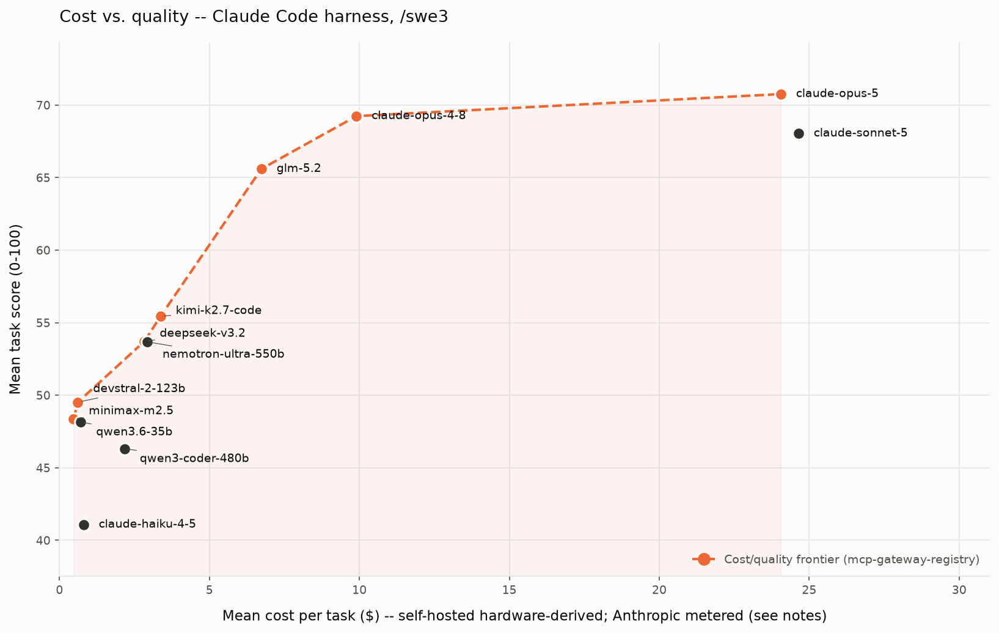
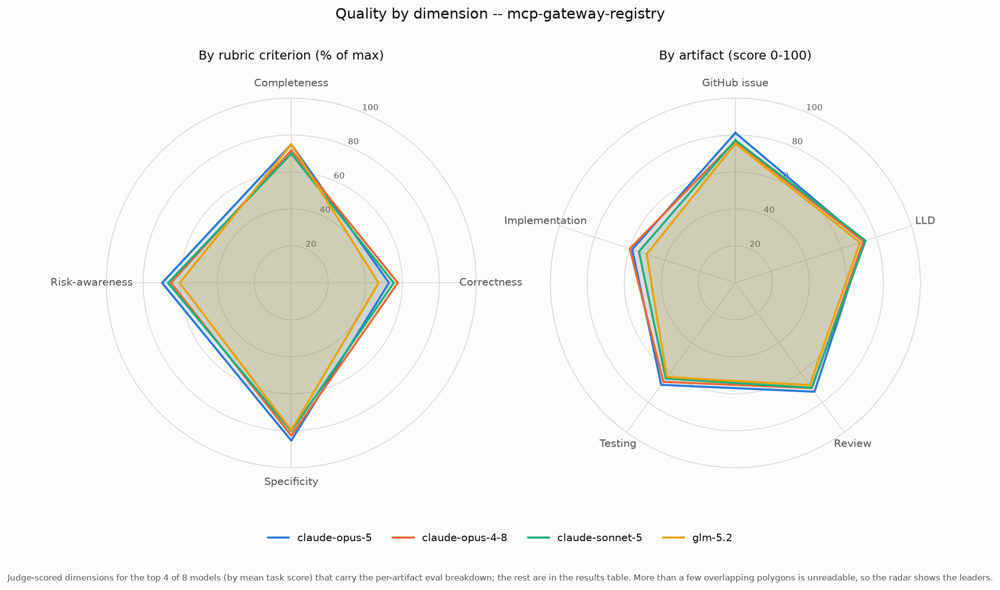
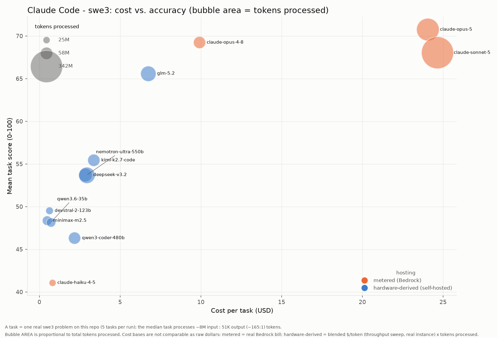

# Results: Claude Code harness (swe3)

Benchmark results for every model run under the **Claude Code** coding agent with the **swe3** skill on `mcp-gateway-registry`, generated from the committed `run-summary.json` files. Regenerate with `uv run scripts/gen_agent_report.py --harness claude-code --skill swe3`. Companion to the cross-harness comparison [agentic-coding-swe-comparison-swe3.md](agentic-coding-swe-comparison-swe3.md).

## Results by model

| Model | Mean score | Completed | Input | Output | Cache read | Cache write | Tokens processed† | Wall-clock | Run cost | Cost basis* |
|---|---:|---:|---:|---:|---:|---:|---:|---:|---:|---|
| claude-opus-5 | 70.76 | 5/5 | 1,426 | 986,884 | 172,663,618 | 1,477,502 | 175,129,430 | 198.6m | $120.25 | metered (Bedrock) |
| claude-opus-4-8 | 69.24 | 5/5 | 981 | 510,834 | 55,313,612 | 1,223,230 | 57,048,657 | 112.8m | $49.51 | metered (Bedrock) |
| claude-sonnet-5 | 68.04 | 5/5 | 2,608 | 893,437 | 338,489,015 | 2,187,670 | 341,572,730 | 190.7m | $123.20 | metered (Bedrock) |
| glm-5.2 | 65.60 | 5/5 | 86,412,298 | 366,782 | 0 | 0 | 86,779,080 | 96.2m | $33.66 | hardware-derived (p5en.48xlarge) |
| kimi-k2.7-code | 55.44 | 5/5 | 57,498,222 | 369,345 | 0 | 0 | 57,867,567 | 79.2m | $16.84 | hardware-derived (p5en.48xlarge) |
| deepseek-v3.2 | 53.72 | 5/5 | 68,435,917 | 427,635 | 0 | 0 | 68,863,552 | 103.2m | $14.17 | hardware-derived (p5en.48xlarge) |
| nemotron-ultra-550b | 53.68 | 5/5 | 95,277,127 | 326,132 | 0 | 0 | 95,603,259 | 81.7m | $14.63 | hardware-derived (p5en.48xlarge) |
| devstral-2-123b | 49.52 | 5/5 | 28,067,376 | 139,691 | 0 | 0 | 28,207,067 | 54.7m | $3.06 | hardware-derived (p5en.48xlarge) |
| minimax-m2.5 | 48.36 | 5/5 | 38,909,159 | 120,433 | 0 | 0 | 39,029,592 | 22.3m | $2.33 | hardware-derived (p5en.48xlarge) |
| qwen3.6-35b | 48.16 | 5/5 | 37,541,216 | 276,328 | 0 | 0 | 37,817,544 | 46.9m | $3.56 | hardware-derived (g6e.12xlarge) |
| qwen3-coder-480b | 46.32 | 5/5 | 57,354,169 | 166,265 | 0 | 0 | 57,520,434 | 54.4m | $10.85 | hardware-derived (p5en.48xlarge) |
| claude-haiku-4-5 | 41.08 | 5/5 | 428 | 147,913 | 24,580,868 | 635,273 | 25,364,482 | 23.0m | $3.99 | metered (Bedrock) |

\* **Cost basis differs by row and the dollars are NOT directly comparable.** _hardware-derived (throughput)_ (self-hosted vLLM): a rented GPU has no per-token bill, so cost is the model's blended cost-per-token -- measured by the throughput sweep at its true instance rate (g6e.12xlarge for L40S, p5en.48xlarge for H200) and peak concurrency -- times the tokens this run processed. This prices the real work done, unlike a wall-clock estimate that would also charge idle agent-thinking time. _metered (Bedrock)_: a hosted API's real per-token bill, summed over the run. It is a metered invoice, not a hardware estimate, and (unlike the self-hosted rows) it benefits from Bedrock prompt caching. See [cost-per-task-methodology.md](cost-per-task-methodology.md).

† **Tokens processed** counts input + output + cache-read + cache-write -- all tokens the model actually processed, not just fresh input+output. On the Bedrock path a task often reports only ~2 fresh input tokens with the rest served from prompt cache, so counting input+output alone would understate the real work ~100x. (Self-hosted rows report their cache reuse via server-side Prometheus counters, folded in here where present.)

A task scoring 0 (missing/empty artifacts) is a model failure, excluded from the mean but counted in `Completed`. A model with 0 scored tasks did not complete any task under this harness.

## Charts

### Cost vs. quality (Pareto frontier)

### Quality by dimension (radar)

### Cost vs. accuracy (bubble area = tokens)

x = cost per task, y = mean score, bubble area = total tokens processed, color = hosting basis (metered Bedrock vs hardware-derived self-hosted -- NOT directly comparable as raw dollars; see the cost note above).

