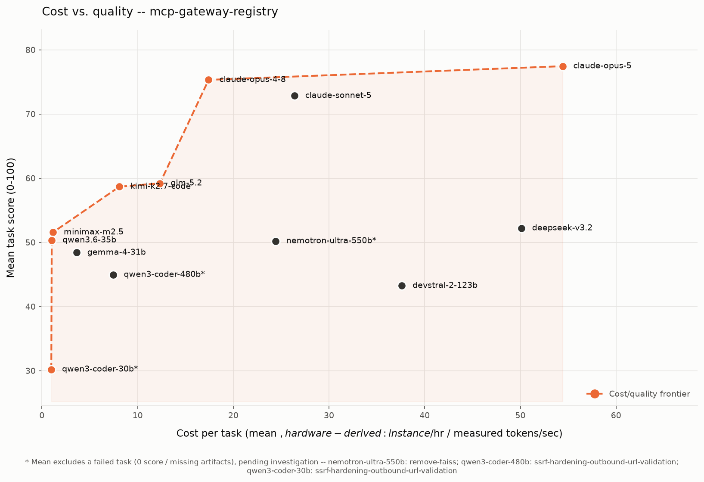
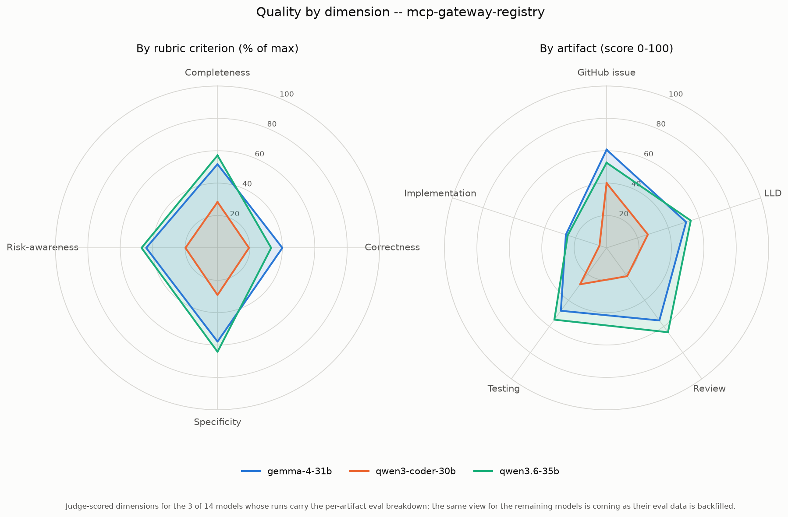

# Results: Claude Code harness

Benchmark results for every model run under the **Claude Code** coding agent on `mcp-gateway-registry`, generated from the committed `run-summary.json` files. Regenerate with `uv run scripts/gen_agent_report.py --harness claude-code`. Companion to the cross-agent [harness comparison](harness-comparison.md).

## Results by model

| Model | Mean score | Completed | Total tokens | Wall-clock | Run cost* |
|---|---:|---:|---:|---:|---:|
| us.anthropic.claude-opus-5[1m] | 77.45 | 4/4 | 968,972 | 366.0m | $64.00 |
| us.anthropic.claude-opus-4-8 | 75.32 | 5/5 | 507,617 | 127.9m | $22.36 |
| us.anthropic.claude-sonnet-5 | 72.84 | 5/5 | 1,009,920 | 267.7m | $46.81 |
| glm-5.2 | 61.96 | 5/5 | 50,051,636 | 65.0m | $11.37 |
| kimi-k2.7-code | 58.68 | 5/5 | 47,675,538 | 130.3m | $22.79 |
| deepseek-v3.2 | 52.20 | 5/5 | 40,916,403 | 80.3m | $14.04 |
| minimax-m2.5 | 51.56 | 5/5 | 33,957,716 | 22.7m | $3.97 |
| qwen3.6-35b | 50.32 | 5/5 | 23,541,194 | 88.4m | $15.46 |
| nemotron-ultra-550b | 50.20 | 4/5 | 32,802,785 | 70.2m | $12.27 |
| gemma-4-31b | 48.40 | 5/5 | 24,842,600 | 213.0m | $37.24 |
| us.anthropic.claude-haiku-4-5-20251001-v1:0 | 47.92 | 5/5 | 166,140 | 28.4m | $4.97 |
| qwen3-coder-480b | 44.95 | 4/5 | 66,233,836 | 68.2m | $11.93 |
| devstral-2-123b | 43.12 | 5/5 | 28,118,483 | 50.6m | $8.84 |
| qwen3-coder-30b | 30.20 | 4/5 | 50,725,919 | 84.2m | $14.71 |

\* Run cost is the whole 4-task run, hardware-derived at g6e.12xlarge on-demand ($10.49/hr): `($/hr / 3600) x wall-clock seconds`. On a rented GPU there is no per-token bill, so time is the cost -- see [cost-per-task-methodology.md](cost-per-task-methodology.md).

A task scoring 0 (missing/empty artifacts) is a model failure, excluded from the mean but counted in `Completed`. A model with 0 scored tasks did not complete any task under this harness.

## Charts

### Cost vs. quality (Pareto frontier)

### Quality by dimension (radar)

