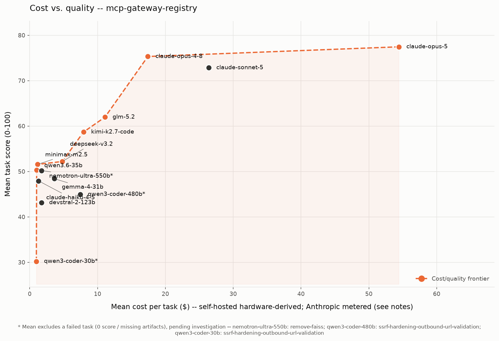
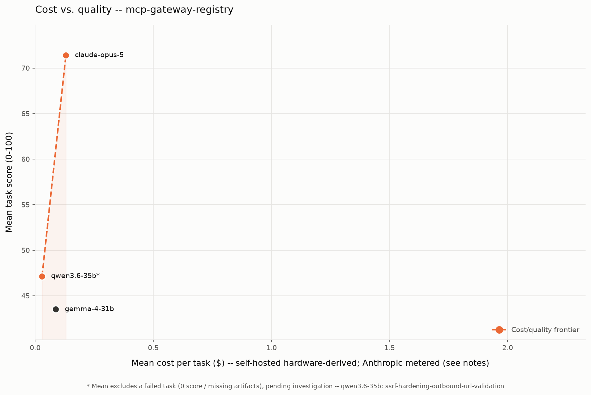
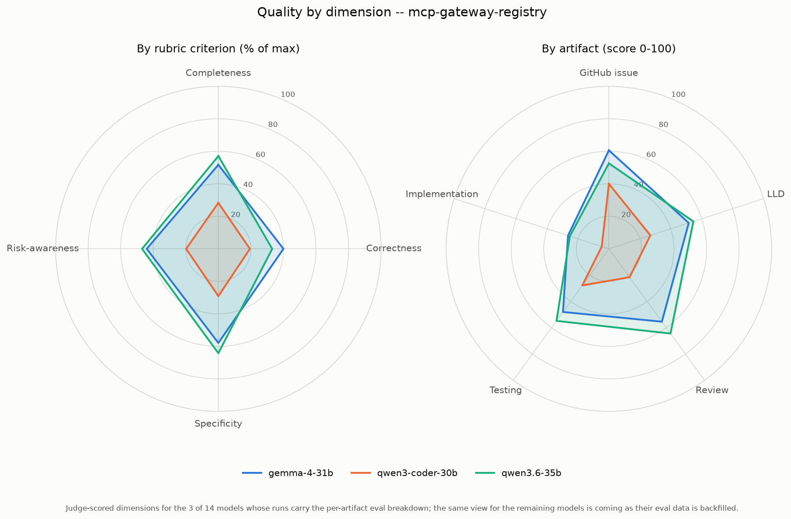
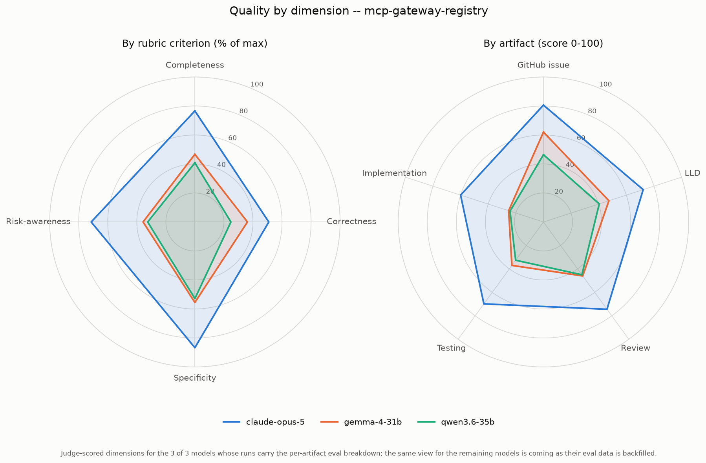

# Harness comparison: Claude Code vs pi

How the **same models** on the **same tasks** and the **same self-hosted vLLM endpoint** behave under two different coding agents (harnesses): [Claude Code](https://docs.anthropic.com/en/docs/claude-code) and [pi](https://github.com/earendil-works/pi-coding-agent). A third harness, [opencode](https://opencode.ai), is being added.

This is a living document. It currently covers **3 models** benchmarked on `mcp-gateway-registry` (5 tasks, tag `1.24.4`, judged by the same codex `gpt-5.6-sol` rubric). We will keep extending it as more models and harnesses are measured.

_Last updated: 2026-08-01._

> Both harnesses ran against the **identical** self-hosted vLLM server (`provider=endpoint`, g6e.12xlarge, 4xL40S, 200K window, prefix caching on). So token counts and wall-clock times are measured on the same basis and are directly comparable -- this is not a hosted-API-vs-self-hosted accounting difference.

## The headline

**Claude Code is a few percentage points more accurate; pi is drastically more token-efficient, and therefore much faster, and therefore -- on a self-hosted vLLM instance billed by the hour -- much cheaper.**

On a rented GPU there is no per-token bill: the only real cost is `(_instance $/hr_ / 3600) x wall-clock seconds` (see [cost-per-task-methodology.md](cost-per-task-methodology.md)). So **time is the bill**, and pi's ~3-3.5x speedup on the same hardware translates directly into a ~3-3.5x cost reduction, for a quality give-up in the low single digits.

| Model | Harness | Mean score | Scored | Total tokens | Wall-clock | Run cost* |
|---|---|---:|---:|---:|---:|---:|
| **qwen3.6-35b** | Claude Code | 50.32 | 5/5 | 23,541,194 | 88.4m | $15.46 |
| | pi | 47.15 | 4/5 | 627,404 | 29.4m | $5.14 |
| | **Delta (pi - cc)** | **-3.17** | -1 | **-97%** | **-59.0m (-67%)** | **-$10.32** |
| **gemma-4-31b** | Claude Code | 48.40 | 5/5 | 24,842,600 | 213.0m | $37.24 |
| | pi | 43.52 | 5/5 | 600,667 | 60.8m | $10.63 |
| | **Delta (pi - cc)** | **-4.88** | 0 | **-98%** | **-152.2m (-71%)** | **-$26.61** |
| **qwen3-coder-30b** | Claude Code | 30.20 | 4/5 | 50,725,919 | 84.2m | $14.71 |
| | pi | -- (0/5) | 0/5 | 410,050 | 17.0m | (no output) |

\* Run cost = whole 5-task run, hardware-derived at g6e.12xlarge on-demand ($10.49/hr = $0.002914/sec). This is the cost of the wall-clock time, not a token price.

> **Note on gemma's 5th task.** In the original unattended run, gemma's `migrate-ecs-env-vars-to-secrets-manager` hit the **1-hour per-task wall-clock timeout** under pi and was killed mid-run (0 artifacts), leaving gemma at 4/5. It was **not** a model failure. A re-run with `--timeout-seconds 7200` completed it comfortably in **~15.5 minutes** (46 turns, 6/6 artifacts, scored **43.0**), restoring gemma to **5/5**. The table above reflects the completed 5-task run. Lesson: heavy tasks may need a longer `--timeout-seconds` under pi.

### What the two capable models show

- **qwen3.6-35b:** pi gives up **3.2 quality points** (47.15 vs 50.32) to run in **1/3 the time at 1/3 the cost** ($5.14 vs $15.46).
- **gemma-4-31b:** pi gives up **4.9 points** (43.52 vs 48.40) to run in **~2/7 the time at ~2/7 the cost** ($10.63 vs $37.24) -- a **3.5x cost reduction for a ~10% quality dip**.

The token gap is the mechanism: Claude Code pushes **23M-50M tokens** through the model per run (it re-feeds a growing context every turn), while pi pushes **~500K-600K** for the same five tasks. Same GPU, same accounting -- pi simply does far less token throughput to reach a comparable result, and fewer tokens processed means fewer GPU-seconds, means lower cost.

### The one exception: qwen3-coder-30b

This is a genuine **model-x-harness interaction**, not a harness bug. Under Claude Code, qwen3-coder-30b works (30.2, 4/5 complete). Under pi it **collapses to 0/5**: each task ran only 23-68 turns at 53K-164K tokens -- well under the 200K window, so **not** a context-wall/compaction problem -- then quit early with 0-2 of the 6 artifacts. Claude Code's heavier scaffolding keeps this model driving the `/swe2` skill; pi does not. It is the clearest example of why harness choice matters and why we measure both.

## Charts

The README's two headline charts now exist for both harnesses.

### Cost vs. quality (Pareto frontier)

Claude Code:

pi:

### Quality by dimension (radar)

Claude Code:

pi:

## Claude Code

Anthropic's command-line coding agent, driven headless (`claude -p`). In this repo it is the **default harness** (`--agent claude`) and the one all prior published results use.

**Strengths observed:**
- **Highest quality on every model measured** (50.32 / 48.40 / 30.20 vs pi's 47.15 / 43.52 / 0).
- **Most reliable completion:** 5/5 scored on both capable models; it even keeps a weak model (qwen3-coder-30b) driving the skill to a usable 4/5.
- Its larger token throughput buys thoroughness -- more reading, more tool calls, more iteration per task.

**Costs observed:**
- **Far more GPU time and tokens** for that quality: 23M-50M tokens/run, and 88-213 minutes for five tasks. On a rented instance that thoroughness is what you pay for -- gemma's Claude Code run cost **$37.24** vs pi's **$10.63**.
- The gemma run in particular (213 minutes) shows Claude Code can spend a very long time per task.

## pi

A lightweight open-source coding agent ([earendil-works/pi-coding-agent](https://github.com/earendil-works/pi-coding-agent)), driven headless (`pi -p --mode json`). Selected with `--agent pi`. Results are written to `<model>/pi/<repo>/<task>` so they never overwrite the Claude Code tree. See the pi-specific mechanics (auto-compaction, top-up completion loop, settings.json) in [harness-reference.md](../benchmarks/docs/harness-reference.md).

**Strengths observed:**
- **Drastically more token-efficient:** ~500K-600K tokens/run vs Claude Code's 23M-50M -- a **97-98% reduction** for the same tasks on the same model.
- **Much faster and much cheaper** as a direct consequence: roughly 1/3 the wall-clock time, and the same fraction of the hardware-derived cost.
- On the two capable models it lands within **3-5 points** of Claude Code's quality -- a small give-up for a large cost win.
- The **top-up completion loop works:** it rescued two qwen3.6-35b tasks to 6/6 artifacts (see the `topped up` flags in that run-summary).

**Costs observed:**
- **A few quality points lower** on capable models (a genuine, consistent gap, not noise).
- **Less robust with a weak model:** where Claude Code coaxed qwen3-coder-30b to 4/5, pi got 0/5 -- the model quit the skill early. pi leans on the model to self-drive; a model that does not, fails.
- **Sensitive to the per-task timeout** on heavy tasks: gemma's `migrate-ecs-env-vars-to-secrets-manager` used the full one-hour cap and was killed mid-run on the first attempt (0 artifacts). A re-run at `--timeout-seconds 7200` finished it in ~15.5 minutes (6/6, scored 43.0), so it was a timeout, not a model failure -- but heavy tasks may need a longer `--timeout-seconds` under pi.

## When to use which

- **Maximize quality / robustness, cost secondary** -> Claude Code. Best scores, most reliable completion, keeps weak models on task.
- **Self-hosting on a rented GPU and cost/throughput matters** -> pi. ~90-95% of the quality at ~30% of the cost, and it frees the instance far sooner (more tasks per GPU-hour).
- **Evaluating a new/weaker model** -> run both. The qwen3-coder-30b result shows a model can be usable under one harness and unusable under another; a single-harness number can mislead.

## Method notes

- Same 5 tasks, same tag (`1.24.4`), same judge (codex `gpt-5.6-sol`, high effort, 4-criterion x 25pt rubric).
- A task scoring 0 (missing/empty artifacts) is a model failure, excluded from the mean but listed.
- Cost is hardware-derived from wall-clock time, not a token price (self-hosted models have no per-token bill).
- Data lives under `benchmarks/swe-benchmark-data/<model>/<harness>/mcp-gateway-registry/run-summary.json`.
