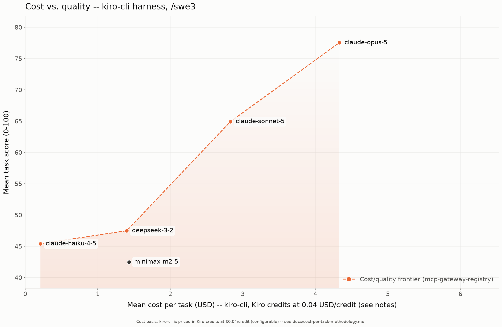
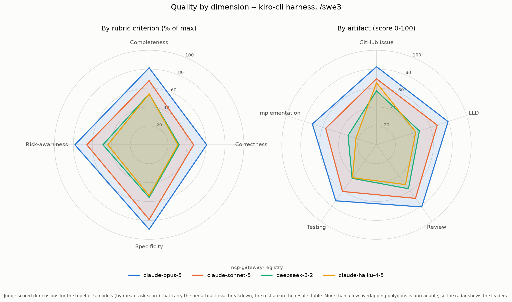

# Results: kiro-cli harness (swe3)

Benchmark results for every model run under the **kiro-cli** coding agent with the **swe3** skill on `mcp-gateway-registry`, generated from the committed `run-summary.json` files. Regenerate with `uv run scripts/gen_agent_report.py --harness kiro-cli --skill swe3`. Companion to the cross-harness comparison [agentic-coding-swe-comparison-swe3.md](agentic-coding-swe-comparison-swe3.md).

## Results by model

| Model | Mean score | Completed | Input | Output | Cache read | Cache write | Tokens processed† | Wall-clock | Run cost | Cost basis* |
|---|---:|---:|---:|---:|---:|---:|---:|---:|---:|---|
| claude-opus-5 | 77.52 | 5/5 | 0 | 0 | 0 | 0 | 0 | 119.2m | $21.63 | Kiro credits ($0.04/credit) |
| claude-sonnet-5 | 64.92 | 5/5 | 0 | 0 | 0 | 0 | 0 | 102.5m | $14.17 | Kiro credits ($0.04/credit) |
| deepseek-3-2 | 47.48 | 5/5 | 0 | 0 | 0 | 0 | 0 | 133.0m | $7.02 | Kiro credits ($0.04/credit) |
| claude-haiku-4-5 | 45.40 | 5/5 | 0 | 0 | 0 | 0 | 0 | 23.1m | $1.05 | Kiro credits ($0.04/credit) |
| minimax-m2-5 | 42.48 | 5/5 | 0 | 0 | 0 | 0 | 0 | 68.1m | $7.15 | Kiro credits ($0.04/credit) |

\* **Cost basis differs by row and the dollars are NOT directly comparable.** _Kiro credits_ (kiro-cli): kiro-cli reports no tokens, only credits consumed; cost is credits x $0.04/credit (configurable), summed over the run. Credits already embed the model's rate multiplier. This is a third basis -- neither a metered token bill nor a GPU estimate. NOTE: Kiro is a per-developer monthly subscription (kiro.dev/pricing) with credits included in the seat; $0.04/credit is the OVERAGE rate, so this treats every credit as add-on overage (worst case). pi/Claude Code on Bedrock are pure usage-based per-token billing with no seat -- a fair comparison models kiro's seat cost + volume, not just this per-task figure. See [cost-per-task-methodology.md](cost-per-task-methodology.md).

† **Tokens processed** counts input + output + cache-read + cache-write -- all tokens the model actually processed, not just fresh input+output. On the Bedrock path a task often reports only ~2 fresh input tokens with the rest served from prompt cache, so counting input+output alone would understate the real work ~100x. (Self-hosted rows report their cache reuse via server-side Prometheus counters, folded in here where present.)

A task scoring 0 (missing/empty artifacts) is a model failure, excluded from the mean but counted in `Completed`. A model with 0 scored tasks did not complete any task under this harness.

## Charts

### Cost vs. quality (Pareto frontier)

### Quality by dimension (radar)

