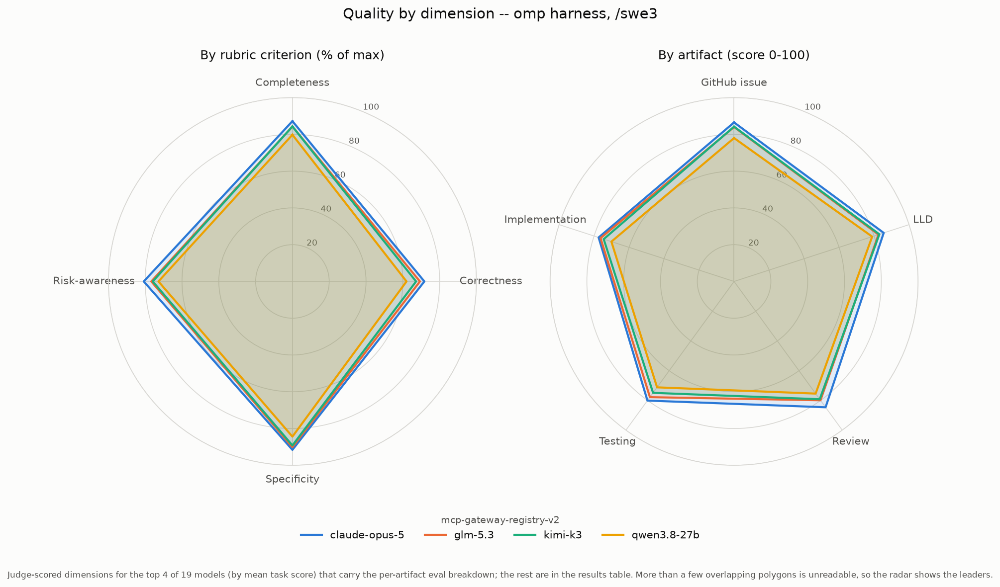
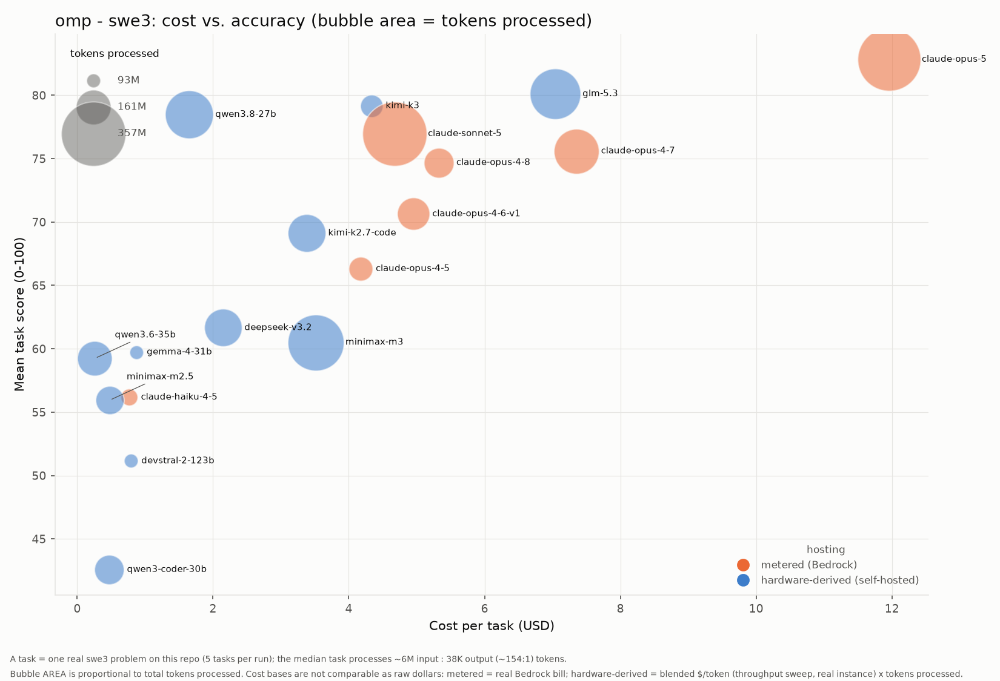

# Results: omp harness (swe3)

Benchmark results for every model run under the **omp** coding agent with the **swe3** skill on `mcp-gateway-registry-v2`, generated from the committed `run-summary.json` files. Regenerate with `uv run scripts/gen_agent_report.py --harness omp --skill swe3 --repo mcp-gateway-registry-v2`. Companion to the cross-harness comparison [agentic-coding-swe-comparison-swe3.md](agentic-coding-swe-comparison-swe3.md).

## Results by model

| Model | Mean score | Completed | Input | Output | Cache read | Cache write | Tokens processed† | Wall-clock | Run cost | Cost basis* |
|---|---:|---:|---:|---:|---:|---:|---:|---:|---:|---|
| claude-opus-5 | 82.83 | 21/21 | 162,025 | 1,450,206 | 204,530,351 | 3,340,646 | 209,483,228 | 448.9m | $160.21 | metered (Bedrock) |
| glm-5.3 | 81.27 | 21/21 | 196,403,475 | 1,408,082 | 242,521,152 | 1,962,956 | 245,606,604 | 150.1m | $143.78 | hardware-derived (p5en.48xlarge) |
| qwen3.8-27b | 78.48 | 20/21 | 176,788,091 | 2,238,375 | 226,013,088 | 7,299,679 | 280,753,227 | 1292.2m | $39.34 | hardware-derived (p5en.48xlarge) |
| claude-sonnet-5 | 76.97 | 21/21 | 96,758 | 1,259,000 | 227,322,015 | 3,683,654 | 232,361,427 | 356.3m | $67.46 | metered (Bedrock) |
| claude-opus-4-8 | 74.69 | 21/21 | 117,490 | 1,047,405 | 136,713,205 | 2,660,506 | 140,538,606 | 237.2m | $111.76 | metered (Bedrock) |
| glm-5.2 | 74.36 | 21/21 | 200,492,890 | 767,429 | 198,289,984 | 2,216,533 | 201,260,319 | 159.1m | $97.67 | hardware-derived (p5en.48xlarge) |
| claude-opus-4-6-v1 | 70.64 | 21/21 | 113,365 | 643,572 | 148,125,825 | 2,119,578 | 151,002,340 | 206.3m | $103.97 | metered (Bedrock) |
| kimi-k2.7-code | 69.98 | 20/21 | 138,397,139 | 701,749 | 184,381,920 | 3,696,196 | 214,670,597 | 200.0m | $78.19 | hardware-derived (p5en.48xlarge) |
| deepseek-v3.2 | 60.99 | 21/21 | 125,194,708 | 573,178 | 175,922,048 | 4,580,477 | 186,193,021 | 187.7m | $47.93 | hardware-derived (p5en.48xlarge) |
| gemma-4-31b | 59.74 | 21/21 | 80,485,213 | 456,273 | 89,401,728 | 3,242,130 | 93,169,386 | 344.5m | $18.29 | hardware-derived (p5en.48xlarge) |
| qwen3.6-35b | 59.24 | 21/21 | 109,283,532 | 672,086 | 158,821,872 | 3,652,281 | 177,850,748 | 162.5m | $6.01 | hardware-derived (p5en.48xlarge) |
| claude-haiku-4-5 | 56.18 | 21/21 | 32,478 | 555,228 | 87,467,904 | 2,378,678 | 90,434,288 | 110.1m | $14.53 | metered (Bedrock) |
| minimax-m2.5 | 53.29 | 21/21 | 129,837,822 | 418,721 | 132,496,896 | 1,848,978 | 135,029,351 | 65.8m | $10.07 | hardware-derived (p5en.48xlarge) |
| qwen3-coder-480b | 50.83 | 20/21 | 141,646,302 | 512,567 | 141,018,048 | 1,257,381 | 142,158,869 | 100.5m | $33.54 | hardware-derived (p5en.48xlarge) |
| devstral-2-123b | 47.64 | 17/21 | 96,123,999 | 570,018 | 98,849,840 | 955,671 | 100,637,711 | 163.6m | $13.64 | hardware-derived (p5en.48xlarge) |
| qwen3-coder-30b | 42.58 | 21/21 | 138,288,705 | 556,264 | 138,029,360 | 1,455,218 | 138,844,969 | 109.1m | $9.94 | hardware-derived (p5en.48xlarge) |

\* **Cost basis differs by row and the dollars are NOT directly comparable.** _hardware-derived (throughput)_ (self-hosted vLLM): a rented GPU has no per-token bill, so cost is the model's blended cost-per-token -- measured by the throughput sweep at its true instance rate (g6e.12xlarge for L40S, p5en.48xlarge for H200) and peak concurrency -- times the tokens this run processed. This prices the real work done, unlike a wall-clock estimate that would also charge idle agent-thinking time. _metered (Bedrock)_: a hosted API's real per-token bill, summed over the run. It is a metered invoice, not a hardware estimate, and (unlike the self-hosted rows) it benefits from Bedrock prompt caching. See [cost-per-task-methodology.md](cost-per-task-methodology.md).

† **Tokens processed** counts input + output + cache-read + cache-write -- all tokens the model actually processed, not just fresh input+output. On the Bedrock path a task often reports only ~2 fresh input tokens with the rest served from prompt cache, so counting input+output alone would understate the real work ~100x. (Self-hosted rows report their cache reuse via server-side Prometheus counters, folded in here where present.)

A task scoring 0 (missing/empty artifacts) is a model failure, excluded from the mean but counted in `Completed`. A model with 0 scored tasks did not complete any task under this harness.

## Charts

### Cost vs. quality (Pareto frontier)

### Quality by dimension (radar)

### Cost vs. accuracy (bubble area = tokens)

x = cost per task, y = mean score, bubble area = total tokens processed, color = hosting basis (metered Bedrock vs hardware-derived self-hosted -- NOT directly comparable as raw dollars; see the cost note above).

