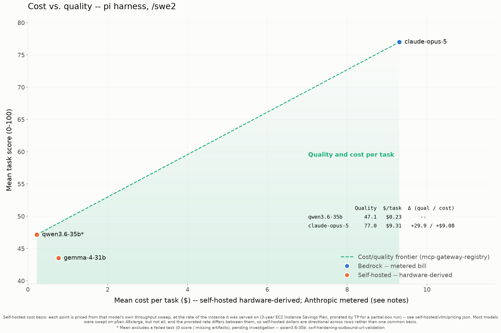
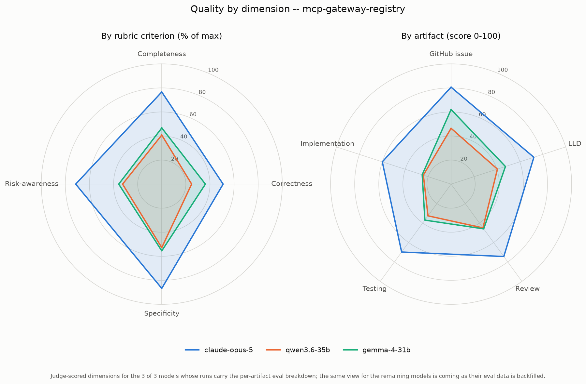
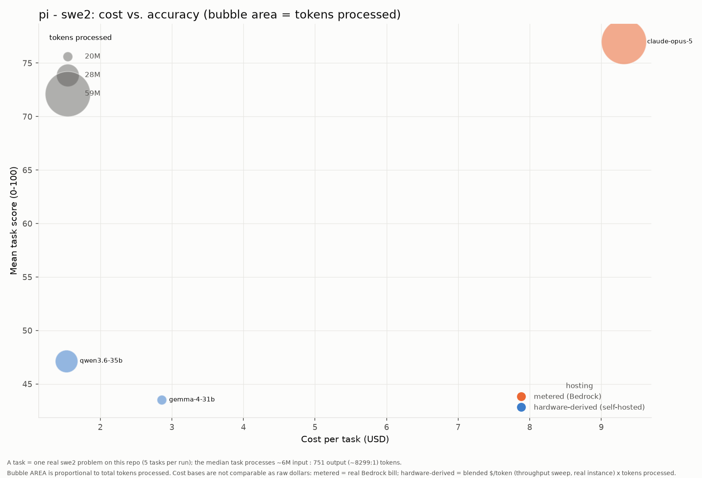

# Results: pi harness (swe2)

Benchmark results for every model run under the **pi** coding agent with the **swe2** skill on `mcp-gateway-registry`, generated from the committed `run-summary.json` files. Regenerate with `uv run scripts/gen_agent_report.py --harness pi --skill swe2`. Companion to the cross-harness comparison [agentic-coding-swe-comparison-swe2.md](agentic-coding-swe-comparison-swe2.md).

## Results by model

| Model | Mean score | Completed | Input | Output | Cache read | Cache write | Tokens processed† | Wall-clock | Run cost | Cost basis* |
|---|---:|---:|---:|---:|---:|---:|---:|---:|---:|---|
| claude-opus-5 | 77.00 | 5/5 | 812 | 480,622 | 57,197,580 | 951,263 | 58,630,277 | 98.3m | $46.56 | metered (Bedrock) |
| qwen3.6-35b | 47.15 | 4/5 | 609,647 | 17,757 | 26,707,296 | 672,843 | 28,007,543 | 29.4m | $0.95 | hardware-derived (p5en.48xlarge) |
| gemma-4-31b | 43.52 | 5/5 | 597,747 | 2,920 | 18,498,976 | 525,688 | 19,625,331 | 60.8m | $3.85 | hardware-derived (p5en.48xlarge) |
| qwen3-coder-30b | -- (0 scored) | 0/5 | 407,989 | 2,061 | 12,508,624 | 313,139 | 13,231,813 | 17.0m | $0.95 | hardware-derived (p5en.48xlarge) |

\* **Cost basis differs by row and the dollars are NOT directly comparable.** _hardware-derived (throughput)_ (self-hosted vLLM): a rented GPU has no per-token bill, so cost is the model's blended cost-per-token -- measured by the throughput sweep at its true instance rate (g6e.12xlarge for L40S, p5en.48xlarge for H200) and peak concurrency -- times the tokens this run processed. This prices the real work done, unlike a wall-clock estimate that would also charge idle agent-thinking time. _metered (Bedrock)_: a hosted API's real per-token bill, summed over the run. It is a metered invoice, not a hardware estimate, and (unlike the self-hosted rows) it benefits from Bedrock prompt caching. See [cost-per-task-methodology.md](cost-per-task-methodology.md).

† **Tokens processed** counts input + output + cache-read + cache-write -- all tokens the model actually processed, not just fresh input+output. On the Bedrock path a task often reports only ~2 fresh input tokens with the rest served from prompt cache, so counting input+output alone would understate the real work ~100x. (Self-hosted rows report their cache reuse via server-side Prometheus counters, folded in here where present.)

A task scoring 0 (missing/empty artifacts) is a model failure, excluded from the mean but counted in `Completed`. A model with 0 scored tasks did not complete any task under this harness.

## Charts

### Cost vs. quality (Pareto frontier)

### Quality by dimension (radar)

### Cost vs. accuracy (bubble area = tokens)

x = cost per task, y = mean score, bubble area = total tokens processed, color = hosting basis (metered Bedrock vs hardware-derived self-hosted -- NOT directly comparable as raw dollars; see the cost note above).

