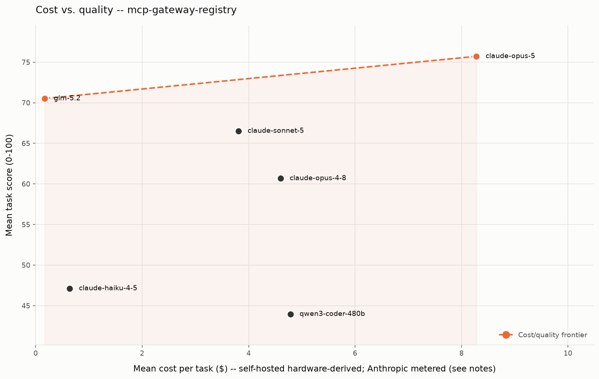
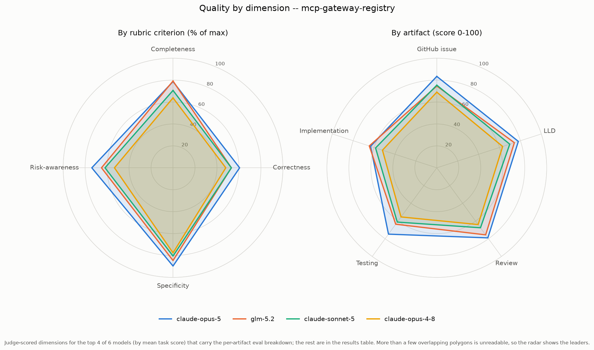

# Results: pi harness (swe3)

Benchmark results for every model run under the **pi** coding agent with the **swe3** skill on `mcp-gateway-registry`, generated from the committed `run-summary.json` files. Regenerate with `uv run scripts/gen_agent_report.py --harness pi --skill swe3`. Companion to the cross-agent [harness comparison](harness-comparison.md).

## Results by model

| Model | Mean score | Completed | Input | Output | Cache read | Cache write | Tokens processed† | Wall-clock | Run cost | Cost basis* |
|---|---:|---:|---:|---:|---:|---:|---:|---:|---:|---|
| claude-opus-5 | 75.72 | 5/5 | 774 | 462,242 | 48,639,156 | 886,691 | 49,988,863 | 94.0m | $41.42 | metered (Bedrock) |
| glm-5.2 | 70.52 | 5/5 | 756,340 | 5,593 | 56,140,480 | 343,726 | 57,246,139 | 90.5m | $15.83 | hardware-derived |
| claude-sonnet-5 | 66.52 | 5/5 | 948 | 384,852 | 65,823,081 | 822,296 | 67,031,177 | 73.7m | $19.07 | metered (Bedrock) |
| claude-opus-4-8 | 60.68 | 5/5 | 430 | 322,184 | 21,532,803 | 666,666 | 22,522,083 | 62.5m | $22.99 | metered (Bedrock) |
| claude-haiku-4-5 | 47.12 | 5/5 | 20,461 | 188,060 | 17,459,585 | 403,623 | 18,071,729 | 29.0m | $3.21 | metered (Bedrock) |
| qwen3-coder-480b | 43.96 | 5/5 | 44,261,023 | 143,957 | 43,805,376 | 491,611 | 88,701,967 | 27.8m | $4.85 | hardware-derived |

\* **Cost basis differs by row and the dollars are NOT directly comparable.** _hardware-derived_ (self-hosted vLLM): a rented GPU has no per-token bill, so cost is `($/hr / 3600) x wall-clock seconds` at g6e.12xlarge on-demand ($10.49/hr). _metered (Bedrock)_: a hosted API's real per-token bill, summed over the run. It is a metered invoice, not a hardware estimate, and (unlike the self-hosted rows) it benefits from Bedrock prompt caching. See [cost-per-task-methodology.md](cost-per-task-methodology.md).

† **Tokens processed** counts input + output + cache-read + cache-write -- all tokens the model actually processed, not just fresh input+output. On the Bedrock path a task often reports only ~2 fresh input tokens with the rest served from prompt cache, so counting input+output alone would understate the real work ~100x. (Self-hosted rows report their cache reuse via server-side Prometheus counters, folded in here where present.)

A task scoring 0 (missing/empty artifacts) is a model failure, excluded from the mean but counted in `Completed`. A model with 0 scored tasks did not complete any task under this harness.

## Charts

### Cost vs. quality (Pareto frontier)

### Quality by dimension (radar)

