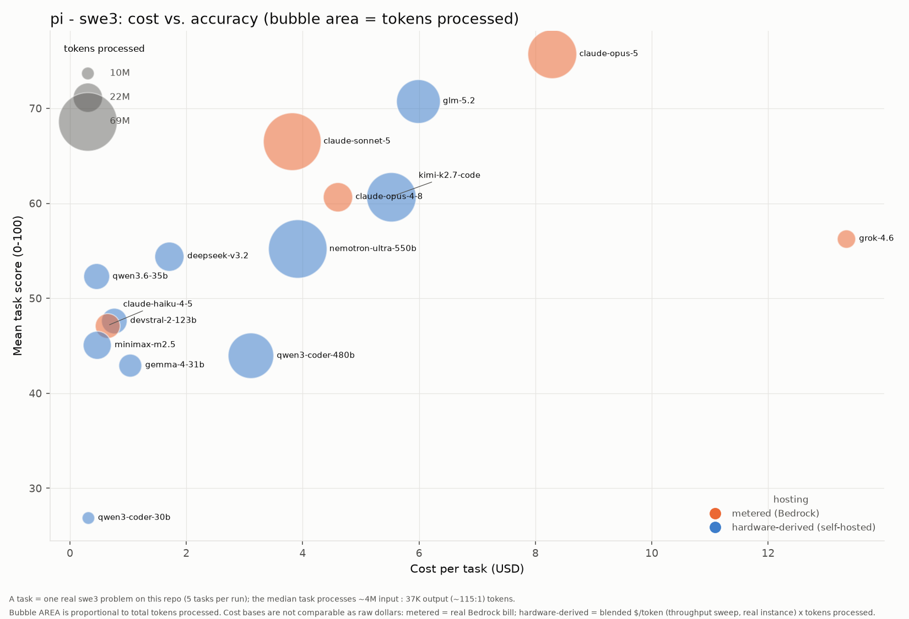

# Results: pi harness (swe3)

Benchmark results for every model run under the **pi** coding agent with the **swe3** skill on `mcp-gateway-registry`, generated from the committed `run-summary.json` files. Regenerate with `uv run scripts/gen_agent_report.py --harness pi --skill swe3`. Companion to the cross-harness comparison [agentic-coding-swe-comparison-swe3.md](agentic-coding-swe-comparison-swe3.md).

## Results by model

| Model | Mean score | Completed | Input | Output | Cache read | Cache write | Tokens processed† | Wall-clock | Run cost | Cost basis* |
|---|---:|---:|---:|---:|---:|---:|---:|---:|---:|---|
| claude-opus-5 | 75.72 | 5/5 | 774 | 462,242 | 48,639,156 | 886,691 | 49,988,863 | 94.0m | $41.42 | metered (Bedrock) |
| glm-5.2 | 70.76 | 5/5 | 40,983,637 | 535,508 | 40,663,808 | 532,339 | 41,519,145 | 104.8m | $20.15 | hardware-derived (p5en.48xlarge) |
| claude-sonnet-5 | 66.52 | 5/5 | 948 | 384,852 | 65,823,081 | 822,296 | 67,031,177 | 73.7m | $19.07 | metered (Bedrock) |
| qwen3.8-27b | 66.40 | 5/5 | 27,584,894 | 329,829 | 66,505,152 | 2,318,687 | 75,678,960 | 709.8m | $10.60 | hardware-derived (p5en.48xlarge) |
| claude-opus-4-8 | 60.68 | 5/5 | 430 | 322,184 | 21,532,803 | 666,666 | 22,522,083 | 62.5m | $22.99 | metered (Bedrock) |
| kimi-k2.7-code | 60.68 | 5/5 | 50,764,666 | 251,979 | 49,935,424 | 1,116,643 | 51,016,645 | 56.6m | $18.58 | hardware-derived (p5en.48xlarge) |
| grok-4.6 | 56.28 | 5/5 | 12,939,964 | 79,518 | 43,136 | 0 | 13,062,618 | 69.5m | $66.71 | metered (Bedrock) |
| nemotron-ultra-550b | 55.20 | 5/5 | 68,498,340 | 206,991 | 66,768,768 | 1,873,817 | 68,705,331 | 33.8m | $13.16 | hardware-derived (p5en.48xlarge) |
| deepseek-v3.2 | 54.44 | 5/5 | 22,180,582 | 165,360 | 21,784,192 | 396,390 | 22,345,942 | 32.8m | $5.75 | hardware-derived (p5en.48xlarge) |
| qwen3.6-35b | 52.30 | 4/5 | 18,857,234 | 209,367 | 18,224,976 | 632,258 | 19,066,601 | 29.0m | $0.64 | hardware-derived (p5en.48xlarge) |
| devstral-2-123b | 47.64 | 5/5 | 18,673,660 | 119,316 | 18,371,296 | 302,364 | 18,792,976 | 29.5m | $2.55 | hardware-derived (p5en.48xlarge) |
| claude-haiku-4-5 | 47.12 | 5/5 | 20,461 | 188,060 | 17,459,585 | 403,623 | 18,071,729 | 29.0m | $3.21 | metered (Bedrock) |
| minimax-m2.5 | 45.08 | 5/5 | 21,076,622 | 103,270 | 20,836,992 | 239,630 | 21,179,892 | 13.5m | $1.58 | hardware-derived (p5en.48xlarge) |
| qwen3-coder-480b | 43.96 | 5/5 | 44,261,023 | 143,957 | 43,805,376 | 491,611 | 44,404,980 | 27.8m | $10.48 | hardware-derived (p5en.48xlarge) |
| gemma-4-31b | 42.96 | 5/5 | 16,388,112 | 87,495 | 15,897,568 | 490,544 | 16,475,607 | 58.2m | $3.24 | hardware-derived (p5en.48xlarge) |
| qwen3-coder-30b | 26.90 | 2/5 | 9,735,803 | 103,395 | 9,428,448 | 307,355 | 9,839,198 | 18.0m | $0.70 | hardware-derived (p5en.48xlarge) |

\* **Cost basis differs by row and the dollars are NOT directly comparable.** _hardware-derived (throughput)_ (self-hosted vLLM): a rented GPU has no per-token bill, so cost is the model's blended cost-per-token -- measured by the throughput sweep at its true instance rate (g6e.12xlarge for L40S, p5en.48xlarge for H200) and peak concurrency -- times the tokens this run processed. This prices the real work done, unlike a wall-clock estimate that would also charge idle agent-thinking time. _metered (Bedrock)_: a hosted API's real per-token bill, summed over the run. It is a metered invoice, not a hardware estimate, and (unlike the self-hosted rows) it benefits from Bedrock prompt caching. See [cost-per-task-methodology.md](cost-per-task-methodology.md).

† **Tokens processed** counts input + output + cache-read + cache-write -- all tokens the model actually processed, not just fresh input+output. On the Bedrock path a task often reports only ~2 fresh input tokens with the rest served from prompt cache, so counting input+output alone would understate the real work ~100x. (Self-hosted rows report their cache reuse via server-side Prometheus counters, folded in here where present.)

A task scoring 0 (missing/empty artifacts) is a model failure, excluded from the mean but counted in `Completed`. A model with 0 scored tasks did not complete any task under this harness.

## Charts

### Cost vs. quality (Pareto frontier)

### Quality by dimension (radar)

### Cost vs. accuracy (bubble area = tokens)

x = cost per task, y = mean score, bubble area = total tokens processed, color = hosting basis (metered Bedrock vs hardware-derived self-hosted -- NOT directly comparable as raw dollars; see the cost note above).

