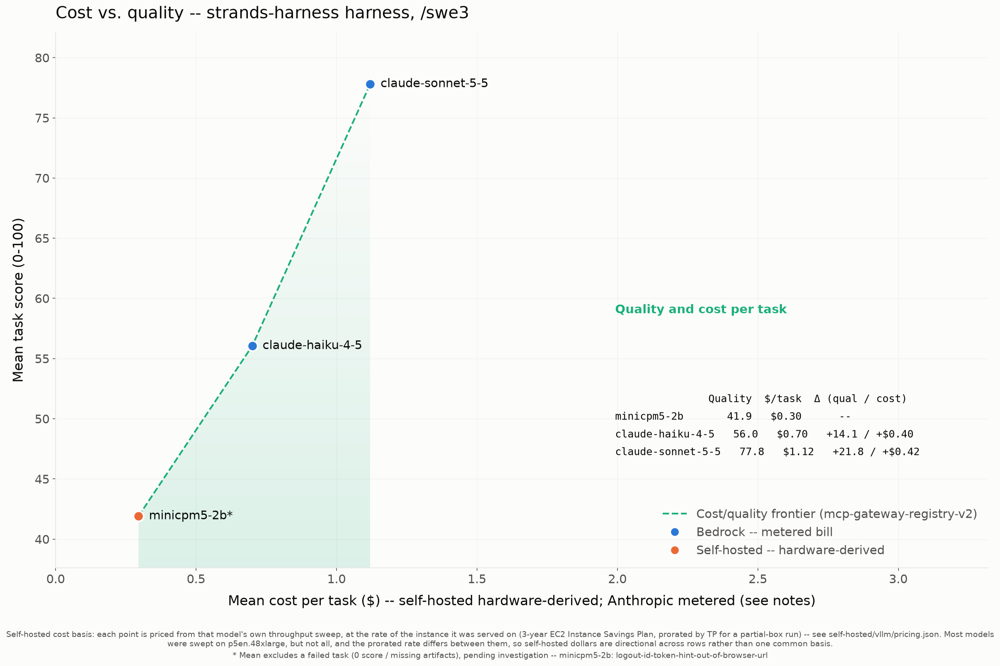
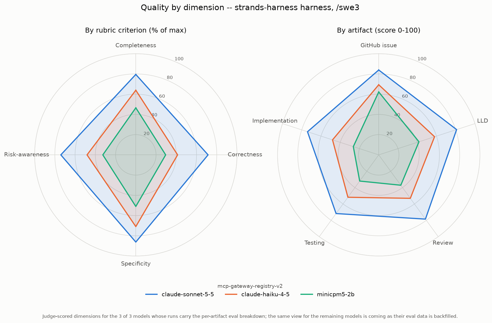
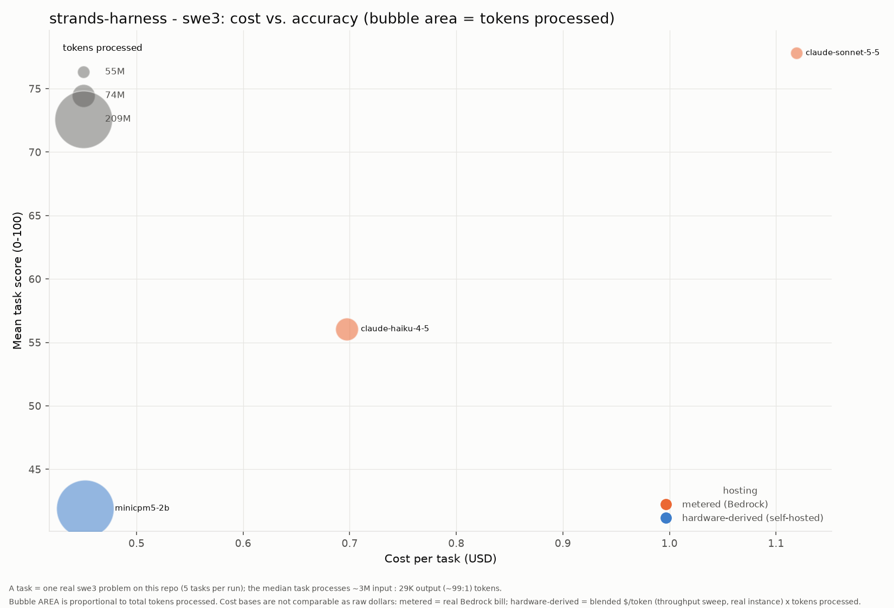

# Results: Strands harness (create_harness) harness (swe3)

Benchmark results for every model run under the **Strands harness (create_harness)** coding agent with the **swe3** skill on `mcp-gateway-registry-v2`, generated from the committed `run-summary.json` files. Regenerate with `uv run scripts/gen_agent_report.py --harness strands-harness --skill swe3 --repo mcp-gateway-registry-v2`. See [Strands setup](strands-setup.md) for install and configuration. Companion to the cross-harness comparison [agentic-coding-swe-comparison-swe3.md](agentic-coding-swe-comparison-swe3.md).

## Results by model

| Model | Mean score | Completed | Input | Output | Cache read | Cache write | Tokens processed† | Wall-clock | Run cost | Cost basis* |
|---|---:|---:|---:|---:|---:|---:|---:|---:|---:|---|
| claude-sonnet-5-5 | 77.81 | 21/21 | 56,899 | 755,444 | 52,479,831 | 2,133,327 | 55,425,501 | 87.5m | $23.50 | metered (Bedrock) |
| claude-haiku-4-5 | 56.05 | 21/21 | 196,458 | 793,458 | 70,997,542 | 1,637,152 | 73,624,610 | 119.5m | $14.64 | metered (Bedrock) |
| minicpm5-2b | 41.91 | 20/21 | 1,774,615 | 777,921 | 206,897,216 | 0 | 209,449,752 | 187.8m | $9.03 | hardware-derived (g6e.4xlarge) |

\* **Cost basis differs by row and the dollars are NOT directly comparable.** _hardware-derived (throughput)_ (self-hosted vLLM): a rented GPU has no per-token bill, so cost is the model's blended cost-per-token -- the cheapest concurrency level of ITS OWN throughput sweep -- times the tokens this run processed. Each row is priced at the rate of the instance that model was actually served on, named in this column, at that instance's rate in self-hosted/vllm/pricing.json. **The instance differs by row, so a self-hosted dollar figure is the cost of that model's work on ITS OWN hardware, not a common basis**; comparing two self-hosted rows compares two model-plus-hardware pairings rather than the models alone. This prices the real work done, unlike a wall-clock estimate that would also charge idle agent-thinking time. _metered (Bedrock)_: a hosted API's real per-token bill, summed over the run. It is a metered invoice, not a hardware estimate, and (unlike the self-hosted rows) it benefits from Bedrock prompt caching. See [cost-per-task-methodology.md](cost-per-task-methodology.md).

† **Tokens processed** counts input + output + cache-read + cache-write -- all tokens the model actually processed, not just fresh input+output. On the Bedrock path a task often reports only ~2 fresh input tokens with the rest served from prompt cache, so counting input+output alone would understate the real work ~100x. (Self-hosted rows report their cache reuse via server-side Prometheus counters, folded in here where present.)

A task scoring 0 (missing/empty artifacts) is a model failure, excluded from the mean but counted in `Completed`. A model with 0 scored tasks did not complete any task under this harness.

## Charts

### Cost vs. quality (Pareto frontier)

### Quality by dimension (radar)

### Cost vs. accuracy (bubble area = tokens)

x = cost per task, y = mean score, bubble area = total tokens processed, color = hosting basis (metered Bedrock vs hardware-derived self-hosted -- NOT directly comparable as raw dollars; see the cost note above).

## Notes on these runs

This section is written by hand, below the generated part, and a regenerate does not keep it. Add it back after running the generator.

`--agent strands-harness` builds the agent with the Strands team's `create_harness()`, with web tools, subagents, memory and sessions turned off; [strands-setup.md](strands-setup.md#the-strands-harness---agent-strands-harness) lists every setting. All three runs used the runner from [#212](https://github.com/aarora79/agentic-coding-harness-benchmarks/pull/212) and [#213](https://github.com/aarora79/agentic-coding-harness-benchmarks/pull/213), so the tool map, the `bash` alias and the recursion limit applied. The loop guard applied to the Haiku and Sonnet 5.5 runs, and it never fired in the Sonnet 5.5 run.

The same model under the other harnesses, on the same 21 tasks:

| Model | omp | Strands, hand-built Agent | Strands harness |
|---|---|---|---|
| claude-sonnet-5-5 | not run | 76.73, 21/21, $0.96 | 77.81, 21/21, $1.12 |
| claude-haiku-4-5 | 56.18, 21/21, $0.76 | 51.20, 20/21, $0.70 | 56.05, 21/21, $0.70 |
| minicpm5-2b | 42.59, 19/21 | 45.28, 21/21 | 41.91, 20/21 |

Sources: each harness's `run-summary.json` under `benchmarks/swe-benchmark-data/<model>/`. The hand-built Haiku run predates the runner changes in [#204](https://github.com/aarora79/agentic-coding-harness-benchmarks/pull/204), so part of its gap may come from those changes, not from the harness.

Two `minicpm5-2b` tasks looped: `lifecycle-workflow-webhooks` ran `git diff HEAD --stat` 674 times over 844 turns and still wrote all six artifacts, and `logout-id-token-hint-out-of-browser-url` repeated one `grep` 542 times and hit the recursion limit after 1,148 turns with no artifacts. Together they used 125M of the run's 209M tokens. The loop guard in #213 would have stopped both at 40 repeats.

On Sonnet 5.5 the harness scored 1.08 points above the hand-built agent and cost $0.16 more a task. On Haiku 4.5 the gap was 4.85 points.
