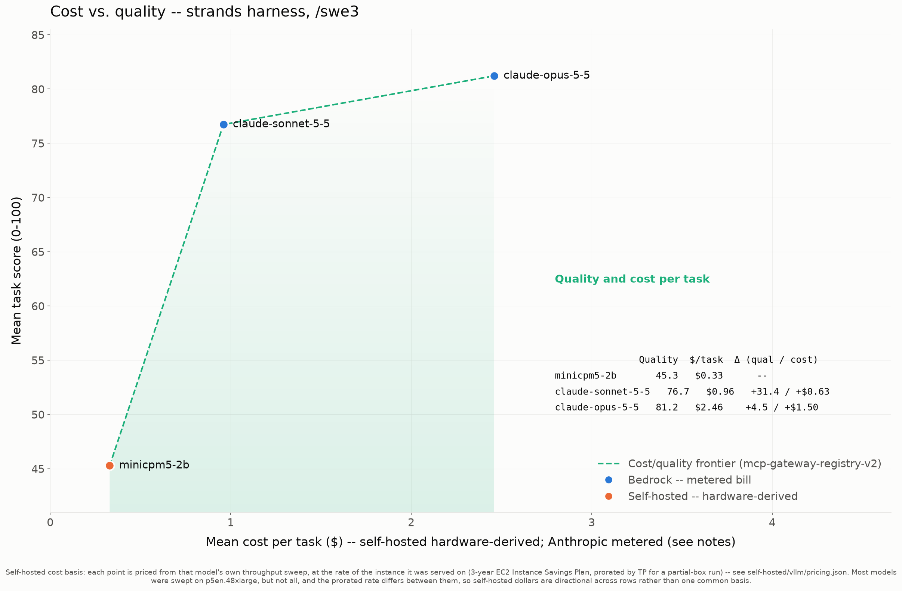
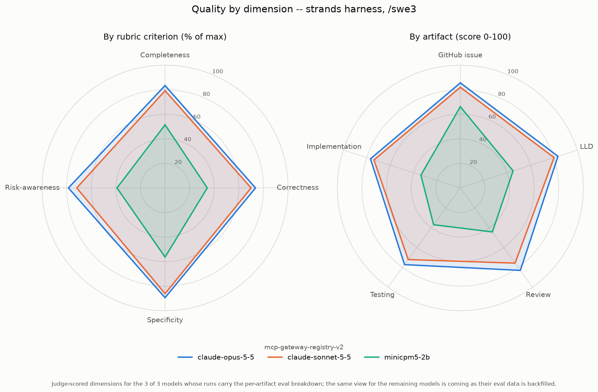
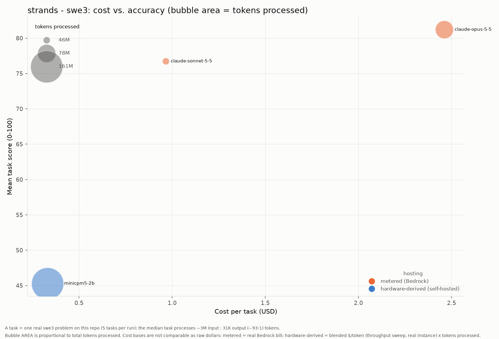

# Results: Strands Agents harness (swe3)

Benchmark results for every model run under the **Strands Agents** coding agent with the **swe3** skill on `mcp-gateway-registry-v2`, generated from the committed `run-summary.json` files. Regenerate with `uv run scripts/gen_agent_report.py --harness strands --skill swe3 --repo mcp-gateway-registry-v2`. See [Strands setup](strands-setup.md) for install and configuration. Companion to the cross-harness comparison [agentic-coding-swe-comparison-swe3.md](agentic-coding-swe-comparison-swe3.md).

## Results by model

| Model | Mean score | Completed | Input | Output | Cache read | Cache write | Tokens processed† | Wall-clock | Run cost | Cost basis* |
|---|---:|---:|---:|---:|---:|---:|---:|---:|---:|---|
| claude-opus-5-5 | 81.21 | 21/21 | 1,660 | 980,873 | 74,748,022 | 2,483,522 | 78,214,077 | 184.8m | $51.69 | metered (Bedrock) |
| claude-sonnet-5-5 | 76.73 | 21/21 | 1,122 | 681,675 | 43,052,826 | 1,933,669 | 45,669,292 | 74.1m | $20.26 | metered (Bedrock) |
| minicpm5-2b | 45.28 | 21/21 | 3,245,301 | 689,816 | 156,682,768 | 0 | 160,617,885 | 167.4m | $6.93 | hardware-derived (g6e.4xlarge) |

\* **Cost basis differs by row and the dollars are NOT directly comparable.** _hardware-derived (throughput)_ (self-hosted vLLM): a rented GPU has no per-token bill, so cost is the model's blended cost-per-token -- the cheapest concurrency level of ITS OWN throughput sweep -- times the tokens this run processed. Each row is priced at the rate of the instance that model was actually served on, named in this column, at that instance's rate in self-hosted/vllm/pricing.json. **The instance differs by row, so a self-hosted dollar figure is the cost of that model's work on ITS OWN hardware, not a common basis**; comparing two self-hosted rows compares two model-plus-hardware pairings rather than the models alone. This prices the real work done, unlike a wall-clock estimate that would also charge idle agent-thinking time. _metered (Bedrock)_: a hosted API's real per-token bill, summed over the run. It is a metered invoice, not a hardware estimate, and (unlike the self-hosted rows) it benefits from Bedrock prompt caching. See [cost-per-task-methodology.md](cost-per-task-methodology.md).

† **Tokens processed** counts input + output + cache-read + cache-write -- all tokens the model actually processed, not just fresh input+output. On the Bedrock path a task often reports only ~2 fresh input tokens with the rest served from prompt cache, so counting input+output alone would understate the real work ~100x. (Self-hosted rows report their cache reuse via server-side Prometheus counters, folded in here where present.)

A task scoring 0 (missing/empty artifacts) is a model failure, excluded from the mean but counted in `Completed`. A model with 0 scored tasks did not complete any task under this harness.

## Charts

### Cost vs. quality (Pareto frontier)

### Quality by dimension (radar)

### Cost vs. accuracy (bubble area = tokens)

x = cost per task, y = mean score, bubble area = total tokens processed, color = hosting basis (metered Bedrock vs hardware-derived self-hosted -- NOT directly comparable as raw dollars; see the cost note above).

## Notes on these runs

This section is written by hand, below the generated part, and a regenerate does not keep it. Add it back after running the generator.

The rows used different versions of the Strands runner.

| Model | Run date | Path | Runner |
|---|---|---|---|
| claude-opus-5-5 | 2026-10-02 ([#195](https://github.com/aarora79/agentic-coding-harness-benchmarks/pull/195)) | Amazon Bedrock | Strands as first added in [#194](https://github.com/aarora79/agentic-coding-harness-benchmarks/pull/194): skill loaded through the `AgentSkills` plugin, no tool-output cap, no tool-name map |
| claude-sonnet-5-5 | 2026-10-04 ([#203](https://github.com/aarora79/agentic-coding-harness-benchmarks/pull/203)) | Amazon Bedrock, `global.` cross-region profile | the same runner as Opus 5.5 |
| minicpm5-2b | 2026-10-04 ([#196](https://github.com/aarora79/agentic-coding-harness-benchmarks/issues/196)) | self-hosted vLLM, 131,072-token window | the runner after [#204](https://github.com/aarora79/agentic-coding-harness-benchmarks/pull/204), with the five changes listed in [strands-setup.md](strands-setup.md#where-the-runner-departs-from-strands-as-it-ships) |

Opus 5.5 scored 81.21 under Strands and 81.16 under omp on the same 21 tasks, and cost $2.46 a task under Strands against $4.44 under omp (`benchmarks/swe-benchmark-data/claude-opus-5-5/{strands,omp}/swe3/mcp-gateway-registry-v2/run-summary.json`). A strong model on Bedrock did not need the changes in #204.

MiniCPM5-2B did. Before #204, Strands lost task attempts on this model to rejected summaries, single large tool results, skipped skill loads and Claude Code tool names. The [model guide](../self-hosted/vllm/models/minicpm5-2b.md#measured-results-strands-swe3-mcp-gateway-registry-v2) compares the run with omp's on the same model: 45.28 over 21 tasks against 42.59 over 19.

Sonnet 5.5 has no omp run to compare against. Its results first landed in a folder named after the full profile id, `global.anthropic.claude-sonnet-5-5`, because the folder-name rule did not strip the `global.` prefix; [#205](https://github.com/aarora79/agentic-coding-harness-benchmarks/issues/205) fixed the rule and moved the folder to `claude-sonnet-5-5`.

Two sanity runs on the one-task `hello-world` dataset (`benchmarks/dataset/hello-world.yaml`) checked the harness when it was added in #194. They use a different dataset, so they stay out of the table: `claude-opus-4-8` scored 78.2, and `claude-haiku-4-5` wrote all six artifacts but was not judged.
