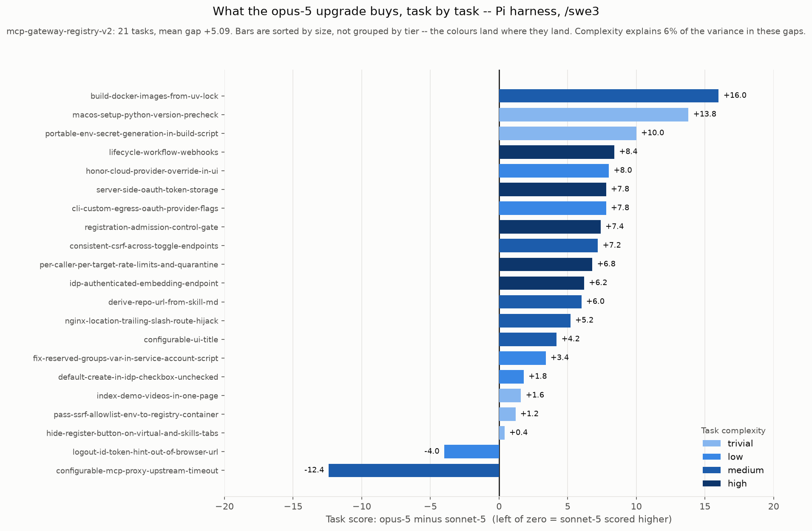
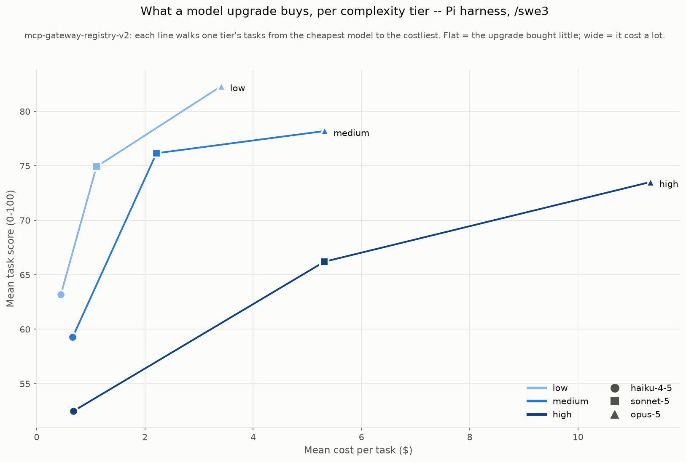

# Which model for which task? Reading the v2 results as a buying decision

> **Not the headline result.** The reported run is the **omp** harness with `/swe3` on the **v2** dataset -- 16 models, 21 tasks -- in [harness-omp-swe3.md](harness-omp-swe3.md). This page covers the complexity read of the v2 dataset from the 3-model pi run. Different task sets and harnesses, so the scores here do not compare with it.

The [v2 dataset](../benchmarks/dataset/mcp-gateway-registry-v2.yaml) was built to answer a question a single leaderboard number cannot: **does the right model change with the difficulty of the work?**

Three models, 21 tasks across trivial / low / medium / high, pi harness, `/swe3`. Raw numbers in [results-swe3-v2.md](results-swe3-v2.md). This page is the inference drawn from them.

Everything below rests on **one run per model per task**. The short answer is that the question in the title has a worse answer than expected: **complexity is not the axis that decides which model you need.**

## First, the intuition that turns out to be wrong

The natural expectation is that **easy tasks are a leveller** -- on small work any competent model gets it right, the models converge, so you use the cheap one and save your budget for hard problems.

That is not what the data shows.

| Tier | n | haiku-4-5 | sonnet-5 | opus-5 | opus − sonnet | opus − haiku |
|---|---:|---:|---:|---:|---:|---:|
| trivial | 5 | 54.80 | 73.64 | 79.04 | +5.40 | **+24.24** |
| low | 5 | 65.36 | 76.52 | 79.92 | +3.40 | **+14.56** |
| medium | 6 | 56.53 | 73.57 | 77.93 | +4.37 | **+21.40** |
| high | 5 | 52.48 | 66.20 | 73.52 | +7.32 | **+21.04** |

**The gap is widest on the *trivial* tier.** A tier was added below `low` specifically to look for convergence, and it found the largest opus-haiku gap in the dataset (+24.24) and haiku's worst tier score (54.80 -- below its own `low` and `medium`).

A "trivial" task is small in *scope*, not forgiving of error. The score is not "did it change the line" -- it is the quality of the issue spec, design, review, test plan and patch, and a small task has just as many ways to be done sloppily.

So **you cannot justify a cheap model on the grounds that the task is small.**

## The real finding: complexity explains 6% of it

The tier means above differ by a few points. The per-task gaps behind them run from **-12.4 to +16.0**. Decomposing the variance in the per-task opus-over-sonnet gap: **complexity accounts for 6% of it.** Sorting the gaps by size scatters the tier colours instead of banding them.

The `trivial` tier shows why, because it contains both extremes:

| Trivial task | sonnet | opus | opus − sonnet |
|---|---:|---:|---:|
| `hide-register-button-on-virtual-and-skills-tabs` | 82.4 | 82.8 | **+0.4** |
| `pass-ssrf-allowlist-env-to-registry-container` | 84.0 | 85.2 | **+1.2** |
| `index-demo-videos-in-one-page` | 84.4 | 86.0 | **+1.6** |
| `portable-env-secret-generation-in-build-script` | 68.8 | 78.8 | **+10.0** |
| `macos-setup-python-version-precheck` | 48.6 | 62.4 | **+13.8** |

All five are one-file changes. The first three are **mechanical** -- write a docs index, add two env passthroughs, narrow a render condition -- and opus buys almost nothing. The last two **hinge on one exact fact**: that BSD `sed -i` swallows the next argument as a backup suffix, and that a version *check* must compare rather than test for existence. There opus is worth 10-14 points.

**Scope and precision demand are different properties, and the tier labels capture the first.** That is the actionable finding, and it is not the one this page was set up to produce: ask whether the task turns on getting one specific thing right, not how big it is.

The `high` tier is the exception that makes the rule usable. It is the only tier where the gap is *consistent* (+6.2 to +8.4 on all five tasks) rather than merely large. Everywhere else the opus premium ranges from negative to +16.

## What actually changes with difficulty: the price

Each line walks one tier from the cheapest model to the costliest. Cost is the one thing the tiers do predict cleanly: opus's price per task rises 3.9x from trivial to high, and every model's cost rises monotonically with the label.

| Tier | haiku $/task | sonnet $/task | opus $/task | opus ÷ haiku |
|---|---:|---:|---:|---:|
| trivial | $0.33 | $0.72 | $2.88 | **8.7×** |
| low | $0.49 | $1.18 | $4.11 | **8.4×** |
| medium | $0.63 | $2.09 | $5.11 | **8.1×** |
| high | $0.68 | $5.32 | $11.34 | **16.7×** |

Difficulty barely moves haiku's cost ($0.33 → $0.68) but raises sonnet's 7.4x and opus's 3.9x. Hard tasks are where a frontier model spends its money: more turns, more exploration, more context re-read per turn.

Which turns the decision into a marginal one — **what does the next tier of model cost per point of quality it adds?**

| Tier | haiku → sonnet | sonnet → opus |
|---|---:|---:|
| trivial | $0.02 / point | $0.40 / point |
| low | $0.06 / point | $0.86 / point |
| medium | $0.09 / point | $0.69 / point |
| high | $0.34 / point | $0.82 / point |

**Upgrading haiku → sonnet is cheap at every tier** — 2¢ to 34¢ per point. It is the best-value move in the entire matrix and there is no tier where it is a bad idea.

**Upgrading sonnet → opus is uniformly mediocre value** — $0.40 to $0.86 per point, remarkably flat across tiers. There is no tier where opus is *good* value; you buy it when you need the ceiling, not because a task is hard.

## The rule that does hold: pick by quality bar, not by difficulty

Because complexity explains so little of the gap, "how hard is this task" is the wrong input. The right one is **how good does the output need to be** — difficulty then decides what that costs, not who does it.

Cheapest model clearing a given mean score, per tier:

| Quality bar | trivial | low | medium | high |
|---|---|---|---|---|
| ≥ 55 | haiku ($0.33) | haiku ($0.49) | haiku ($0.63) | sonnet ($5.32) |
| ≥ 60 | sonnet ($0.72) | haiku ($0.49) | sonnet ($2.09) | sonnet ($5.32) |
| ≥ 65 | sonnet ($0.72) | haiku ($0.49) | sonnet ($2.09) | sonnet ($5.32) |
| **≥ 70** | **sonnet ($0.72)** | **sonnet ($1.18)** | **sonnet ($2.09)** | **opus ($11.34)** |
| ≥ 75 | opus ($2.88) | sonnet ($1.18) | opus ($5.11) | *none* |
| ≥ 80 | *none* | *none* | *none* | *none* |

Read down the **≥ 70** row: **sonnet everywhere except high complexity, where only opus clears the bar.** That is the rule, and it holds despite complexity being a poor predictor of the *gap* — because it is a decision about clearing an absolute bar, not about maximising a difference.

Three things this table makes concrete:

- **Haiku never clears 70 at any tier.** Its ceiling is 65.36, on the `low` tier — and notably *not* on `trivial`, where it scores 54.80. If your bar is "mergeable with light review", haiku is not a cheaper way to get there; it is a different outcome.
- **Sonnet is the default.** It clears 70 on three of four tiers, for between $0.72 and $2.09. It is the only model that is never obviously the wrong call. Reach past it deliberately, not by habit.
- **Opus earns its price on high complexity and essentially nowhere else.** It is the only model above 70 there. On trivial work it costs 4× sonnet to add 5.4 points, and on three of the five trivial tasks it added under 2.
- **Nobody clears 80 on any tier.** The best tier mean in the whole matrix is opus at 79.92 on `low`. This benchmark has headroom left.

## Where the extra quality actually shows up

Model choice is a decision about **implementation quality specifically**. Mean per artifact across all 21 tasks:

| Model | Issue spec | LLD | Review | Testing | Implementation |
|---|---:|---:|---:|---:|---:|
| `claude-haiku-4-5` | 73.2 | 59.5 | 51.6 | 54.8 | **47.2** |
| `claude-sonnet-5` | 80.0 | 76.5 | 71.6 | 66.4 | **68.1** |
| `claude-opus-5` | 82.5 | 79.5 | 79.4 | 75.4 | **71.3** |

Issue-spec scores are compressed at the top — 73.2 to 82.5, a 9.3-point range across an 11× price difference. **Every model can write a decent spec.** Implementation spans 47.2 to 71.3, more than twice the range.

That gives a sharper version of the rule: **if a step's output is a document a human will read and correct, the cheap model is competitive. If its output is code that must actually work, it is not.** Haiku producing an 80-scoring issue spec and an 11-scoring implementation on the same task (`registration-admission-control-gate`) is the pattern in its purest form.

A practical consequence: for a design-only workflow, haiku at $0.54/task is genuinely viable. For anything that ends in a patch, the gap you are paying to close is the implementation gap.

Note also that sonnet has nearly closed the distance to opus on implementation (68.1 vs 71.3). Most of opus's remaining lead is in **review** (79.4 vs 71.6) and **testing** (75.4 vs 66.4) — it is better at checking its own work than at writing it.

## Putting it together

1. **Set a quality bar first.** Difficulty tells you what that bar costs; it does not tell you which model to use.
2. **Default to sonnet.** Best value at every tier ($0.02–$0.34 per point over haiku), and clears 70 on three of four tiers.
3. **Escalate to opus for high-complexity tasks** — the only model above 70 there, and the only tier where its advantage is *reliable* (+6.2 to +8.4 on all five tasks) rather than a lottery.
4. **Ask whether the task turns on one exact fact, not how big it is.** That is the property that predicts whether a stronger model pays off; scope explains 6% of the gap. A three-line change that hinges on a portability trap is worth opus; a three-file mechanical edit is not.
5. **Do not drop to haiku because a task looks small.** `trivial` is haiku's *worst* tier. Drop to haiku when the *deliverable* tolerates it — design documents a human will review — not when the task is small.
6. **Budget for difficulty, not volume.** Opus on high-complexity work costs 16.7× haiku; two hard tasks cost more than the whole 21-task haiku run.

## Caveats

- **n=1 per model per task.** A single task swings a 5-task tier mean by several points. Opus's two losses (`configurable-mcp-proxy-upstream-timeout`, `logout-id-token-hint-out-of-browser-url`) are the live examples, and with n=1 neither is established as a real weakness.
- **The 6% figure is a variance decomposition over 21 tasks**, not a significance test. It says the tier labels are a weak instrument on this data; it does not prove complexity is irrelevant in general.
- **"Precision demand" is a post-hoc reading, not a measured variable.** It fits all 21 tasks and it explains the trivial-tier split cleanly, but it was named after looking at the results. Testing it properly means labelling tasks by that property *before* the next run.
- **One task was re-tiered on the strength of this run.** `build-docker-images-from-uv-lock` moved `low` → `medium` after all three models scored it worst-in-tier. Tier labels are a judgement, and a wrong one propagates straight into guidance.
- **One harness, one repo.** pi on `mcp-gateway-registry`. Harness effects are real and measured elsewhere in this repo — see [best-harness-selection.md](best-harness-selection.md).
- **Only three models, all Anthropic.** The self-hosted open-weight models on the v1 charts have not been run on v2, so nothing here speaks to the cross-hosting question.
- **Costs are metered Bedrock prices** and not comparable with the hardware-derived figures used for self-hosted models. See [cost-per-task-methodology.md](cost-per-task-methodology.md).
