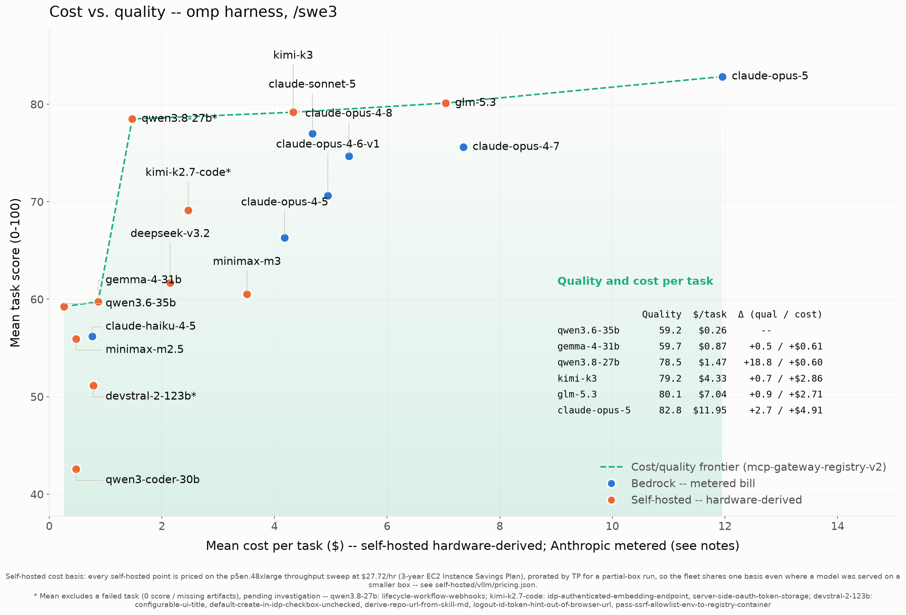
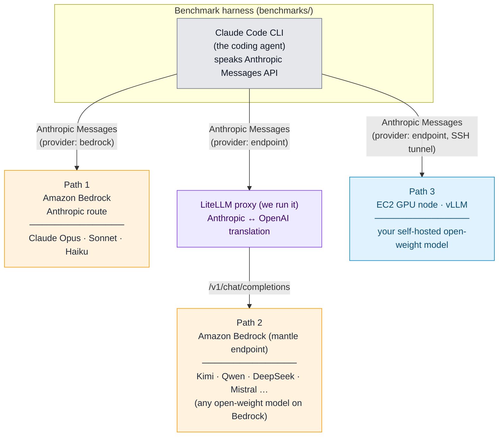
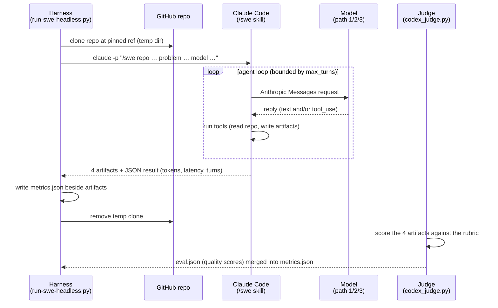

> [!NOTE]
> **Superseded.** This is the README as it stood before the restructure of 2026-09-04, kept for reference. The current one is [README.md](../../README.md), and the detail this file carried now lives in the documents it links to.

<h1 align="center">Agentic Coding Harness and Benchmarks</h1>

<p align="center">
<a href="../../LICENSE"></a>
<a href="https://docs.aws.amazon.com/bedrock/latest/userguide/models-endpoint-availability.html"></a>
<a href="../.././"></a>
</p>

<p align="center">
<a href="https://github.com/aarora79/agentic-coding-harness-benchmarks">GitHub Repo</a> |
<a href="#what-do-i-do-with-this">What do I do with this?</a> |
<a href="../results-swe3.md">Results (/swe3)</a> |
<a href="../agentic-coding-swe-comparison-swe3.md">Harness Comparison</a> |
<a href="../slides/agentic-coding-benchmarks-presentation.pdf">Slide Deck</a> |
<a href="../slides/agentic-coding-benchmarks-exec.pdf">Executive Brief</a> |
<a href="../cost-per-task-methodology.md">Cost Methodology</a>
</p>

> **This is sample code intended for demonstration and learning purposes only.**
> It is not meant for production use. Review and harden all scripts, configurations,
> and IAM permissions before using in any production or sensitive environment.

> [!WARNING]
> **These results are actively churning -- expect the numbers to move for a few days.**
> We are re-running benchmarks almost hourly and learning a great deal about how
> different **coding-harness x model** combinations behave: their real token usage,
> caching, cost, and how each model drives (or under-drives) a long-horizon agentic
> task. As we learn, methodology improves (e.g. counting subagent tokens, switching
> the default skill to a single-agent variant) and figures get re-measured. Treat
> the current numbers as a **live snapshot**, not final -- they should settle over
> the coming days.

## Why this exists

Enterprises are adopting coding agents and models at scale, and the bill grows with every developer and every task. The two big levers on that bill -- **which harness** drives the work and **which model** it drives -- are usually chosen on gut feel or on public leaderboards that may already be **saturated**: models can be tuned toward well-known public test sets, so a high headline number does not reliably predict performance on a team's actual, messy, long-horizon coding work.

This repo measures the thing that actually matters instead: **harness x model, on real agentic software-engineering tasks against real repositories**, reporting all three axes a buyer trades off -- **cost, latency, and accuracy**. Crossing harnesses with models gives real **optionality**: the same model can be a few points more accurate under one agent yet several times cheaper and faster under another (see the [cross-harness comparison](../agentic-coding-swe-comparison-swe3.md)). With those numbers in hand, an organization can make an **informed, defensible decision** about the cost/latency/accuracy trade-off for its own workload -- and, very often, **lower its coding bill substantially** by picking a cheaper harness-and-model pairing that is more than good enough, rather than defaulting to the most expensive option. That is the deliverable: an evidence base for smart, budget-aware choices on work that looks like yours, not like a leaderboard.

## Overview

This repository is a **benchmark and harness for measuring how well different LLMs perform real-world software-engineering tasks** when driven by a coding agent. It supports **four coding agents (harnesses)** today -- [Claude Code](https://docs.anthropic.com/en/docs/claude-code), Anthropic's command-line coding agent; [pi](https://github.com/earendil-works/pi-coding-agent), a lightweight open-source agent; [oh-my-pi](https://github.com/can1357/oh-my-pi) (`omp`, [omp.sh](https://omp.sh)), a fork of pi -- see [omp setup](../omp-setup.md); and [kiro-cli](https://kiro.dev) (the successor to the Amazon Q Developer CLI), which drives Kiro's own managed, Amazon Bedrock-backed models -- with [opencode](https://opencode.ai) being added soon. Claude Code and pi are each wired to run with a model hosted in any of **three different places**, so you can put many models through the *same* tasks with the *same* harness and compare them directly on both quality and cost; kiro-cli instead runs Kiro's managed models directly (it cannot target a self-hosted endpoint -- see [kiro-cli setup](../kiro-cli-setup.md)). Pick the harness per run with `--agent claude` (default), `--agent pi`, `--agent omp`, or `--agent kiro`, and the skill with `--skill swe2`/`--skill swe3`; results are kept separate on disk (`<model>/<harness>/<skill>/<repo>/<task>`) so neither the agents nor the two skills ever overwrite each other.

It runs **two complementary benchmarks**, and combining them is the whole point:

1. **Quality** -- how well a model actually does a real coding task (scored 0-100 by an independent LLM judge).
2. **Throughput** -- how many tokens per second a self-hosted model sustains on a given GPU instance, which turns the instance's hourly price into a **hardware-derived cost per task**.

Quality alone tells you which model is best; cost alone tells you which is cheapest. Plotting one against the other yields the **cost/quality Pareto frontier** (the chart below) -- the set of models where nothing else is both better *and* cheaper. That frontier is the deliverable: it is what lets you choose a model for a real budget, and it exists only because this repo measures both halves.

**Crucially, the two benchmarks must be combined over the *real agentic coding tasks*, not over a synthetic input:output token ratio.** Agentic coding is a **prefill-heavy, long-horizon** workload: each task replays a large, growing transcript as fresh input on every turn and emits a comparatively tiny edit, so the real input:output ratio runs ~150:1 up to ~660:1 -- far more lopsided than the ~3:1 or ~4:1 assumed by generic pricing. A model's cost per task therefore depends on *how* it drives the task (how many turns, how much context it re-reads, whether prefix caching hits), which a lab-style token-count estimate cannot capture. This repo measures throughput on that same prefill-heavy shape and multiplies it by the tokens each real run actually processed, so the cost on the frontier is the cost of the *work as it happens* -- see [cost-per-task-methodology.md](../cost-per-task-methodology.md).

## What the frontier is for

A frontier you only look at is a chart. The point is to spend less on every coding task your team does, and that takes two things: a frontier measured on **your** code, and something that reads it during **their** work.

Both exist. The measurement side is this repository; the spending side is [**`swe-router`**](../../vend/swe-router/), a skill that installs into any coding assistant and names the cheapest model that clears the bar for the task in front of the developer.

The diagram below is also a [slide-ready HTML version](../slides/swe-router-workflow.html).

```
MEASURE ONCE, SPEND LESS ON EVERY TASK
Everyone knows the top model is overkill for most tasks.
This makes the cheaper choice the automatic one.

+- PLATFORM TEAM: a cron job, weekly, unattended ------------+  +- EVERY DEVELOPER: every task ----+
| 1 . MEASURE                     SHIPS AS THE               |  | 2 . ROUTE                        |
| self-hosted . managed service   swe-router SKILL           |  | Claude Code . Codex . pi . ...   |
| . vendor API                                               |  |                                  |
|                                 +------------------------+ |  | +------------------------------+ |
| +----------------------------+  | models.json            | |  | | A task begins                | |
| | Available models           |  |   score + cost, per    | |  | |   swe-router is installed in | |
| |   whatever security        |  |   tier                 | |  | |   the harness - it engages   | |
| |   approved                 |  |                        | |  | |   on its own, nobody invokes | |
| +----------------------------+  |   allowed-models.txt   | |  | |   it                         | |
|                                 |   the approved list,   | |  | +------------------------------+ |
| +----------------------------+  |   now the filter       | |  |                |                 |
| | Your dataset               |  |                        | |  |   +------------+------------+    |
| |   tasks from your repo     |  |   route.py             | |  |   v                         v    |
| +----------------------------+  |   the decision, as     | |  |   +------------+  +------------+ |
|               |                 |   code                 | |  |   | How bad if |  | How hard   | |
|               v                 |                        | |  |   |   wrong?   |  |   is it?   | |
| +----------------------------+  |   One curl to install. | |  |   |   -> a     |  |   -> a     | |
| | Run the benchmark          |  |   Every developer      | |  |   |   floor    |  |   table    | |
| |   every model x every      |  |   reads the same       | |  |   +------------+  +------------+ |
| |   task, judged             |  |   numbers on the same  | |  |   +------------+------------+    |
| +----------------------------+  |   day.                 | |  |                v                 |
|               |                 +------------------------+ |  | +==============================+ |
|               v                                            |  | | CHEAPEST MODEL OVER THE FLOOR| |
| +============================+                             |  | |   ranked over what this      | |
| | YOUR FRONTIER              |                             |  | |   developer can actually     | |
| |   not a vendor claim, not  |                             |  | |   select                     | |
| |   a public set that leaked |                             |  | +==============================+ |
| |   into training data       |                             |  |                                  |
| +============================+                             |  |                                  |
+------------------------------------------------------------+  +----------------------------------+

====================================================================================================
PLATFORM TEAM GETS   Up to 88% less per task, against running the top model on every task
                     - measured on your own repo, not claimed.

DEVELOPERS GET       No decision. The right model arrives with the task; nobody weighs
                     quality against the bill, twenty times a day.
```

**Why measure it yourself.** A vendor's benchmark tells you how their model does on their tasks. A public dataset tells you how every model does on problems that have been in training data for a year. Neither tells you what a model costs to run *your* code, which is the only number a budget cares about. **Measure** takes your model list -- whatever security approved and procurement cleared -- and your repository, and produces a frontier that is true for you.

**Why what ships matters.** The frontier stops being a chart at the moment it becomes a file someone can install. `models.json`, `allowed-models.txt` and the skill are one commit, and a developer gets them with one `curl` — so the measurement a platform team ran on Tuesday is what every assistant is reading on Wednesday, with no one retyping a number.

The allow-list is the same list on both sides. What security approved in **Measure** *is* the file that filters candidates in **Route**, which is why a model nobody cleared can never be recommended, however well it scored.

**Why version it.** A frontier is a fact with a date on it. New models arrive, prices move, and a fix to token accounting once moved `claude-opus-5` from $7.63 to $11.95 per task without changing a single score. Committed, that is a reviewable diff rather than a surprise, and a bad frontier can be reverted like any other dependency.

**What Route costs to adopt.** Five files copied into a skills directory. `swe-router` runs in Claude Code, Codex, pi, or anything that reads a skill, engages on its own before a substantial task, and prints a few lines. It changes no settings and writes no code -- the developer switches model, or does not.

Measured over the 21 benchmark tasks, routing this way clears a quality floor of 70 on 18 of them at **$1.47 per task**, against `claude-opus-5` clearing it on all 21 at **$11.95**. That trade is the product: see [what it delivers, measured](../../vend/swe-router/README.md#what-it-delivers-measured) for the floors, the hit rates and the headroom that buys back most of the gap.

**This is not a static, single-shot benchmark.** Most model evaluations measure one prompt and one response. Here the unit of work is a **long-horizon, multi-turn agentic task**: the model drives Claude Code through an open-ended tool-use loop -- reading files, editing code, running commands, and reacting to results over **tens to hundreds of LLM turns** (typically ~50-250, up to 300+) that run **anywhere from ~10 minutes to over an hour** per task. What we measure is whether a model can *sustain* coherent engineering work across that horizon -- staying on task, using tools correctly, and landing a working change -- not whether it can answer a single question well. That is a fundamentally different (and harder) thing to be good at, and it is where models that look similar on conventional benchmarks pull apart.

Each task points the agent at a real GitHub repository and a real problem. The agent works the task **non-interactively** through the `/swe2` skill, which lands six artifacts on disk -- four design docs (`github-issue.md`, `lld.md`, `review.md`, `testing.md`) plus the implemented change (`patch.diff`, `implementation.md`). The harness records what the run cost -- token usage, latency, and the number of LLM turns -- and a separate [judge](../../benchmarks/docs/harness-reference.md#scoring-the-artifacts-the-judge) scores the artifacts for quality. Run the same task across models and the resulting `metrics.json` / `eval.json` files line up side by side.

## Results

The headline run is the **omp** harness driving the single-agent `/swe3` skill over the **`mcp-gateway-registry-v2`** dataset: 21 tasks, 16 models, every task scored 0-100 by an independent judge. Each task comes from a closed issue in [agentic-community/mcp-gateway-registry](https://github.com/agentic-community/mcp-gateway-registry), pinned to the release *before* the fix shipped, so the defect is present in the tree the agent clones. The tasks span four complexity tiers, so the results split by how hard the work is.

This repo also holds earlier runs on other harnesses, skills and datasets -- Claude Code and pi on the 5-task v1 dataset, kiro-cli, and the multi-agent `/swe2` skill. Those stay published as background. They use different task sets, so their scores do not line up with the table below and must not be merged into it.



> **What is a Pareto frontier, and what does it mean here?** The frontier is the set of models where **no other model is both higher-scoring _and_ cheaper**. Those are the only models worth considering; everything else is *dominated*, so there is never a reason to pick it. From this chart: **`qwen3.8-27b` (78.48, $1.47/task) dominates `claude-sonnet-5` (76.97, $4.67/task)** -- a 27B open-weight model outscores a frontier API model at under a third of the cost. Read it in two steps: pick the quality you need on the y-axis, then take the cheapest model on the frontier at that level. Costs come in two bases that do not compare as raw dollars -- metered Bedrock bills against hardware-derived self-hosted figures -- so the results docs also draw the frontier within each basis.

**claude-opus-5 tops quality at 82.83 for $11.95 a task.** `glm-5.3` comes within 1.6 points at 81.27 for $8.09. The cheapest way to reach the high 70s is `qwen3.8-27b`: 78.48 for **$1.47 a task**. At the other end, `qwen3.6-35b` scores 59.24 for **26 cents**. Every self-hosted figure is priced on one basis -- the p5en.48xlarge sweep -- so the fleet compares like for like even where a model was served on a smaller box; a figure is the cost of that model's work on p5en, not a quote for the box it ran on.

Within the metered Bedrock rows alone the frontier is `claude-haiku-4-5` ($0.76, 56.18), `claude-opus-4-5` ($4.18, 66.32), `claude-sonnet-5` ($4.67, 76.97) and `claude-opus-5` ($11.95, 82.83). Three Opus builds fall off it: Sonnet 5 beats `claude-opus-4-7` (75.60, $7.35), `claude-opus-4-8` (74.69, $5.32) and `claude-opus-4-6-v1` (70.64, $4.95) on score and on price.

- **[omp harness, /swe3, v2 dataset](../harness-omp-swe3.md)** -- the headline table above, 16 models, with the quality radar and the cost-accuracy view.
- **[Which model for which task?](../model-selection-by-complexity.md)** -- what a model upgrade buys you at each difficulty tier.
- **[Cost per task, and why the two bases differ](../cost-per-task-methodology.md)** -- how a fixed instance price becomes a cost per token and per task.

Background runs, on other datasets and harnesses:

- **[Results -- /swe3 on the v1 dataset](../results-swe3.md)** -- 5 tasks, 16 models, pi harness.
- **[Results -- /swe3 on v2](../results-swe3-v2.md)** -- the v2 dataset under the earlier harnesses.
- **[Results -- /swe2 (multi-agent)](../results-swe2.md)** -- the multi-agent skill, Claude Code harness, 14 models.
- **[Cross-harness comparison (/swe3)](../agentic-coding-swe-comparison-swe3.md)** -- Claude Code against pi on the same models.

Path 1 (Anthropic on Bedrock) and Path 3 (self-hosted on vLLM) have published runs. Path 2 (open-weight on Bedrock via LiteLLM) [works](../../benchmarks/docs/path-open-weight-on-bedrock-litellm.md) but nobody has run it yet. Both datasets ship in [benchmarks/dataset/](../../benchmarks/dataset/) so you can reproduce a run; generated artifacts are not committed.

> **The example repo is the example, not the contract.** `/swe3` works against any GitHub URL -- clone the target you actually care about, write the task description, and run.

### Results by harness and skill

One model can be driven by different coding agents (harnesses), and each harness runs either SWE skill (`swe2`, the multi-agent one, or `swe3`, the single-agent one). Token use and accuracy differ enough that results are kept per (harness, skill), each with its own generated document: a table plus cost-quality and quality-radar charts. **The reported result is omp with `/swe3` on the v2 dataset**; the rest of this table is earlier work on other datasets, kept for reference and not comparable with it.

| Skill | Results write-up | Cross-harness comparison | Per-harness generated docs |
|---|---|---|---|
| `/swe3` (single-agent) | [results-swe3.md](../results-swe3.md) | [comparison](../agentic-coding-swe-comparison-swe3.md) | [Claude Code](../harness-claude-code-swe3.md) · [pi](../harness-pi-swe3.md) · [omp](../harness-omp-swe3.md) · [kiro-cli](../harness-kiro-cli-swe3.md) |
| `/swe2` (multi-agent) | [results-swe2.md](../results-swe2.md) | [comparison](../agentic-coding-swe-comparison-swe2.md) | [Claude Code](../harness-claude-code-swe2.md) · [pi](../harness-pi-swe2.md) |

**kiro-cli** ([#73](https://github.com/aarora79/agentic-coding-harness-benchmarks/issues/73)) has landed as a third harness (`/swe3`, 5 models -- see [its results](../harness-kiro-cli-swe3.md) and [setup/cost notes](../kiro-cli-setup.md)); it drives Kiro's managed Bedrock-backed models and is priced on a distinct **Kiro-credit** basis (see the [cost methodology](../cost-per-task-methodology.md)). [opencode](https://opencode.ai) ([#72](https://github.com/aarora79/agentic-coding-harness-benchmarks/issues/72)) is coming.

## Does routing beat picking one model?

The results above rank models on a whole dataset. A developer picks one per task, which is a different question -- and the usual answer is "run the best model for everything", which these numbers say is expensive. The **[`/swe-router`](../../.claude/skills/swe-router/SKILL.md)** skill answers it per task: read the repository and the change, decide a quality floor from the consequence of getting it wrong and a complexity tier, then take the cheapest measured model that clears the floor at that tier. It recommends and stops. The developer makes the switch.

We ran it against its own evidence. All 16 models have run all 21 v2 tasks, so for whatever the skill picks we can look up what that model **actually** scored and cost on that task, rather than estimating it.

| | Router | `claude-opus-5` on everything |
|---|---:|---:|
| Total cost, 21 tasks | **$134.64** | $251.04 |
| Mean task score | 78.94 | 82.83 |

**46.4% cheaper for 4.7% less quality**, using four models: `qwen3.8-27b` on 13 tasks, `claude-opus-5` on 2, `claude-opus-4-8` and `glm-5.3` on 1 each. On 4 further tasks nothing cleared the floor and the skill's answer was to stay put.

Three caveats decide how much to trust that, and all three come from the judgment step rather than the arithmetic:

- **The judgment is not stable.** Run three times per task with an identical prompt, the floor came out unanimous on only **14 of 21** tasks and the tier on 18 of 21.
- **The tier classifier is right about 76% of the time**, matching the dataset's own complexity label on 16 of 21 -- and every miss rated the task *harder* than it was.
- **Some floors are unreachable.** The skill never checks that a model exists which can clear the floor it just set. At the floors this run produced, nothing measured scores 80 on the hard tier, so `claude-opus-5` itself falls short on 4 tasks.

Read the full working: **[what the model judged each task to need](../swe-router-judged-inputs.md)** (floor, tier and reasoning per task, with the spread across repeats) and **[the routing result joined to the measured runs](../swe-router-evaluation-judged.md)** (per-task picks, costs and score deltas). A script writes both -- see [Reproducing the routing evaluation](../../benchmarks/README.md#reproducing-the-routing-evaluation).

One thing is still a person's job: `swe-router` recommends, and the developer switches. [docs/vision.md](../vision.md) describes the step past that, a harness that changes model on its own.

## The three hosting paths

Whichever path you choose, the agent (Claude Code), the tasks, the `/swe` skill, and the scoring are identical -- only *where the model runs and how the request reaches it* changes.



| | Path 1 - Anthropic on Bedrock | Path 2 - open-weight on Bedrock (LiteLLM) | Path 3 - self-hosted on EC2 (vLLM) |
| --- | --- | --- | --- |
| **Which models** | Anthropic family (Claude Opus, Sonnet, Haiku) | Any open-weight model on Bedrock (Kimi, Qwen, DeepSeek, Mistral, GLM, …) | Any open-weight model you can serve (Qwen3-Coder, GLM, Kimi, …) |
| **Where the model runs** | Amazon Bedrock | Amazon Bedrock | Your EC2 GPU instance |
| **How Claude Code reaches it** | Directly, native Anthropic route | Through a [LiteLLM](https://github.com/BerriAI/litellm) proxy we run that translates Anthropic ↔ OpenAI | Directly to your vLLM server (over an SSH tunnel) |
| **Cost model** | Pay-per-token | Pay-per-token | Fixed hourly GPU cost |
| **Extra infrastructure** | None | The LiteLLM proxy ([one script](../../benchmarks/scripts/bedrock-mantle-proxy.sh)) | An EC2 GPU node running vLLM |
| **Best for** | Benchmarking the Anthropic family | Model variety with zero infrastructure to manage | Data sovereignty, air-gapped, and high-volume workloads where fixed GPU cost beats per-token pricing |
| **Operational guide** | [Path 1](../../benchmarks/docs/path-anthropic-on-bedrock.md) | [Path 2](../../benchmarks/docs/path-open-weight-on-bedrock-litellm.md) | [Path 3](../../benchmarks/docs/path-self-hosted-vllm.md) |

The key enabler for Path 2 is the LiteLLM proxy. Claude Code speaks the [Anthropic Messages API](https://docs.aws.amazon.com/bedrock/latest/userguide/inference-messages-api.html), which on Bedrock reaches **only** Claude/Anthropic models; the open-weight models are reachable solely through Bedrock's OpenAI-compatible [`bedrock-mantle` endpoint](https://docs.aws.amazon.com/bedrock/latest/userguide/inference.html) (Chat Completions). The proxy sits between the two and translates in both directions, so **any open-weight model on Bedrock can be wired into Claude Code** without changing the agent. All 38 third-party models on `bedrock-mantle` support tool calling and streaming natively.

## What a single benchmark run does

The flow below is identical across all three paths; only the box the request lands in (Bedrock's Anthropic route, the LiteLLM proxy, or your vLLM server) changes.



The `/swe2` and `/swe3` skills land **six artifacts** -- four design docs plus the implemented change (`patch.diff`, `implementation.md`) -- but they do **not** run tests or open PRs; whether the design and code are any good is the downstream evaluation the judge (or a human) performs on the artifacts. Full mechanics are in the [harness reference](../../benchmarks/docs/harness-reference.md).

> **"SWE" here means software engineering in general -- not [SWE-bench](https://www.swebench.com/), the specific benchmark dataset.** The `/swe` skill lets you run any model against any task in any repo of your choosing. It is a *harness*, not a fixed benchmark set: compare results across models on the same task, or a single model across tasks of varying difficulty.

## Datasets

A dataset is a single YAML file: a metadata header plus a list of tasks, each pointing at a GitHub repo and a problem. Two datasets ship in [benchmarks/dataset/](../../benchmarks/dataset/):

- [hello-world.yaml](../../benchmarks/dataset/hello-world.yaml) -- a trivial sanity dataset (the [octocat/Hello-World](https://github.com/octocat/Hello-World) repo) for kicking the tires of a new model or endpoint.
- [mcp-gateway-registry.yaml](../../benchmarks/dataset/mcp-gateway-registry.yaml) -- the reference dataset, whose tasks are drawn from real upstream issues in [agentic-community/mcp-gateway-registry](https://github.com/agentic-community/mcp-gateway-registry).

**Nothing in the harness is specific to a particular repository.** Adding your own benchmark dataset is just writing another YAML file in the same format -- point tasks at any public repo and pinned ref. The dataset format is documented in the [harness reference](../../benchmarks/docs/harness-reference.md#the-dataset).

### What do I do with this?

The point of this repo is to help you **pick the right coding agent and model for your tasks** -- the pairing that lands the quality you need at the cost and latency you can live with, instead of defaulting to the most expensive option. There are two ways to get there:

1. **Use the frontier we already published.** The cost/quality results here (across harnesses, models, and hosting paths) are a strong, ready-made baseline -- read the [harness comparison](../agentic-coding-swe-comparison-swe3.md) and per-harness docs and pick from the models on the frontier. No runs of your own required.
2. **Build your own frontier on your own code.** When you want numbers on **work that looks like yours** rather than our example repo, use the benchmarking harness in this repo: write a dataset YAML pointing at your repositories and run it -- the models, harnesses, judge, and cost math are identical to what produced the results above. This is the rest of this section.

**Then put it in front of developers.** [`swe-router`](../../vend/swe-router/) reads whichever frontier you point it at -- ours or the one you just built -- and names the cheapest model clearing the bar for each task. Five files, no dependencies, works in any assistant that reads a skill. Point it at your own `models.json` and the recommendations are grounded in your code rather than our example repo.

### Benchmark your own code repositories

This is option 2 above -- building your own frontier on your own code. It is a few steps:

1. **Create a dataset file** under [benchmarks/dataset/](../../benchmarks/dataset/), e.g. `my-team.yaml`. Copy [mcp-gateway-registry.yaml](../../benchmarks/dataset/mcp-gateway-registry.yaml) as a template. Minimal shape:

   ```yaml
   schema_version: "1.0"
   name: my-team
   title: My team's benchmark
   description: Real tasks from our own repositories.
   default_ref: main                      # pin a tag/commit per task for reproducibility
   metrics: [input_tokens, output_tokens, num_turns]
   complexity_levels: [low, medium, high]
   tasks:
     - id: add-rate-limiting-to-gateway
       repo: https://github.com/your-org/your-repo
       ref: v2.3.0                         # pin so every run clones the same code
       complexity: medium
       tags: [python, api, feature]
       problem_statement: |
         Describe the task in enough detail for an agent to act on it without
         you present -- what to change, constraints, and what "done" means.
   ```

   Each task points at a repo + pinned ref + a problem statement (from a real ticket or issue). Full field reference: [harness reference -> The dataset](../../benchmarks/docs/harness-reference.md#the-dataset). Any repo the runner can `git clone` works (public, or private with credentials available to your shell).

2. **Run it** against whichever model/harness/path you want -- same commands as the example, just swap the dataset:

   ```
   /benchmark provider=bedrock model=claude-opus-5 dataset=dataset/my-team.yaml
   ```

   or headless: `benchmarks/scripts/run-e2e-benchmark.sh --provider bedrock --model ... --dataset dataset/my-team.yaml`. Pick the harness with `--agent claude|pi|kiro` and the skill with `--skill swe2|swe3` (`--agent kiro` drives Kiro's managed models and sets `--provider kiro` automatically).

3. **Read your results.** Artifacts and scores land under `benchmarks/swe-benchmark-data/<model>/<harness>/<skill>/<your-dataset-repo>/<task>/`, and the same generators build your own cost/quality frontier (`gen_swe_comparison.py`, `plot_cost_quality.py`). Your runs are gitignored, so a customer's private code never lands in version control.

> **Tips for good tasks:** pin a `ref` so reruns are comparable; write the `problem_statement` like a well-scoped ticket; use `tags` to slice results by language/domain/change-type; and add optional `ground_truth` (reviewer-only, never shown to the agent) if you want the judge to check against a known-good approach.

## Prerequisites

> **On a fresh machine, start with the [`/setup-machine` skill](../../.claude/skills/setup-machine/SKILL.md).** It inspects the box, prints exactly what it will install and why, installs it, and summarizes -- so you do not have to work through the list below by hand. It also installs the GPU stack (vLLM, nvtop, nvitop) only when a GPU is actually present, and puts the vLLM venv and its caches on the large ephemeral NVMe when the root disk is too small.

- An **AWS account** with [Amazon Bedrock model access](https://console.aws.amazon.com/bedrock/home#/modelaccess) enabled for the models you want (Paths 1 and 2).
- **AWS credentials** configured locally (`aws configure`, an IAM role, or AWS SSO).
- **[Claude Code CLI](https://docs.anthropic.com/en/docs/claude-code)** installed.
- **[uv](https://docs.astral.sh/uv/)** and **Python 3.10+** for the harness.
- For Path 3: permission to launch an **EC2 GPU instance** (e.g. `g6e.12xlarge`).

> The `bedrock-mantle` endpoint used for Path 2 (third-party models) is currently available in **`us-east-1`**.

## Get started

1. **Set up the machine -- do this first on any new box.** Run the **`/setup-machine` skill** from Claude Code (or its script directly). It reports what the instance is, lists every missing dependency with the reason each one is needed, installs them, and prints a summary table:

   ```bash
   # Dry run: report only, install nothing
   .claude/skills/setup-machine/setup-machine.sh --check

   # Install everything missing (git identity is required, never guessed)
   .claude/skills/setup-machine/setup-machine.sh --install \
       --git-name "Your Name" --git-email "you@example.com"
   ```

   Add `--with-omp` / `--with-kiro` to include those two harnesses (opt-in: both ship third-party install scripts, and kiro-cli needs an interactive sign-in). See [.claude/skills/setup-machine/SKILL.md](../../.claude/skills/setup-machine/SKILL.md) for the full component list and flags.

2. **Set up the harness** (its own isolated virtual environment):

   ```bash
   cd benchmarks
   uv sync
   cp config/runner.example.yaml config/runner.yaml
   ```

3. **Wire the agent CLIs to Amazon Bedrock.** Installing `claude` and `codex` does not configure them -- an unconfigured `codex` silently calls `api.openai.com` and 401s mid-run. Follow [benchmarks/docs/agent-cli-bedrock-setup.md](../../benchmarks/docs/agent-cli-bedrock-setup.md).

4. **Run a benchmark.** The fastest way is the **`/benchmark` skill** from Claude Code, which drives the whole flow interactively -- pre-flight checks, the harness run over a dataset, and the judge -- for any of the three paths. It even manages the vLLM server and metrics collector for the self-hosted path:

   ```
   /benchmark provider=vllm model=qwen3.6-35b dataset=dataset/mcp-gateway-registry.yaml
   ```

   Prefer a script? The same flow runs headless via [benchmarks/scripts/run-e2e-benchmark.sh](../../benchmarks/scripts/run-e2e-benchmark.sh) (`--provider bedrock|litellm|vllm --model ... --dataset ...`).

5. **Pick a path and follow its guide** for the setup details each one needs -- every guide ends with a copy-pasteable run command:
   - [Path 1 - Anthropic models directly on Amazon Bedrock](../../benchmarks/docs/path-anthropic-on-bedrock.md)
   - [Path 2 - open-weight models on Amazon Bedrock via a LiteLLM proxy](../../benchmarks/docs/path-open-weight-on-bedrock-litellm.md)
   - [Path 3 - self-hosted open-weight models on EC2 with vLLM](../../benchmarks/docs/path-self-hosted-vllm.md)

6. **Read the shared mechanics** once (they apply to every path): the [harness reference](../../benchmarks/docs/harness-reference.md) covers the dataset format, the runner config, running the benchmark, the metrics file, and the judge.

For Path 3 you must first stand up the vLLM server itself -- see [self-hosted/vllm/README.md](../../self-hosted/vllm/README.md) (or let the `/benchmark` skill start it for you).

## Repository structure

```text
claude-code-multi-model/
├── README.md                  ← You are here (concepts, the three paths, results)
├── LICENSE                    MIT-0
├── CODE_OF_CONDUCT.md
├── CONTRIBUTING.md
├── SECURITY.md
├── SUPPORT.md
├── THIRD_PARTY                Third-party dependency attributions
├── .github/                   Issue and pull-request templates
├── .claude/                   ← Claude Code skills shipped with the repo
│   └── skills/
│       ├── setup-machine/     /setup-machine — inspect a fresh box, install every dependency (start here)
│       ├── benchmark/         /benchmark — run one end-to-end benchmark (service + harness + judge)
│       ├── swe/, swe2/, swe3/ /swe* — drive a model through a SWE task on any repo (swe3 is the default)
│       ├── swe-router/      /swe-router — recommend the right model for a task, from these measurements
│       ├── throughput/        /throughput — sweep a served model's throughput
│       ├── security-check/    /security-check — Cipher security review + fix before any commit
│       └── vllm-setup/        /vllm-setup — stand up the EC2 vLLM server (Path 3)
├── benchmarks/                ← The benchmark harness and results
│   ├── README.md              Harness landing page
│   ├── docs/                  Shared harness reference + one guide per hosting path
│   ├── config/                runner.example.yaml, litellm-mantle.yaml (Path 2 proxy)
│   ├── dataset/               Benchmark dataset YAML files
│   ├── scripts/               Run harness, dataset/config loaders, judges, proxy launcher
│   ├── tests/                 Unit tests
│   └── swe-benchmark-data/    Committed example: Hello-World only; all other runs are gitignored
└── self-hosted/               ← Path 3: EC2 self-hosted serving (vLLM)
    └── vllm/
        ├── README.md          Full EC2 + vLLM setup guide
        ├── models/            Per-model serving guidelines (one .md per model)
        ├── scripts/           vllm-install.sh, vllm-serve.sh, tunnel.sh, …
        ├── clients/           Inference + metrics-collection Python clients
        ├── tests/             unittest suite for the clients
        └── config/            claude-code.json, opencode.json
```

## Documentation map

Where to read more, by topic:

| Document | What it covers |
|----------|----------------|
| [.claude/skills/setup-machine/SKILL.md](../../.claude/skills/setup-machine/SKILL.md) | **Start here on a new machine.** What `/setup-machine` inspects and installs, why each component is needed, where the vLLM venv lands on a small root disk, and what it deliberately does not do. |
| [docs/results-swe3.md](../results-swe3.md) / [docs/results-swe2.md](../results-swe2.md) | Full benchmark results per skill: task-by-task tables, per-model leaderboard, cost/quality frontier, hardware, and what the data says. |
| [.claude/skills/swe-router/SKILL.md](../../.claude/skills/swe-router/SKILL.md) | The `/swe-router` skill: how it sets a quality floor from the consequence of a change being wrong, picks the tier table to read it against, and selects the cheapest model that clears it. Advisory -- it recommends and stops. |
| [docs/swe-router-judged-inputs.md](../swe-router-judged-inputs.md) | What `omp` + `claude-opus-5` judged each of the 21 v2 tasks to need: floor, tier, the reasoning, and how much those moved across three identical runs. |
| [docs/swe-router-evaluation-judged.md](../swe-router-evaluation-judged.md) | Whether routing on those judgments beats running one model on everything: per-task picks joined to the measured runs, with cost and quality deltas. |
| [docs/vision.md](../vision.md) | The north star: a cost-aware harness that routes each task (and each phase) to the right model on the frontier -- frontier / workhorse / budget -- switching automatically. |
| [benchmarks/README.md](../../benchmarks/README.md) | The benchmark harness landing page: the three hosting paths, how a run works, and how to reproduce the results above. |
| [benchmarks/docs/harness-reference.md](../../benchmarks/docs/harness-reference.md) | Full harness reference: config, the `/swe2` flow, context-window/auto-compaction, and the LLM-as-judge scoring. |
| [docs/agentic-coding-swe-comparison-swe3.md](../agentic-coding-swe-comparison-swe3.md) | Claude Code vs pi on the same models and tasks (per skill): per-metric win tallies, the cost/quality frontier, and hand-authored model-tier buying guidance. Claude Code is a few points more accurate on some models; pi is far more token-efficient (and thus faster and, when self-hosting, cheaper). See the [per-skill results docs](#results-by-harness-and-skill) for each agent's full table and charts. |
| [benchmarks/docs/path-anthropic-on-bedrock.md](../../benchmarks/docs/path-anthropic-on-bedrock.md) | Path 1 setup: benchmarking the Anthropic family (Claude Opus/Sonnet/Haiku) directly on Amazon Bedrock. |
| [benchmarks/docs/path-open-weight-on-bedrock-litellm.md](../../benchmarks/docs/path-open-weight-on-bedrock-litellm.md) | Path 2 setup: open-weight models on Amazon Bedrock through the LiteLLM proxy. |
| [benchmarks/docs/path-self-hosted-vllm.md](../../benchmarks/docs/path-self-hosted-vllm.md) | Path 3 setup: self-hosting a model on vLLM and pointing the harness at it. |
| [docs/kiro-cli-setup.md](../kiro-cli-setup.md) | The kiro-cli harness: install, sign-in, headless use, the Bedrock-managed-only constraint, and how its Kiro-credit spend is calculated. Results: [harness-kiro-cli-swe3.md](../harness-kiro-cli-swe3.md). |
| [benchmarks/docs/end-to-end-self-hosted-run.md](../../benchmarks/docs/end-to-end-self-hosted-run.md) | The full manual run-book for an end-to-end self-hosted benchmark. |
| [self-hosted/vllm/README.md](../../self-hosted/vllm/README.md) | Standing up a vLLM server: install, tensor parallelism, tool-call parsers, and the serving-config reference. |
| [self-hosted/vllm/models/](../../self-hosted/vllm/models/) | Per-model serving guides (HF repo, context window, TP size, tool parser, hardware fit) for every benchmarked model. |
| [docs/agentic-coding-throughput-comparison.md](../agentic-coding-throughput-comparison.md) | Serving-economics comparison across models: throughput, saturation, and hardware-derived cost per token / per task. |
| [docs/gpu-selection-h200-vs-l40s.md](../gpu-selection-h200-vs-l40s.md) | Which GPU to serve on: one H200 slice of a p5en vs a whole g6e.4xlarge (1x L40S), same model and config. Why the H200 slice is 41% cheaper per unit of work despite costing 2.6x per hour, and what it costs to serve N developers. Public on-demand prices, no discounts. |
| [docs/cost-per-task-methodology.md](../cost-per-task-methodology.md) | How the cost numbers are derived: the two cost lenses, prompt-caching accounting (API vs self-hosted), and why agentic coding is prefill-bound. |
| [docs/serving-optimization-notes.md](../serving-optimization-notes.md) | Portable vLLM serving defaults and why we do not tune the prefill knobs per model. |
| [CONTRIBUTING.md](../../CONTRIBUTING.md) / [SECURITY.md](../../SECURITY.md) / [SUPPORT.md](../../SUPPORT.md) | How to contribute, report a vulnerability, and get help. |

## See also

- [Claude Code docs](https://docs.anthropic.com/en/docs/claude-code) -- official Claude Code documentation
- [benchmarks/README.md](../../benchmarks/README.md) -- the harness landing page
- [self-hosted/vllm/README.md](../../self-hosted/vllm/README.md) -- standing up a self-hosted vLLM server (Path 3)

## License

This library is licensed under the MIT-0 License. See the [LICENSE](../../LICENSE) file.
