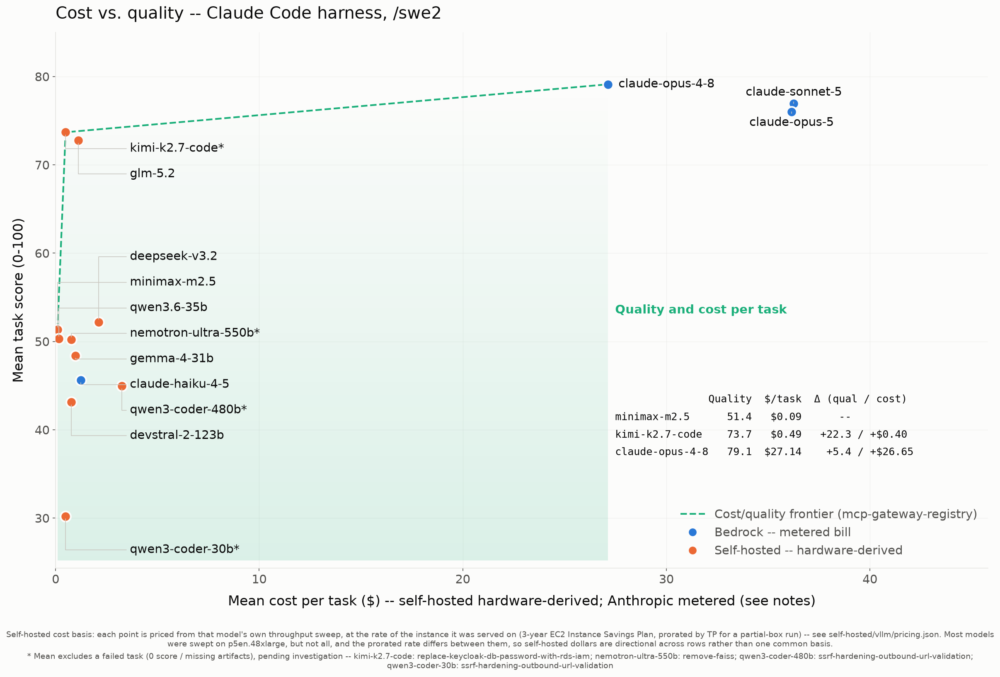
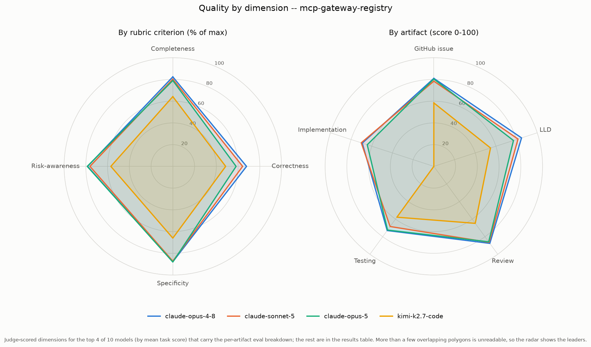

# Results -- /swe2 (multi-agent skill)

Full benchmark results for the **`/swe2`** skill (the multi-agent variant -- the agent may fan work out to sub-agents) on [agentic-community/mcp-gateway-registry](https://github.com/agentic-community/mcp-gateway-registry) at tag `1.24.4`: **5 tasks**, each scored 0-100 by an independent LLM judge (`codex exec`, `gpt-5.6-sol`, high reasoning effort). The single-agent `/swe3` results (the primary view) live in [results-swe3.md](results-swe3.md).

> **These results are a live snapshot, not final.** Benchmarks are re-run frequently and methodology keeps improving (e.g. counting sub-agent tokens, switching the default skill to the single-agent `/swe3` variant). Treat the numbers as directional.

> **Cost figures on this page predate the current cost basis and are being refreshed.** The self-hosted `$/task` numbers below were computed against earlier throughput sweeps and on-demand GPU pricing; the repo has since moved to committed-capacity rates (p5en Capacity Reservation $54.92/hr, g6e 1-year commitment rate $6.61/hr) and re-measured several models. For current, consistent cost numbers use the **[/swe3 results](results-swe3.md)** (the primary view) and the generated **[/swe2 harness docs](harness-claude-code-swe2.md)**, which are regenerated from the committed data. The task scores here are unaffected.

We ran **14 models** across **Path 1** (Anthropic on Amazon Bedrock) and **Path 3** (self-hosted on vLLM, across an 8x H200 `p5en.48xlarge` and a single `g6e.12xlarge`). Path 2 (open-weight on Bedrock via the LiteLLM proxy) is **fully implemented** ([setup](../benchmarks/docs/path-open-weight-on-bedrock-litellm.md)) but **has no published benchmark results yet** -- we publish only what we have measured. The `mcp-gateway-registry` dataset ships in [benchmarks/dataset/](../benchmarks/dataset/mcp-gateway-registry.yaml) so you can reproduce the run; generated artifacts are not committed.

## The tasks

| # | Problem | Difficulty | Source |
|---|---------|-----------|--------|
| 1 | `remove-faiss` | Medium | Upstream [#1285](https://github.com/agentic-community/mcp-gateway-registry/issues/1285) / [#452](https://github.com/agentic-community/mcp-gateway-registry/issues/452) |
| 2 | `remove-efs-from-terraform-aws-ecs` | Medium | Upstream [#1286](https://github.com/agentic-community/mcp-gateway-registry/issues/1286) |
| 3 | `ssrf-hardening-outbound-url-validation` | Medium | Upstream [#1282](https://github.com/agentic-community/mcp-gateway-registry/issues/1282) |
| 4 | `migrate-ecs-env-vars-to-secrets-manager` | High | Upstream [#1134](https://github.com/agentic-community/mcp-gateway-registry/issues/1134) |
| 5 | `replace-keycloak-db-password-with-rds-iam` | High | Upstream [#1303](https://github.com/agentic-community/mcp-gateway-registry/issues/1303) |

**Models benchmarked:** **Path 1 (Bedrock):** Claude-Opus-5, Claude-Opus-4.8, Claude-Sonnet-5, Claude-Haiku-4.5. **Path 3 (self-hosted on vLLM):** Kimi-K2.7-Code, GLM-5.2, DeepSeek-V3.2, MiniMax-M2.5, Nemotron-Ultra-550B, Qwen3-Coder-480B-A35B-Instruct, and Devstral-2-123B-Instruct (all on 8x H200 / `p5en.48xlarge`), plus Qwen3.6-35B-A3B, Qwen3-Coder-30B-A3B-Instruct, Qwen3-Coder-Next, and Gemma-4-31B-it (on `g6e.12xlarge` / 4x L40S). **No results yet (path is built):** Path 2 (open-weight on Bedrock via the LiteLLM proxy -- Mistral, ...) is [fully implemented](../benchmarks/docs/path-open-weight-on-bedrock-litellm.md).

## Cost vs. quality



Mean cost per task (x) against mean task score (y), one point per model. For **self-hosted** models with a throughput sweep, cost is **hardware-derived**: the model's blended cost per token (instance $/hr / measured tokens/sec, see [cost-per-task-methodology.md](cost-per-task-methodology.md)) times its *actual* input+output tokens per task, averaged over non-failed tasks. The four **Anthropic** points (Opus-4.8, Sonnet-5, Opus-5, Haiku-4.5) are **real token-metered Bedrock bills**; every self-hosted model now has a throughput sweep, so all of their costs are hardware-derived (no token-priced estimates remain) -- comparable as spend, different in kind. The cost/quality frontier runs **Qwen3-Coder-30B ($0.98 / 30.20) -> Qwen3.6-35B ($1.03 / 50.32) -> MiniMax-M2.5 ($1.16 / 51.56) -> Gemma-4-31B ($3.27 / 51.60) -> DeepSeek-V3.2 ($4.81 / 52.20) -> Kimi-K2.7-Code ($7.93 / 58.68) -> GLM-5.2 ($11.09 / 61.96) -> Claude-Opus-4.8 ($27.14 / 79.12)**. Opus-4.8 is both the **top-quality point and the top of the frontier**: it beats every other model on score at $27.14/task. Everything else is **dominated**: notably **Claude-Opus-5 ($36.15 / 76.00) and Claude-Sonnet-5 ($36.26 / 76.96) are both beaten by Opus-4.8 on score AND cost** -- Opus-4.8 scores higher and costs less than either. Claude-Haiku-4.5 (45.64 at $1.23) is beaten by MiniMax-M2.5 on both axes; Devstral-2-123B ($1.74 / 43.12), Nemotron-Ultra-550B ($1.75 / 50.20), and Qwen3-Coder-480B ($7.43) are dominated too. Qwen3-Coder-Next is omitted (not viable on this node). A model's mean excludes any 0-score failed task (footnote 5). Regenerate with `uv run scripts/plot_cost_quality.py --harness claude-code --skill swe2` (add `--dark`) from `benchmarks/`.

## Results -- 5 tasks x models

All cells are task scores (0-100), the mean of the artifact totals per (task x model). These are **`/swe2` runs -- design *and* implementation** (six artifacts: the four design docs plus `patch.diff` + `implementation.md`), scored by the same judge (`codex exec`, `gpt-5.6-sol`, high reasoning effort). **Claude-Opus-5, Claude-Opus-4.8, Claude-Sonnet-5, and Claude-Haiku-4.5** are **Path 1** results (Anthropic on Amazon Bedrock); every other column is **Path 3, self-hosted via vLLM** (hardware differs by model size -- see the row under the table). Columns are ordered by mean score. Bold = top score in row. Path 2 (open-weight on Bedrock via LiteLLM) is **built but not yet benchmarked**.

| Task | Diff. | Opus-4.8⁹ | Sonnet-5⁹ | Opus-5⁹ | GLM-5.2⁶ | Kimi-K2.7 | DeepSeek-V3.2 | MiniMax-M2.5 | Qwen3.6-35B | Nemotron-550B | Gemma-4-31B | Haiku-4.5⁹ | Qwen3-Coder-480B⁷ | Devstral-2-123B | Qwen3-Coder-30B |
|------|-------|----------:|----------:|--------:|---------:|----------:|--------------:|-------------:|------------:|--------------:|------------:|-----------:|------------------:|----------------:|----------------:|
| `remove-faiss` | Med | **76.0** | 72.2 | 69.8 | 58.2 | 55.2 | 48.2 | 44.2 | 53.2 | 0.0 ⁵ | n/a¹⁰ | 39.4 | 45.6 | 43.6 | 32.0 |
| `remove-efs-from-terraform-aws-ecs` | Med | **83.8** | 83.6 | 77.0 | 65.2 | 63.4 | 59.0 | 62.0 | 65.2 | 55.4 | 63.4 | 55.4 | 55.4 | 47.4 | 28.2 |
| `ssrf-hardening-outbound-url-validation` | Med | 78.6 | **83.0** | 81.2 | 65.2 | 56.4 | 56.4 | 58.2 | 41.6 | 52.4 | 52.6 | 43.4 | 0.0 ⁵ | 51.8 | 0.0 ⁵ |
| `migrate-ecs-env-vars-to-secrets-manager` | High | **84.4** | 70.4 | 78.6 | 63.2 | 67.6 | 51.2 | 53.6 | 46.4 | 50.0 | 48.0 | 41.4 | 41.0 | 42.8 | 30.8 |
| `replace-keycloak-db-password-with-rds-iam` | High | 72.8 | **75.6** | 73.4 | 58.0 | 50.8 | 46.2 | 39.8 | 45.2 | 43.0 | 42.4 | 48.6 | 37.8 | 30.0 | 29.8 |
| **Mean (excl. failed⁵)** | | **79.12** | 76.96 | 76.00 | 61.96 | 58.68 | 52.20 | 51.56 | 50.32 | 50.20 | 51.60 | 45.64 | 44.95 | 43.12 | 30.20 |

The **Mean** row excludes any task that scored 0 -- a genuine model failure (missing artifacts), an unresolved anomaly rather than a quality measurement, so it is left out of the average **pending further investigation** and flagged with `⁵`. Per-task 0.0 cells are still shown so the failure is visible. No-failure (5/5): Opus-4.8, Sonnet-5, Opus-5, Haiku-4.5, GLM-5.2, Kimi-K2.7-Code, DeepSeek-V3.2, MiniMax-M2.5, Qwen3.6-35B, Devstral-2-123B. 4/5 (one failed): Nemotron-550B (`remove-faiss`), Qwen3-Coder-480B (`ssrf`), Qwen3-Coder-30B (`ssrf`). Gemma-4-31B ran 4/4 (`remove-faiss` was not run this pass -- see `¹⁰`).

**Hardware:** Claude-Haiku-4.5 is a **Path 1** (Amazon Bedrock) result like the other Claude models -- no self-hosting. Kimi-K2.7-Code (1.06T-param MoE, ~1 TB weights) ran on **8x H200** (`p5en.48xlarge`) at its full **131,072-token (128K) native context window**; GLM-5.2 (744B MoE / 40B active, ~750 GB FP8 weights, 200K window), MiniMax-M2.5, Qwen3-Coder-480B (480B MoE / 35B active, FP8, TP=4), DeepSeek-V3.2, Nemotron-Ultra-550B, and Devstral-2-123B (123B dense, FP8, ~128 GB, served at **TP=4** -- half the box -- at a 256K window) also ran on **8x H200** (`p5en.48xlarge`); the three smaller Qwen models (3B-active MoE) and Gemma-4-31B (dense, ~63 GB) ran on a single **`g6e.12xlarge`** (4x L40S) at a 200K window. All via vLLM. Gemma-4-31B is dense and slow, so it used a raised per-task timeout (`--timeout-seconds 3600`); the default 1800s was not enough for it to return. Note Kimi's 128K window is below the harness's 200K agentic-coding guideline, yet it completed all 5 tasks with no failures -- two tasks (`ssrf`, `remove-faiss`) hit the max-turns cap (251) at that window but still produced scoreable artifacts, so neither is a context-overflow failure.

⁴ Qwen3-Coder-Next (79.6B, ~160 GB weights) **could not be benchmarked on the `g6e.12xlarge`.** There the weights leave room for only a ~16K context window, but agentic coding tasks need 100K-250K input tokens per request, so every task overflows the window on the first prompt. It needs a larger-VRAM node (e.g. `g6e.48xlarge`) to serve a >=200K window. The `/benchmark` skill enforces a 200K-minimum gate by default as a conservative guideline -- Kimi's 128K run shows a window somewhat below 200K can still work when the tasks fit, but 16K cannot. See [self-hosted/vllm/models/qwen3-coder-next.md](../self-hosted/vllm/models/qwen3-coder-next.md).

⁵ **Genuine model failures, scored 0.** On these `/swe2` runs the failures are: Nemotron-Ultra-550B on `remove-faiss`, Qwen3-Coder-480B on `ssrf`, and Qwen3-Coder-30B on `ssrf`. Each failed to produce a scorable artifact set (typically the model exhausted its turn budget on the implementation step without landing edits, so no `patch.diff`). The judge records a missing/empty-artifact folder as a 0 with a `MODEL FAILURE` verdict rather than dropping it. The **Mean** row is over the tasks each model completed, excluding those failures: 5/5 for Opus-4.8, Sonnet-5, Opus-5, Haiku-4.5, GLM-5.2, Kimi-K2.7-Code, DeepSeek-V3.2, MiniMax-M2.5, Qwen3.6-35B, Devstral-2-123B; 4/5 for Nemotron-Ultra-550B, Qwen3-Coder-480B, and Qwen3-Coder-30B; Gemma-4-31B ran 4/4 (`remove-faiss` not run -- see `¹⁰`).

⁶ **GLM-5.2 re-run at the standard 200K window.** GLM-5.2 (`zai-org/GLM-5.2-FP8`, 744B MoE / 40B active, ~750 GB FP8 weights) was served on **8x H200** at a **200K context window** (~$11.09/task, see the cost section) -- the same window the other H200 models use, so it is now apples-to-apples on context (an earlier run used a 300K window and scored 59.20). At 200K it scores **61.96 over 5/5**, ahead of Kimi (58.68) on the same box and the top open-weight model overall.

⁷ **Qwen3-Coder-480B intermittently fails to produce artifacts -- the failure is nondeterministic, not task-specific.** Qwen3-Coder-480B (`Qwen/Qwen3-Coder-480B-A35B-Instruct-FP8`, 480B MoE / 35B active) was served on the **8x H200** node at **TP=4** (a block-FP8 MoE sharding constraint forces TP=4, not 8 -- see [its model guide](../self-hosted/vllm/models/qwen3-coder-480b.md)), 200K window. Like the smaller Qwen3-Coder-30B, it periodically explores/edits the repo instead of completing the artifact chain (or exhausts the turn cap), scoring 0 on some tasks. It is a harness-conformance instability of a coder-tuned model, not a serving or context problem.

⁸ *(retired)* Earlier runs of Claude-Opus-5 covered only 4 of the 5 tasks; it has since been re-run over all 5 (mean 76.00), so this caveat no longer applies. All four Anthropic models now carry footnote `⁹`.

⁹ **Claude-Opus-4.8, Claude-Sonnet-5, Claude-Opus-5, and Claude-Haiku-4.5 are Path 1 (Bedrock) results -- their cost is a real metered API bill, not hardware-derived.** All were run through Amazon Bedrock (no self-hosting), so their `$/task` ($27.14, $36.26, $36.15, and $1.23) is the actual token-metered charge (read from each run's `total_cost_usd`), whereas a self-hosted model's `$/task` is `instance $/hr / measured tokens/sec` x tokens (see the cost section). Comparable as "what you would pay," but different in provenance. **Opus-4.8 tops the frontier at $27.14/task -- it out-scores every model AND costs less than both Opus-5 ($36.15) and Sonnet-5 ($36.26), which it dominates on both axes.** The best open-weight model is GLM-5.2 (61.96) at $11.09/task, ahead of Kimi-K2.7-Code (58.68) at ~$8/task. Haiku-4.5 is the cheapest Claude at $1.23/task but scores 45.64 (mid-pack), so it is dominated on cost by MiniMax-M2.5 ($1.16 / 51.56) and sits just off the frontier. (Opus-5's per-task cost equals Opus-4.8's rate but its longer implementations run up more output tokens, so it costs more per task while scoring lower here.)

## Per-model leaderboard

Mean score is over the tasks each model completed (any 0-score failed task is excluded pending investigation; see the note above). **$/task** is the hardware-derived blended cost (instance $/hr / measured tokens/sec x this run's actual per-task tokens); lower is better.

| Rank | Model | Params (active) | Hardware | Mean score | $/task | Tasks scored |
|-----:|-------|----------------|----------|-----------:|-------:|-------------:|
| 1 | Claude-Opus-4.8⁹ | -- (Bedrock) | Amazon Bedrock (Path 1) | **79.12** | $27.14† | 5/5 |
| 2 | Claude-Sonnet-5⁹ | -- (Bedrock) | Amazon Bedrock (Path 1) | **76.96** | $36.26† | 5/5 |
| 3 | Claude-Opus-5⁹ | -- (Bedrock) | Amazon Bedrock (Path 1) | **76.00** | $36.15† | 5/5 |
| 4 | GLM-5.2⁶ | 744B (40B) | 8x H200 | **61.96** | $11.09 | 5/5 |
| 5 | Kimi-K2.7-Code | 1,058.6B (MoE) | 8x H200 | **58.68** | $7.93 | 5/5 |
| 6 | DeepSeek-V3.2 | 671B (37B) | 8x H200 | **52.20** | $4.81 | 5/5 |
| 7 | Gemma-4-31B-it | 31B (dense) | g6e.12xlarge | **51.60** | $3.27 | 4/4¹⁰ |
| 8 | MiniMax-M2.5 | 230B (10B) | 8x H200 (TP=4) | **51.56** | $1.16 | 5/5 |
| 9 | Qwen3.6-35B-A3B | 35.9B (3B) | g6e.12xlarge | **50.32** | $1.03 | 5/5 |
| 10 | Nemotron-Ultra-550B | 550B (dense) | 8x H200 | **50.20** | $1.75 | 4/5 |
| 11 | Claude-Haiku-4.5⁹ | -- (Bedrock) | Amazon Bedrock (Path 1) | **45.64** | $1.23† | 5/5 |
| 12 | Qwen3-Coder-480B-A35B-Instruct⁷ | 480B (35B) | 8x H200 (TP=4) | **44.95** | $7.43 | 4/5 |
| 13 | Devstral-2-123B-Instruct | 123B (dense) | 8x H200 (TP=4) | **43.12** | $1.74 | 5/5 |
| 14 | Qwen3-Coder-30B-A3B-Instruct | 30.5B (3B) | g6e.12xlarge | **30.20** | **$0.98** | 4/5 |
| - | Qwen3-Coder-Next | 79.6B (3B) | (needs bigger node) | not viable on g6e.12xlarge | -- | 0 |

† Claude-Opus-5 / Claude-Opus-4.8 / Claude-Sonnet-5 / Claude-Haiku-4.5 `$/task` is a real Bedrock **API bill** (token-metered), not a hardware-derived figure; see footnotes `⁸` and `⁹`. Every self-hosted row is now hardware-derived from a throughput sweep (`instance $/hr / measured tokens-sec` x the run's tokens) -- no token-priced estimates remain.

¹⁰ **Gemma-4-31B ran 4 of the 5 tasks** (`remove-faiss` was not run in this pass), so its 51.60 mean is over those 4 -- not strictly comparable to the 5-task means until it is completed, though it moves Gemma onto the cost/quality frontier at $3.27/task. It is a Path 3 (self-hosted, `g6e.12xlarge`) result; its `$/task` is hardware-derived like the other self-hosted rows.

**Built, not yet benchmarked:** the open-weight Bedrock models via the LiteLLM proxy (Path 2 -- Mistral, ...) -- the [proxy path is implemented](../benchmarks/docs/path-open-weight-on-bedrock-litellm.md), no run published yet.

## What the data says

These are early self-hosted numbers on differing hardware; treat them as a starting point, not a final ranking. Cross-path comparisons wait until the Bedrock paths are run.

- **The frontier Anthropic models top the table:** Claude-Opus-4.8 (79.12 over 5/5), Claude-Sonnet-5 (76.96 over 5/5), and Claude-Opus-5 (76.00 over 5/5) lead every self-hosted model by a clear margin -- the best open-weight is GLM-5.2 at 61.96 ($11.09/task, 5/5, re-run at the standard 200K window), just ahead of Kimi-K2.7-Code at 58.68 (~$8/task, 5/5). **Opus-4.8 is the standout: it is the single highest-scoring model AND the top of the cost/quality frontier at $27.14/task -- it dominates both Opus-5 ($36.15) and Sonnet-5 ($36.26), out-scoring them while costing less per task** (its implementations are less verbose, so it emits fewer of the expensive output tokens). The cheapest Claude, Haiku-4.5, lands mid-pack (45.64 over 5/5) at just $1.23/task -- but MiniMax-M2.5 beats it on both score and cost, so it sits just off the frontier.
- **Qwen3.6-35B is the value story:** on one mid-range GPU node (a single g6e.12xlarge) it scores 50.32 over all 5 tasks with no failures at a **hardware-derived $1.03 per task** -- roughly a median score at a small fraction of the frontier models' cost, and on the cost/quality frontier.
- **MiniMax-M2.5 is the best quality-per-dollar in the upper-middle:** 51.56 over 5/5 at **$1.16/task** -- it beats the pricier Qwen3-Coder-480B ($7.43) while costing a fraction, anchoring the frontier just above Qwen3.6-35B. Just above it on the frontier sit **Gemma-4-31B** ($3.27/task, 51.60 over 4/4 -- see ¹⁰) and **DeepSeek-V3.2** ($4.81/task, 52.20, hardware-derived after its throughput sweep -- down from the earlier $50.10 token-priced estimate).
- **The judge is strict, and implementation is harder than design.** These `/swe2` runs score design *and* code; scores in the 30-75 range reflect serviceable artifacts that are often light on specificity, risk-analysis, and a complete implementation. Coder-tuned models (Qwen3-Coder-30B/480B) are the least reliable -- they burn the turn budget implementing instead of completing the artifact set, producing the 0-score failures.

## Quality by dimension (where models are strong or weak)

The single task score hides *how* a model earns it. The radar below breaks the judge's scores out by **rubric criterion** (left -- is the model complete? correct? specific? risk-aware?) and by **artifact** (right -- which deliverable is it best at?). It reads the per-artifact `eval_scores` embedded in each run's `run-summary.json`.



The shape is as informative as the size: qwen3.6-35b leads on specificity and its review/testing artifacts; gemma-4-31b is strongest on risk-awareness; the coder-tuned qwen3-coder-30b trails on every axis and collapses on implementation. Every model dips hardest on **implementation** and **correctness** -- landing working code is the hard part. This view currently covers the models whose runs carry the per-artifact breakdown; the rest are being backfilled. Regenerate with `uv run scripts/plot_quality_radar.py --harness claude-code --skill swe2` (add `--dark`) from `benchmarks/`.

## Full cross-harness comparison

The per-model breakdown across **both** harnesses (Claude Code vs pi), the cost-vs-accuracy bubble charts, and the hand-authored model-tier guidance live in the generated comparison doc: **[Agentic coding: model comparison on /swe2](agentic-coding-swe-comparison-swe2.md)**.

## How the scores are produced (LLM-as-judge rubric)

Each artifact is scored 0-100 by an independent judge session (`codex exec`, `gpt-5.6-sol`, high reasoning effort) against a fixed 4-criterion rubric -- **completeness, correctness, specificity, risk-awareness**, 25 points each. Artifact total = sum of the four; task score = mean of the artifact totals. The judge is calibrated strict (a median artifact scores ~60-70, not 85) and runs read-only against a fresh clone of the target repo so it can check claims against real code. Per-criterion breakdowns and judge notes land at `{model}/{harness}/{skill}/{repo}/{task}/eval.json`. Full rubric, calibration, and judge internals: [harness reference](../benchmarks/docs/harness-reference.md#the-rubric).

## Reproduce

```bash
cd benchmarks
uv run python scripts/run-swe-headless.py --agent claude --skill swe2 --config config/runner.yaml --model <model> --dataset dataset/mcp-gateway-registry.yaml
uv run python scripts/gen_swe_comparison.py --skill swe2
uv run python scripts/plot_cost_quality.py --harness claude-code --skill swe2
```
