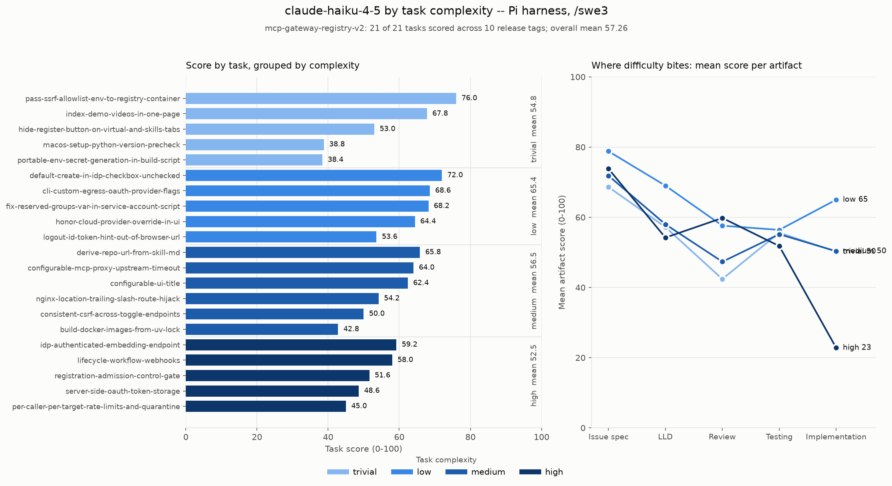
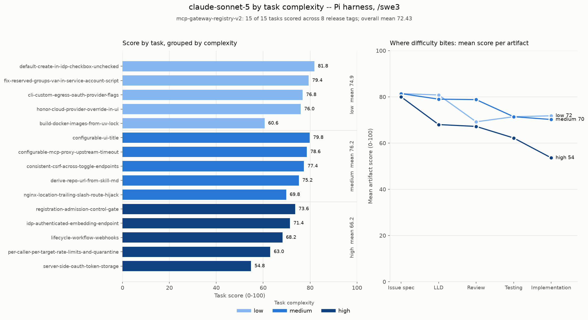

# Results -- `/swe3` on the v2 dataset (release-sourced, complexity-balanced)

> **Not the headline result.** The reported run is the **[oh-my-pi](omp-setup.md)** (`omp`) harness with `/swe3` on the **v2** dataset -- 16 models, 21 tasks -- in [harness-omp-swe3.md](harness-omp-swe3.md). This page covers the same v2 dataset under the **pi** harness, 3 models. Different task sets and harnesses, so the scores here do not compare with it.

Three models, 21 tasks each, on the **pi** harness with the single-agent [`/swe3`](../.claude/skills/swe3/SKILL.md) skill, scored by the codex judge (`openai.gpt-5.6-sol`, high effort).

This is a **different dataset** from [results-swe3.md](results-swe3.md). Scores here are not comparable with the v1 numbers there -- different tasks, different refs, a different difficulty mix -- and the two must never be merged into one table. See [Why v2 exists](#why-v2-exists) below.

For what these results imply about *which model to use for which work*, see **[model-selection-by-complexity.md](model-selection-by-complexity.md)**.

## Leaderboard

| Rank | Model | Mean score | Median | sd | Range | $/task | Run total | Completed |
|---:|---|---:|---:|---:|---|---:|---:|---|
| 1 | `claude-opus-5` | **77.62** | 81.0 | 7.90 | 62.4-86.0 | $5.83 | $122.33 | 21/21 |
| 2 | `claude-sonnet-5` | **72.53** | 75.2 | 9.57 | 48.6-84.4 | $2.31 | $48.61 | 21/21 |
| 3 | `claude-haiku-4-5` | **57.26** | 58.0 | 10.92 | 38.4-76.0 | $0.54 | $11.24 | 21/21 |

All three completed every task with all six artifacts. **No failures, no top-ups, no retries** across 63 runs -- the tasks are hard enough to separate models but well-enough specified that no model got stuck.

Opus costs **2.5x sonnet for +5.09 points**. Total spend for the three runs: **$182.18**.

## By complexity tier

| Tier | n | haiku-4-5 | sonnet-5 | opus-5 | opus − sonnet | haiku $ | sonnet $ | opus $ |
|---|---:|---:|---:|---:|---:|---:|---:|---:|
| trivial | 5 | 54.80 | 73.64 | **79.04** | +5.40 | $0.33 | $0.72 | $2.88 |
| low | 5 | 65.36 | 76.52 | **79.92** | +3.40 | $0.49 | $1.18 | $4.11 |
| medium | 6 | 56.53 | 73.57 | **77.93** | +4.37 | $0.63 | $2.09 | $5.11 |
| high | 5 | 52.48 | 66.20 | **73.52** | +7.32 | $0.68 | $5.32 | $11.34 |

**Cost tracks complexity cleanly; score does not.** Opus's cost per task rises 3.9x from trivial to high, and every model's cost rises monotonically. Scores do not: `trivial` is the *worst* tier for haiku (54.80, below its `low` and `medium`) and is mid-table for the other two.

That is the headline of this run, and it is a negative result about the dataset's own organising idea -- see [complexity does not predict the gap](#complexity-does-not-predict-the-gap).

A note on provenance: an earlier version of this table covered 15 tasks with three tiers and read 19.1 / 18.9 / 21.0 for the haiku-opus spread. `build-docker-images-from-uv-lock` was labelled `low` and is now `medium` (see [the re-tier](#the-re-tiered-task)), and the `trivial` tier plus one `low` task were added afterwards.

Per model -- per-task scores banded by tier on the left, mean score per judged artifact on the right. Read the right-hand panels against each other: the three tier lines sit close together through the design stages in every case, and separate at implementation by an amount that shrinks as the model gets stronger -- 39 points low-to-high for haiku, 18 for sonnet, 15 for opus.

**claude-haiku-4-5** -- implementation splits 62 / 55 / 23 by tier, a 39-point collapse and the widest of the three.



**claude-sonnet-5** -- the same shape, less than half the collapse: implementation 72 / 70 / 54.



**claude-opus-5** -- the flattest profile, implementation 78 / 70 / 63. The one visible dip is `configurable-mcp-proxy-upstream-timeout` pulling the medium line down.


## Complexity does not predict the gap


The tier means above differ by only a few points. The per-task gaps behind them run from **-12.4 to +16.0**, and sorting them by size scatters the tier colours rather than banding them.

Decomposing the variance in the per-task opus-over-sonnet gap: **complexity explains 6% of it.** The other 94% is differences between tasks inside the same tier.

The `trivial` tier is the clearest illustration, because it contains both extremes:

| Trivial task | sonnet | opus | opus − sonnet |
|---|---:|---:|---:|
| `hide-register-button-on-virtual-and-skills-tabs` | 82.4 | 82.8 | **+0.4** |
| `pass-ssrf-allowlist-env-to-registry-container` | 84.0 | 85.2 | **+1.2** |
| `index-demo-videos-in-one-page` | 84.4 | 86.0 | **+1.6** |
| `portable-env-secret-generation-in-build-script` | 68.8 | 78.8 | **+10.0** |
| `macos-setup-python-version-precheck` | 48.6 | 62.4 | **+13.8** |

All five are one-file changes. The first three are *mechanical* -- write a docs index, add two env passthroughs, narrow a render condition -- and opus buys essentially nothing on them. The last two turn on knowing one exact thing: that BSD `sed -i` consumes the following argument as a backup suffix, and that a version *check* must compare rather than test for existence. There opus is worth 10-14 points.

So the axis that predicts whether a stronger model pays off is not how big the change is; it is **whether the task hinges on getting one specific thing right**. Scope and precision demand are different properties, and the complexity labels capture the first.

One consequence for the `high` tier: it is the only tier where the gap is *consistent* (+6.2 to +8.4 across all five tasks) rather than large. Everywhere else the gap is a lottery ranging from negative to +16.

## Per-task scores, all three models

| Task | Cx | ref | haiku-4-5 | sonnet-5 | opus-5 |
|---|---|---|---:|---:|---:|
| `index-demo-videos-in-one-page` | trivial | `1.24.3` | 67.8 | 84.4 | 86.0 |
| `pass-ssrf-allowlist-env-to-registry-container` | trivial | `1.27.1` | 76.0 | 84.0 | 85.2 |
| `hide-register-button-on-virtual-and-skills-tabs` | trivial | `v1.0.18` | 53.0 | 82.4 | 82.8 |
| `portable-env-secret-generation-in-build-script` | trivial | `1.27.1` | 38.4 | 68.8 | 78.8 |
| `macos-setup-python-version-precheck` | trivial | `1.27.1` | 38.8 | 48.6 | 62.4 |
| `cli-custom-egress-oauth-provider-flags` | low | `1.28.0` | 68.6 | 76.8 | 84.6 |
| `honor-cloud-provider-override-in-ui` | low | `1.24.7` | 64.4 | 76.0 | 84.0 |
| `default-create-in-idp-checkbox-unchecked` | low | `v1.0.21` | 72.0 | 81.8 | 83.6 |
| `fix-reserved-groups-var-in-service-account-script` | low | `1.27.1` | 68.2 | 79.4 | 82.8 |
| `logout-id-token-hint-out-of-browser-url` | low | `1.27.1` | 53.6 | 68.6 | 64.6 |
| `consistent-csrf-across-toggle-endpoints` | medium | `v1.0.20` | 50.0 | 77.4 | 84.6 |
| `configurable-ui-title` | medium | `1.23.0` | 62.4 | 79.8 | 84.0 |
| `derive-repo-url-from-skill-md` | medium | `v1.0.19` | 65.8 | 75.2 | 81.2 |
| `build-docker-images-from-uv-lock` | medium | `1.23.0` | 42.8 | 60.6 | 76.6 |
| `nginx-location-trailing-slash-route-hijack` | medium | `1.27.1` | 54.2 | 69.8 | 75.0 |
| `configurable-mcp-proxy-upstream-timeout` | medium | `1.25.0` | 64.0 | 78.6 | 66.2 |
| `registration-admission-control-gate` | high | `v1.0.19` | 51.6 | 73.6 | 81.0 |
| `idp-authenticated-embedding-endpoint` | high | `1.28.0` | 59.2 | 71.4 | 77.6 |
| `lifecycle-workflow-webhooks` | high | `1.24.7` | 58.0 | 68.2 | 76.6 |
| `per-caller-per-target-rate-limits-and-quarantine` | high | `1.27.1` | 45.0 | 63.0 | 69.8 |
| `server-side-oauth-token-storage` | high | `1.23.0` | 48.6 | 54.8 | 62.6 |

**Opus wins 19 of 21; sonnet beats haiku on all 21.** Opus's two losses are `configurable-mcp-proxy-upstream-timeout` (66.2 vs 78.6) and `logout-id-token-hint-out-of-browser-url` (64.6 vs 68.6).

Sonnet beating haiku on every one of 21 tasks, with no exception, is worth noting on its own: the ordering between those two is not in question, whatever the per-task noise.

## The design/execution gap

Mean score per judged artifact, across all 21 tasks:

| Model | Issue spec | LLD | Review | Testing | Implementation | Spec − impl |
|---|---:|---:|---:|---:|---:|---:|
| `claude-haiku-4-5` | 73.2 | 59.5 | 51.6 | 54.8 | 47.2 | **26.0** |
| `claude-sonnet-5` | 80.0 | 76.5 | 71.6 | 66.4 | 68.1 | **11.9** |
| `claude-opus-5` | 82.5 | 79.5 | 79.4 | 75.4 | 71.3 | **11.2** |

**Every model specifies better than it builds.** Issue spec is the best artifact for all three; implementation is the worst for haiku and sonnet, and second-worst for opus. What capability buys is a narrower gap: 26.0 → 11.9 → 11.2 -- and note that sonnet has essentially closed the distance to opus on this measure.

The extreme case is haiku on `registration-admission-control-gate`: an issue spec scoring **80** and an implementation scoring **11**. It could describe the work in detail and then not do it.

Issue-spec scores are compressed near the top for all three (73.2-82.5, a 9.3-point range across an 11x price difference), so the artifact that actually separates models is implementation (47.2-71.3, a 24.1-point range).

## Cost and effort

| Model | $/task | Turns/task | Wall clock/task | Tokens/task | Run wall clock |
|---|---:|---:|---:|---:|---:|
| `claude-haiku-4-5` | $0.54 | 52.6 | 5.1 min | 3,008,077 | 1.8 h |
| `claude-sonnet-5` | $2.31 | 71.3 | 11.1 min | 7,453,256 | 3.9 h |
| `claude-opus-5` | $5.83 | 57.8 | 14.5 min | 6,602,512 | 5.1 h |

Sonnet takes **more turns** than opus (71.3 vs 57.8) and processes **more tokens** (7.5M vs 6.6M) while scoring 5.1 points lower. Opus is not winning by grinding longer; it is winning by needing fewer attempts. Sonnet and opus both ran at pi's native **1M** context window on Bedrock; haiku at **200K**, so haiku is the only one that had to compact.

Cost is concentrated in a few high-tier tasks. Opus's two most expensive -- `lifecycle-workflow-webhooks` ($17.33, 150 turns) and `per-caller-per-target-rate-limits-and-quarantine` ($16.07, 113 turns) -- are a quarter of its entire bill, and either one alone costs more than haiku's complete 21-task run ($11.24).

## The re-tiered task

`build-docker-images-from-uv-lock` was labelled `low` in the run that produced these numbers, and all three models scored it worst-in-tier: haiku 42.8, sonnet 60.6, opus 76.6, with the implementation artifact collapsing every time (25 / 31 / 58) while the design artifacts held. Three independent models failing the same way is a mislabel, not variance -- the task touches two Dockerfiles, the lockfile flow and build caching.

**It is now `medium`.** No re-run was needed: `complexity` is dataset metadata copied into each run record, not a measurement, so the task scores are identical either way. The committed `metrics.json` files were corrected and the summaries regenerated. Only the tier assignment moved.

The correction improves the result rather than muddying it: with the task in its right tier, **all three models become monotonic across tiers**, and low's spread drops from 19.1 to 15.5.

## One anomaly worth knowing about

**1. `configurable-mcp-proxy-upstream-timeout` is opus's only loss.** Opus scores 66.2 against sonnet's 78.6, and every artifact is depressed (71/68/65/75/52) rather than one bad component -- the signature of a bad run, not a hard task. It costs opus 12 points on that task and drags its medium-tier mean from 81.2 to 78.20, which is the entire reason opus is not monotonic across tiers. **With n=1 per model per task, this is exactly the kind of result that should not be over-read.** A repeat run would settle it.

## Why v2 exists

v1 ([results-swe3.md](results-swe3.md)) is 5 tasks at a single ref, with no low-complexity tasks at all (0 low / 3 medium / 2 high). That is too small to separate close models and cannot be sliced by difficulty.

v2 is 21 tasks drawn from real closed upstream issues that shipped in named releases, each pinned to the release **immediately before** its fix, so the defect is genuinely present in the tree the agent clones -- 8 distinct refs across the set. Tasks span four complexity tiers (5 trivial / 5 low / 6 medium / 5 high) and span the project's full surface: FastAPI, React/TypeScript, nginx templating, bash, Docker/Compose, Terraform, Helm and the CLI. Every task records `ground_truth` (how upstream actually fixed it), which is reviewer-facing and never shown to the agent.

Three limits to keep attached to any claim made from this data:

- **n=1 per model per task.** Both anomalies above are single-run artifacts. Tier means over 5 tasks move ~2-4 points if one task swings.
- **Survivorship.** Every task was sampled from an issue someone actually fixed and shipped. Problems that were abandoned or remain open are not represented, so this is a sample of *solvable* work.
- **The complexity labels are a weak instrument.** They were assigned by scope, and this run shows scope explains only 6% of the variance in the model gap. They are still useful for pricing a task -- cost tracks them cleanly -- but they should not be read as predicting which model you need.

## Reproducing

```bash
cd benchmarks
./scripts/run-e2e-benchmark.sh --provider bedrock --agent pi --skill swe3 \
    --model 'us.anthropic.claude-opus-5[1m]' \
    --dataset dataset/mcp-gateway-registry-v2.yaml --yes
```

Results land under `swe-benchmark-data/<model>/pi/swe3/mcp-gateway-registry-v2/`, kept apart from v1 by the dataset's `output_scope` (see [harness-reference.md](../benchmarks/docs/harness-reference.md#where-results-land)).

Charts:

```bash
uv run scripts/plot_complexity_breakdown.py --model claude-opus-5 \
    --scope mcp-gateway-registry-v2 --both
uv run scripts/plot_tier_frontier.py --scope mcp-gateway-registry-v2 \
    --models claude-haiku-4-5 claude-sonnet-5 claude-opus-5 --both
```
