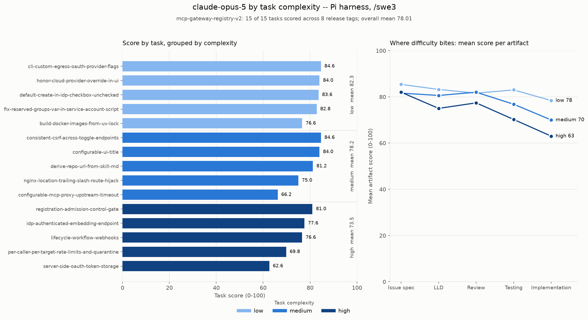

# Results -- `/swe3` on the v2 dataset (release-sourced, complexity-balanced)

Three models, 15 tasks each, on the **pi** harness with the single-agent [`/swe3`](../.claude/skills/swe3/SKILL.md) skill, scored by the codex judge (`openai.gpt-5.6-sol`, high effort).

This is a **different dataset** from [results-swe3.md](results-swe3.md). Scores here are not comparable with the v1 numbers there -- different tasks, different refs, a different difficulty mix -- and the two must never be merged into one table. See [Why v2 exists](#why-v2-exists) below.

For what these results imply about *which model to use for which work*, see **[model-selection-by-complexity.md](model-selection-by-complexity.md)**.

## Leaderboard

| Rank | Model | Mean score | Median | sd | Range | $/task | Run total | Completed |
|---:|---|---:|---:|---:|---|---:|---:|---|
| 1 | `claude-opus-5` | **78.01** | 81.0 | 7.02 | 62.6-84.6 | $6.69 | $100.36 | 15/15 |
| 2 | `claude-sonnet-5` | **72.43** | 75.2 | 7.84 | 54.8-81.8 | $2.88 | $43.17 | 15/15 |
| 3 | `claude-haiku-4-5` | **58.32** | 59.2 | 9.17 | 42.8-72.0 | $0.60 | $8.97 | 15/15 |

All three completed every task with all six artifacts. **No failures, no top-ups, no retries** -- unusual, and a point in the dataset's favour: the tasks are hard enough to separate models but well-enough specified that no model got stuck.

Total spend for the three runs: **$152.50**.

## By complexity tier



| Tier | haiku-4-5 | sonnet-5 | opus-5 | Spread | opus $/task |
|---|---:|---:|---:|---:|---:|
| low | 63.20 | 74.92 | **82.32** | 19.12 | $3.41 |
| medium | 59.28 | 76.16 | **78.20** | 18.92 | $5.32 |
| high | 52.48 | 66.20 | **73.52** | 21.04 | $11.34 |

Every model scores worst on the high tier, so the difficulty labels are doing real work. Two details worth stating rather than smoothing over:

- **The spread between models is flat across tiers** (19.1 / 18.9 / 21.0). Models do *not* converge on easy work -- see [model-selection-by-complexity.md](model-selection-by-complexity.md), where this is the central finding.
- **Only opus is monotonic** (82.3 → 78.2 → 73.5). Sonnet scores marginally higher on medium than low, because of `build-docker-images-from-uv-lock` (below).

## Per-task scores, all three models

| Task | Cx | ref | haiku-4-5 | sonnet-5 | opus-5 |
|---|---|---|---:|---:|---:|
| `cli-custom-egress-oauth-provider-flags` | low | `1.28.0` | 68.6 | 76.8 | 84.6 |
| `honor-cloud-provider-override-in-ui` | low | `1.24.7` | 64.4 | 76.0 | 84.0 |
| `default-create-in-idp-checkbox-unchecked` | low | `v1.0.21` | 72.0 | 81.8 | 83.6 |
| `fix-reserved-groups-var-in-service-account-script` | low | `1.27.1` | 68.2 | 79.4 | 82.8 |
| `build-docker-images-from-uv-lock` | low | `1.23.0` | 42.8 | 60.6 | 76.6 |
| `consistent-csrf-across-toggle-endpoints` | medium | `v1.0.20` | 50.0 | 77.4 | 84.6 |
| `configurable-ui-title` | medium | `1.23.0` | 62.4 | 79.8 | 84.0 |
| `derive-repo-url-from-skill-md` | medium | `v1.0.19` | 65.8 | 75.2 | 81.2 |
| `nginx-location-trailing-slash-route-hijack` | medium | `1.27.1` | 54.2 | 69.8 | 75.0 |
| `configurable-mcp-proxy-upstream-timeout` | medium | `1.25.0` | 64.0 | **78.6** | 66.2 |
| `registration-admission-control-gate` | high | `v1.0.19` | 51.6 | 73.6 | 81.0 |
| `idp-authenticated-embedding-endpoint` | high | `1.28.0` | 59.2 | 71.4 | 77.6 |
| `lifecycle-workflow-webhooks` | high | `1.24.7` | 58.0 | 68.2 | 76.6 |
| `per-caller-per-target-rate-limits-and-quarantine` | high | `1.27.1` | 45.0 | 63.0 | 69.8 |
| `server-side-oauth-token-storage` | high | `1.23.0` | 48.6 | 54.8 | 62.6 |

**Opus wins 14 of 15; sonnet beats haiku on all 15.** The single exception is `configurable-mcp-proxy-upstream-timeout`, where opus (66.2) falls below sonnet (78.6) -- see [anomalies](#two-anomalies-worth-knowing-about).

Task difficulty is only moderately consistent between models. Spearman rank correlation of the 15 task scores: haiku~sonnet **0.75**, sonnet~opus **0.66**, haiku~opus **0.53**. So "hard for haiku" is a weak predictor of "hard for opus" -- capability changes *which* tasks are hard, not just how well they go.

## The design/execution gap

Mean score per judged artifact, across all 15 tasks:

| Model | Issue spec | LLD | Review | Testing | Implementation | Spec − impl |
|---|---:|---:|---:|---:|---:|---:|
| `claude-haiku-4-5` | 74.9 | 60.7 | 54.8 | 54.6 | 46.7 | **28.2** |
| `claude-sonnet-5` | 80.9 | 75.9 | 71.7 | 68.3 | 65.2 | **15.7** |
| `claude-opus-5` | 83.0 | 79.6 | 80.3 | 76.7 | 70.5 | **12.5** |

**Every model specifies better than it builds, and the ordering never changes** -- issue spec is always the best artifact, implementation always the worst. What capability buys is a narrower gap: 28.2 → 15.7 → 12.5. Opus is the first to clear 70 on implementation.

The extreme case is haiku on `registration-admission-control-gate`: an issue spec scoring **80** and an implementation scoring **11**. It could describe the work in detail and then not do it.

Since issue-spec scores are compressed near the top for all three (74.9-83.0), the artifact that actually separates models is implementation (46.7-70.5, a 23.8-point range).

## Cost and effort

| Model | $/task | Turns/task | Wall clock/task | Tokens/task | Run wall clock |
|---|---:|---:|---:|---:|---:|
| `claude-haiku-4-5` | $0.60 | 58.6 | 5.6 min | 3,453,553 | 1.4 h |
| `claude-sonnet-5` | $2.88 | 86.7 | 13.1 min | 9,591,828 | 3.3 h |
| `claude-opus-5` | $6.69 | 64.7 | 15.8 min | 7,851,011 | 3.9 h |

Sonnet takes **more turns** than opus (86.7 vs 64.7) and processes **more tokens** (9.6M vs 7.9M) while scoring 5.6 points lower. Opus is not winning by grinding longer; it is winning by needing fewer attempts. Sonnet and opus both ran at pi's native **1M** context window on Bedrock; haiku at **200K**, so haiku is the only one that had to compact.

Cost is concentrated in a few high-tier tasks. Opus's two most expensive -- `lifecycle-workflow-webhooks` ($17.33, 150 turns) and `per-caller-per-target-rate-limits-and-quarantine` ($16.07, 113 turns) -- are a third of its entire bill, and either one alone costs more than haiku's complete 15-task run ($8.97).

## Two anomalies worth knowing about

**1. `build-docker-images-from-uv-lock` is mis-tiered.** It is labelled `low`, and all three models score it worst-in-tier: haiku 42.8, sonnet 60.6, opus 76.6. In every case the implementation artifact is the collapse (25 / 31 / 58) while the design artifacts hold up. Three independent models failing the same way is not variance -- the task asks for more than its label implies. **It should be re-tiered to `medium`.** Left as-is for now so this published run matches the dataset it was produced from; the change belongs in a separate commit with a re-run.

**2. `configurable-mcp-proxy-upstream-timeout` is opus's only loss.** Opus scores 66.2 against sonnet's 78.6, and every artifact is depressed (71/68/65/75/52) rather than one bad component -- the signature of a bad run, not a hard task. It costs opus 12 points on that task and drags its medium-tier mean from 81.2 to 78.20, which is the entire reason opus is not monotonic across tiers. **With n=1 per model per task, this is exactly the kind of result that should not be over-read.** A repeat run would settle it.

## Why v2 exists

v1 ([results-swe3.md](results-swe3.md)) is 5 tasks at a single ref, with no low-complexity tasks at all (0 low / 3 medium / 2 high). That is too small to separate close models and cannot be sliced by difficulty.

v2 is 15 tasks drawn from real closed upstream issues that shipped in named releases, each pinned to the release **immediately before** its fix, so the defect is genuinely present in the tree the agent clones -- 8 distinct refs across the set. Tasks are balanced 5 low / 5 medium / 5 high and span the project's full surface: FastAPI, React/TypeScript, nginx templating, bash, Docker/Compose, Terraform, Helm and the CLI. Every task records `ground_truth` (how upstream actually fixed it), which is reviewer-facing and never shown to the agent.

Two limits to keep attached to any claim made from this data:

- **n=1 per model per task.** Both anomalies above are single-run artifacts. Tier means over 5 tasks move ~2-4 points if one task swings.
- **Survivorship.** Every task was sampled from an issue someone actually fixed and shipped. Problems that were abandoned or remain open are not represented, so this is a sample of *solvable* work.

## Reproducing

```bash
cd benchmarks
./scripts/run-e2e-benchmark.sh --provider bedrock --agent pi --skill swe3 \
    --model 'us.anthropic.claude-opus-5[1m]' \
    --dataset dataset/mcp-gateway-registry-v2.yaml --yes
```

Results land under `swe-benchmark-data/<model>/pi/swe3/mcp-gateway-registry-v2/`, kept apart from v1 by the dataset's `output_scope` (see [harness-reference.md](../benchmarks/docs/harness-reference.md#where-results-land)).

Charts:

```bash
uv run scripts/plot_complexity_breakdown.py --model claude-opus-5 \
    --scope mcp-gateway-registry-v2 --both
uv run scripts/plot_tier_frontier.py --scope mcp-gateway-registry-v2 \
    --models claude-haiku-4-5 claude-sonnet-5 claude-opus-5 --both
```
